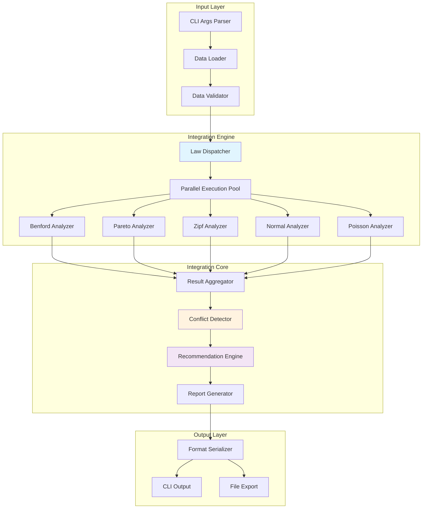

# INTEGRATION_ARCHITECTURE.md - 統合機能アーキテクチャ

## 概要

lawkit統合機能のアーキテクチャ設計。複数統計法則の並列実行、結果統合、矛盾検出、推奨システムの技術実装を定義する。

## アーキテクチャ全体図



## コア構造体定義

### 1. 統合エンジン

```rust
pub struct IntegrationEngine {
    executor: ParallelExecutor,
    aggregator: ResultAggregator,
    conflict_detector: ConflictDetector,
    recommender: RecommendationEngine,
    config: IntegrationConfig,
}

pub struct IntegrationConfig {
    pub enabled_laws: Vec<LawType>,
    pub conflict_threshold: f64,
    pub weight_scheme: WeightScheme,
    pub analysis_focus: AnalysisFocus,
    pub confidence_level: f64,
}

#[derive(Debug, Clone)]
pub enum LawType {
    Benford,
    Pareto,
    Zipf,
    Normal,
    Poisson,
}

#[derive(Debug, Clone)]
pub enum WeightScheme {
    Equal,
    Adaptive,
    Expert(String),
    Custom(HashMap<LawType, f64>),
}

#[derive(Debug, Clone)]
pub enum AnalysisFocus {
    Quality,
    Concentration,
    Distribution,
    Anomaly,
    General,
}
```

### 2. 結果統合構造体

```rust
#[derive(Debug, Clone)]
pub struct IntegrationResult {
    pub dataset_info: DatasetInfo,
    pub law_results: HashMap<LawType, LawResult>,
    pub integration_metrics: IntegrationMetrics,
    pub conflicts: Vec<Conflict>,
    pub recommendation: Recommendation,
    pub execution_metadata: ExecutionMetadata,
}

#[derive(Debug, Clone)]
pub struct IntegrationMetrics {
    pub overall_quality_score: f64,
    pub consistency_score: f64,
    pub conflicts_detected: usize,
    pub recommendation_confidence: f64,
    pub data_characteristics: DataCharacteristics,
}

#[derive(Debug, Clone)]
pub struct LawResult {
    pub law_type: LawType,
    pub quality_score: f64,
    pub risk_level: RiskLevel,
    pub primary_metric: String,
    pub secondary_metrics: HashMap<String, f64>,
    pub computation_time: Duration,
    pub confidence_interval: Option<(f64, f64)>,
}

#[derive(Debug, Clone, PartialEq)]
pub enum RiskLevel {
    Low,
    Medium,
    High,
    Critical,
}

impl RiskLevel {
    pub fn score(&self) -> f64 {
        match self {
            RiskLevel::Low => 0.0,
            RiskLevel::Medium => 0.33,
            RiskLevel::High => 0.66,
            RiskLevel::Critical => 1.0,
        }
    }
}
```

### 3. 矛盾検出構造体

```rust
#[derive(Debug, Clone)]
pub struct Conflict {
    pub conflict_type: ConflictType,
    pub laws_involved: Vec<LawType>,
    pub conflict_score: f64,
    pub description: String,
    pub likely_cause: ConflictCause,
    pub severity: ConflictSeverity,
    pub resolution_suggestions: Vec<String>,
}

#[derive(Debug, Clone)]
pub enum ConflictType {
    DistributionMismatch,
    QualityDiscrepancy,
    ScaleIncompatibility,
    MethodologicalConflict,
    DataTypeConflict,
}

#[derive(Debug, Clone)]
pub enum ConflictCause {
    InappropriateMethod,
    InsufficientData,
    DataPreprocessing,
    OutlierInterference,
    DistributionAssumption,
}

#[derive(Debug, Clone, PartialEq, Eq, PartialOrd, Ord)]
pub enum ConflictSeverity {
    Notice,
    Warning,
    Error,
    Critical,
}
```

### 4. 推奨システム構造体

```rust
#[derive(Debug, Clone)]
pub struct Recommendation {
    pub primary_law: LawType,
    pub secondary_laws: Vec<LawType>,
    pub confidence: f64,
    pub rationale: String,
    pub use_case_specific: HashMap<String, LawType>,
    pub alternative_approaches: Vec<AlternativeApproach>,
}

#[derive(Debug, Clone)]
pub struct AlternativeApproach {
    pub name: String,
    pub laws: Vec<LawType>,
    pub confidence: f64,
    pub description: String,
    pub applicable_scenarios: Vec<String>,
}

#[derive(Debug, Clone)]
pub struct DataCharacteristics {
    pub data_type: DataType,
    pub distribution_shape: DistributionShape,
    pub outlier_presence: OutlierLevel,
    pub scale_range: ScaleRange,
    pub seasonality: Option<SeasonalityPattern>,
    pub analysis_purpose: AnalysisPurpose,
    pub sample_size: usize,
    pub missing_values: f64,
}
```

## 並列実行アーキテクチャ

### 1. 並列実行エンジン

```rust
use rayon::prelude::*;
use tokio::time::Duration;

pub struct ParallelExecutor {
    thread_pool: rayon::ThreadPool,
    timeout: Duration,
    retry_config: RetryConfig,
}

impl ParallelExecutor {
    pub fn new(num_threads: Option<usize>) -> Self {
        let thread_pool = rayon::ThreadPoolBuilder::new()
            .num_threads(num_threads.unwrap_or_else(num_cpus::get))
            .build()
            .expect("Failed to create thread pool");
            
        Self {
            thread_pool,
            timeout: Duration::from_secs(300), // 5分タイムアウト
            retry_config: RetryConfig::default(),
        }
    }
    
    pub fn execute_laws(&self, numbers: &[f64], laws: &[LawType], config: &IntegrationConfig) -> Vec<LawResult> {
        let shared_calculations = Arc::new(CommonCalculations::new(numbers));
        
        laws.par_iter()
            .map(|&law_type| {
                self.execute_single_law(law_type, &shared_calculations, config)
            })
            .collect()
    }
    
    fn execute_single_law(&self, law_type: LawType, calculations: &Arc<CommonCalculations>, config: &IntegrationConfig) -> LawResult {
        let start_time = Instant::now();
        
        let result = match law_type {
            LawType::Benford => self.execute_benford(calculations, config),
            LawType::Pareto => self.execute_pareto(calculations, config),
            LawType::Zipf => self.execute_zipf(calculations, config),
            LawType::Normal => self.execute_normal(calculations, config),
            LawType::Poisson => self.execute_poisson(calculations, config),
        };
        
        let computation_time = start_time.elapsed();
        
        LawResult {
            law_type,
            quality_score: result.quality_score,
            risk_level: result.risk_level,
            primary_metric: result.primary_metric,
            secondary_metrics: result.secondary_metrics,
            computation_time,
            confidence_interval: result.confidence_interval,
        }
    }
}
```

### 2. 共通計算の最適化

```rust
pub struct CommonCalculations {
    pub original_numbers: Vec<f64>,
    pub sorted_numbers: Vec<f64>,
    pub basic_stats: BasicStats,
    pub percentiles: Vec<f64>,
    pub outlier_bounds: OutlierBounds,
    pub distribution_info: DistributionInfo,
}

impl CommonCalculations {
    pub fn new(numbers: &[f64]) -> Self {
        let mut sorted = numbers.to_vec();
        sorted.sort_by(|a, b| a.partial_cmp(b).unwrap());
        
        let basic_stats = BasicStats::calculate(&sorted);
        let percentiles = Self::calculate_percentiles(&sorted);
        let outlier_bounds = OutlierBounds::calculate(&sorted, &basic_stats);
        let distribution_info = DistributionInfo::analyze(&sorted, &basic_stats);
        
        Self {
            original_numbers: numbers.to_vec(),
            sorted_numbers: sorted,
            basic_stats,
            percentiles,
            outlier_bounds,
            distribution_info,
        }
    }
    
    fn calculate_percentiles(sorted: &[f64]) -> Vec<f64> {
        let percentiles = [0.1, 0.25, 0.5, 0.75, 0.9, 0.95, 0.99];
        percentiles.iter()
            .map(|&p| Self::percentile(sorted, p))
            .collect()
    }
    
    fn percentile(sorted: &[f64], p: f64) -> f64 {
        let index = (p * (sorted.len() - 1) as f64).round() as usize;
        sorted[index.min(sorted.len() - 1)]
    }
}

#[derive(Debug, Clone)]
pub struct BasicStats {
    pub mean: f64,
    pub median: f64,
    pub std_dev: f64,
    pub variance: f64,
    pub min: f64,
    pub max: f64,
    pub count: usize,
    pub skewness: f64,
    pub kurtosis: f64,
}

#[derive(Debug, Clone)]
pub struct OutlierBounds {
    pub iqr_lower: f64,
    pub iqr_upper: f64,
    pub zscore_threshold: f64,
    pub modified_zscore_threshold: f64,
}

#[derive(Debug, Clone)]
pub struct DistributionInfo {
    pub estimated_type: DistributionShape,
    pub normality_indicators: NormalityIndicators,
    pub concentration_measures: ConcentrationMeasures,
}
```

## 結果統合アルゴリズム

### 1. 結果アグリゲーター

```rust
pub struct ResultAggregator {
    weight_calculator: WeightCalculator,
    metric_normalizer: MetricNormalizer,
}

impl ResultAggregator {
    pub fn aggregate(&self, law_results: Vec<LawResult>, config: &IntegrationConfig) -> IntegrationMetrics {
        let weights = self.weight_calculator.calculate_weights(&law_results, config);
        let normalized_scores = self.metric_normalizer.normalize_scores(&law_results);
        
        let overall_quality_score = self.calculate_weighted_score(&normalized_scores, &weights);
        let consistency_score = self.calculate_consistency_score(&normalized_scores);
        let data_characteristics = self.analyze_data_characteristics(&law_results);
        
        IntegrationMetrics {
            overall_quality_score,
            consistency_score,
            conflicts_detected: 0, // 後で矛盾検出器が設定
            recommendation_confidence: 0.0, // 後で推奨エンジンが設定
            data_characteristics,
        }
    }
    
    fn calculate_weighted_score(&self, scores: &HashMap<LawType, f64>, weights: &HashMap<LawType, f64>) -> f64 {
        let weighted_sum: f64 = scores.iter()
            .map(|(law, score)| score * weights.get(law).unwrap_or(&1.0))
            .sum();
        let weight_sum: f64 = weights.values().sum();
        
        if weight_sum > 0.0 {
            weighted_sum / weight_sum
        } else {
            0.0
        }
    }
    
    fn calculate_consistency_score(&self, scores: &HashMap<LawType, f64>) -> f64 {
        if scores.len() < 2 {
            return 1.0;
        }
        
        let values: Vec<f64> = scores.values().cloned().collect();
        let mean = values.iter().sum::<f64>() / values.len() as f64;
        let variance = values.iter()
            .map(|v| (v - mean).powi(2))
            .sum::<f64>() / values.len() as f64;
            
        // 正規化された一貫性スコア (0-1の範囲)
        1.0 - (variance / 1.0).min(1.0)
    }
}
```

### 2. 重み計算器

```rust
pub struct WeightCalculator;

impl WeightCalculator {
    pub fn calculate_weights(&self, law_results: &[LawResult], config: &IntegrationConfig) -> HashMap<LawType, f64> {
        match &config.weight_scheme {
            WeightScheme::Equal => self.equal_weights(law_results),
            WeightScheme::Adaptive => self.adaptive_weights(law_results, config),
            WeightScheme::Expert(domain) => self.expert_weights(domain),
            WeightScheme::Custom(weights) => weights.clone(),
        }
    }
    
    fn equal_weights(&self, law_results: &[LawResult]) -> HashMap<LawType, f64> {
        law_results.iter()
            .map(|result| (result.law_type, 1.0))
            .collect()
    }
    
    fn adaptive_weights(&self, law_results: &[LawResult], config: &IntegrationConfig) -> HashMap<LawType, f64> {
        let mut weights = HashMap::new();
        
        for result in law_results {
            let base_weight = 1.0;
            let performance_multiplier = self.calculate_performance_multiplier(result);
            let focus_multiplier = self.calculate_focus_multiplier(result.law_type, &config.analysis_focus);
            
            let final_weight = base_weight * performance_multiplier * focus_multiplier;
            weights.insert(result.law_type, final_weight);
        }
        
        weights
    }
    
    fn calculate_performance_multiplier(&self, result: &LawResult) -> f64 {
        // 品質スコアと計算時間を考慮した性能乗数
        let quality_factor = result.quality_score;
        let speed_factor = if result.computation_time.as_millis() < 100 {
            1.2
        } else if result.computation_time.as_millis() < 1000 {
            1.0
        } else {
            0.8
        };
        
        quality_factor * speed_factor
    }
    
    fn calculate_focus_multiplier(&self, law_type: LawType, focus: &AnalysisFocus) -> f64 {
        match focus {
            AnalysisFocus::Quality => match law_type {
                LawType::Benford => 2.0,
                LawType::Normal => 1.5,
                _ => 1.0,
            },
            AnalysisFocus::Concentration => match law_type {
                LawType::Pareto => 2.0,
                LawType::Zipf => 1.5,
                _ => 1.0,
            },
            AnalysisFocus::Anomaly => match law_type {
                LawType::Normal => 2.0,
                LawType::Poisson => 1.5,
                _ => 1.0,
            },
            AnalysisFocus::Distribution => match law_type {
                LawType::Normal => 1.5,
                LawType::Poisson => 1.5,
                _ => 1.0,
            },
            AnalysisFocus::General => 1.0,
        }
    }
}
```

## 矛盾検出アルゴリズム

### 1. 矛盾検出器

```rust
pub struct ConflictDetector {
    threshold: f64,
    rules: Vec<ConflictRule>,
}

impl ConflictDetector {
    pub fn new(threshold: f64) -> Self {
        Self {
            threshold,
            rules: Self::create_default_rules(),
        }
    }
    
    pub fn detect_conflicts(&self, law_results: &HashMap<LawType, LawResult>) -> Vec<Conflict> {
        let mut conflicts = Vec::new();
        
        // ペアワイズ比較による矛盾検出
        conflicts.extend(self.detect_pairwise_conflicts(law_results));
        
        // ルールベース矛盾検出
        conflicts.extend(self.detect_rule_based_conflicts(law_results));
        
        // グローバル矛盾検出
        conflicts.extend(self.detect_global_conflicts(law_results));
        
        conflicts.sort_by(|a, b| b.severity.cmp(&a.severity));
        conflicts
    }
    
    fn detect_pairwise_conflicts(&self, law_results: &HashMap<LawType, LawResult>) -> Vec<Conflict> {
        let mut conflicts = Vec::new();
        let laws: Vec<_> = law_results.keys().collect();
        
        for i in 0..laws.len() {
            for j in i+1..laws.len() {
                let law_a = laws[i];
                let law_b = laws[j];
                let result_a = &law_results[law_a];
                let result_b = &law_results[law_b];
                
                if let Some(conflict) = self.check_pair_conflict(result_a, result_b) {
                    conflicts.push(conflict);
                }
            }
        }
        
        conflicts
    }
    
    fn check_pair_conflict(&self, result_a: &LawResult, result_b: &LawResult) -> Option<Conflict> {
        let score_diff = (result_a.quality_score - result_b.quality_score).abs();
        let max_score = result_a.quality_score.max(result_b.quality_score);
        
        if max_score > 0.0 {
            let conflict_ratio = score_diff / max_score;
            
            if conflict_ratio > self.threshold {
                let conflict_type = self.classify_conflict_type(result_a, result_b);
                let likely_cause = self.diagnose_conflict_cause(result_a, result_b);
                let severity = self.assess_conflict_severity(conflict_ratio);
                
                return Some(Conflict {
                    conflict_type,
                    laws_involved: vec![result_a.law_type, result_b.law_type],
                    conflict_score: conflict_ratio,
                    description: format!(
                        "{}と{}の評価が大きく異なります (差: {:.2})",
                        result_a.law_type.name(),
                        result_b.law_type.name(),
                        conflict_ratio
                    ),
                    likely_cause,
                    severity,
                    resolution_suggestions: self.generate_resolution_suggestions(result_a, result_b),
                });
            }
        }
        
        None
    }
    
    fn create_default_rules() -> Vec<ConflictRule> {
        vec![
            ConflictRule {
                name: "Continuous-Discrete Mismatch".to_string(),
                condition: Box::new(|results| {
                    let normal_high = results.get(&LawType::Normal)
                        .map(|r| r.quality_score > 0.8)
                        .unwrap_or(false);
                    let poisson_high = results.get(&LawType::Poisson)
                        .map(|r| r.quality_score > 0.8)
                        .unwrap_or(false);
                    normal_high && poisson_high
                }),
                severity: ConflictSeverity::Warning,
                description: "連続分布と離散分布の両方が高い適合度を示しています".to_string(),
            },
            ConflictRule {
                name: "Benford-Normal Contradiction".to_string(),
                condition: Box::new(|results| {
                    let benford_low = results.get(&LawType::Benford)
                        .map(|r| r.quality_score < 0.3)
                        .unwrap_or(false);
                    let normal_high = results.get(&LawType::Normal)
                        .map(|r| r.quality_score > 0.8)
                        .unwrap_or(false);
                    benford_low && normal_high
                }),
                severity: ConflictSeverity::Notice,
                description: "ベンフォード法則の低適合と正規分布の高適合が共存しています".to_string(),
            },
        ]
    }
}

pub struct ConflictRule {
    pub name: String,
    pub condition: Box<dyn Fn(&HashMap<LawType, LawResult>) -> bool + Send + Sync>,
    pub severity: ConflictSeverity,
    pub description: String,
}
```

## 推奨システムアーキテクチャ

### 1. 推奨エンジン

```rust
pub struct RecommendationEngine {
    scorers: Vec<Box<dyn RecommendationScorer>>,
    ranker: LawRanker,
    confidence_calculator: ConfidenceCalculator,
}

impl RecommendationEngine {
    pub fn new() -> Self {
        Self {
            scorers: vec![
                Box::new(QualityScorer::new()),
                Box::new(CompatibilityScorer::new()),
                Box::new(PurposeScorer::new()),
                Box::new(PerformanceScorer::new()),
            ],
            ranker: LawRanker::new(),
            confidence_calculator: ConfidenceCalculator::new(),
        }
    }
    
    pub fn generate_recommendation(
        &self,
        law_results: &HashMap<LawType, LawResult>,
        data_characteristics: &DataCharacteristics,
        conflicts: &[Conflict],
    ) -> Recommendation {
        let scored_laws = self.score_laws(law_results, data_characteristics);
        let ranked_laws = self.ranker.rank(scored_laws);
        let confidence = self.confidence_calculator.calculate(&ranked_laws, conflicts);
        
        let primary_law = ranked_laws[0].law_type;
        let secondary_laws = ranked_laws.iter()
            .skip(1)
            .take(2)
            .map(|s| s.law_type)
            .collect();
        
        let rationale = self.generate_rationale(&ranked_laws, data_characteristics);
        let use_case_specific = self.generate_use_case_recommendations(&ranked_laws);
        let alternative_approaches = self.generate_alternatives(&ranked_laws, data_characteristics);
        
        Recommendation {
            primary_law,
            secondary_laws,
            confidence,
            rationale,
            use_case_specific,
            alternative_approaches,
        }
    }
    
    fn score_laws(
        &self,
        law_results: &HashMap<LawType, LawResult>,
        data_characteristics: &DataCharacteristics,
    ) -> Vec<ScoredLaw> {
        law_results.iter()
            .map(|(law_type, result)| {
                let total_score = self.scorers.iter()
                    .map(|scorer| scorer.score(result, data_characteristics))
                    .sum::<f64>() / self.scorers.len() as f64;
                
                ScoredLaw {
                    law_type: *law_type,
                    score: total_score,
                    component_scores: self.scorers.iter()
                        .map(|scorer| (scorer.name(), scorer.score(result, data_characteristics)))
                        .collect(),
                }
            })
            .collect()
    }
}

pub trait RecommendationScorer: Send + Sync {
    fn name(&self) -> String;
    fn score(&self, result: &LawResult, characteristics: &DataCharacteristics) -> f64;
}

#[derive(Debug, Clone)]
pub struct ScoredLaw {
    pub law_type: LawType,
    pub score: f64,
    pub component_scores: HashMap<String, f64>,
}
```

### 2. 品質スコアラー

```rust
pub struct QualityScorer;

impl RecommendationScorer for QualityScorer {
    fn name(&self) -> String {
        "Quality".to_string()
    }
    
    fn score(&self, result: &LawResult, _characteristics: &DataCharacteristics) -> f64 {
        // 品質スコアは直接の法則品質スコア
        result.quality_score
    }
}

pub struct CompatibilityScorer;

impl RecommendationScorer for CompatibilityScorer {
    fn name(&self) -> String {
        "Compatibility".to_string()
    }
    
    fn score(&self, result: &LawResult, characteristics: &DataCharacteristics) -> f64 {
        match (result.law_type, &characteristics.data_type) {
            (LawType::Normal, DataType::Continuous) => 1.0,
            (LawType::Poisson, DataType::Discrete) => 1.0,
            (LawType::Pareto, DataType::Continuous) if characteristics.distribution_shape == DistributionShape::Skewed => 1.0,
            (LawType::Zipf, DataType::Discrete) if characteristics.distribution_shape == DistributionShape::PowerLaw => 1.0,
            (LawType::Benford, _) => 0.8, // 汎用的に適用可能
            _ => 0.5,
        }
    }
}

pub struct PurposeScorer;

impl RecommendationScorer for PurposeScorer {
    fn name(&self) -> String {
        "Purpose".to_string()
    }
    
    fn score(&self, result: &LawResult, characteristics: &DataCharacteristics) -> f64 {
        match (&characteristics.analysis_purpose, result.law_type) {
            (AnalysisPurpose::QualityAudit, LawType::Benford) => 1.0,
            (AnalysisPurpose::QualityAudit, LawType::Normal) => 0.8,
            (AnalysisPurpose::FraudDetection, LawType::Benford) => 1.0,
            (AnalysisPurpose::FraudDetection, LawType::Poisson) => 0.7,
            (AnalysisPurpose::ConcentrationAnalysis, LawType::Pareto) => 1.0,
            (AnalysisPurpose::ConcentrationAnalysis, LawType::Zipf) => 0.8,
            (AnalysisPurpose::AnomalyDetection, LawType::Normal) => 1.0,
            (AnalysisPurpose::AnomalyDetection, LawType::Poisson) => 0.8,
            _ => 0.5,
        }
    }
}
```

## 性能最適化戦略

### 1. メモリ効率化

```rust
pub struct MemoryOptimizer {
    cache: LruCache<String, CachedCalculation>,
    memory_limit: usize,
}

impl MemoryOptimizer {
    pub fn optimize_memory_usage(&mut self, numbers: &[f64]) -> OptimizedData {
        let hash = self.calculate_hash(numbers);
        
        if let Some(cached) = self.cache.get(&hash) {
            return cached.data.clone();
        }
        
        let optimized = match numbers.len() {
            n if n > 1_000_000 => self.sample_large_dataset(numbers),
            n if n > 100_000 => self.stream_process(numbers),
            _ => self.direct_process(numbers),
        };
        
        self.cache.put(hash, CachedCalculation {
            data: optimized.clone(),
            timestamp: Instant::now(),
        });
        
        optimized
    }
    
    fn sample_large_dataset(&self, numbers: &[f64]) -> OptimizedData {
        // 大量データの場合はサンプリング
        let sample_size = 50_000;
        let step = numbers.len() / sample_size;
        let sampled: Vec<f64> = numbers.iter()
            .step_by(step)
            .cloned()
            .collect();
        
        OptimizedData {
            numbers: sampled,
            is_sampled: true,
            original_size: numbers.len(),
        }
    }
    
    fn stream_process(&self, numbers: &[f64]) -> OptimizedData {
        // ストリーミング処理でメモリ使用量を削減
        OptimizedData {
            numbers: numbers.to_vec(),
            is_sampled: false,
            original_size: numbers.len(),
        }
    }
}

#[derive(Debug, Clone)]
pub struct OptimizedData {
    pub numbers: Vec<f64>,
    pub is_sampled: bool,
    pub original_size: usize,
}

#[derive(Debug, Clone)]
pub struct CachedCalculation {
    pub data: OptimizedData,
    pub timestamp: Instant,
}
```

### 2. 計算最適化

```rust
pub struct ComputationOptimizer {
    parallel_threshold: usize,
    approximation_threshold: usize,
}

impl ComputationOptimizer {
    pub fn optimize_computation(&self, task: ComputationTask) -> OptimizedResult {
        match task.data_size {
            size if size > self.approximation_threshold => {
                self.approximate_computation(task)
            },
            size if size > self.parallel_threshold => {
                self.parallel_computation(task)
            },
            _ => self.sequential_computation(task),
        }
    }
    
    fn approximate_computation(&self, task: ComputationTask) -> OptimizedResult {
        // 大量データに対する近似計算
        match task.computation_type {
            ComputationType::ChiSquare => self.approximate_chi_square(task),
            ComputationType::KolmogorovSmirnov => self.approximate_ks_test(task),
            ComputationType::Correlation => self.approximate_correlation(task),
            _ => self.parallel_computation(task),
        }
    }
    
    fn parallel_computation(&self, task: ComputationTask) -> OptimizedResult {
        // 並列計算の実装
        use rayon::prelude::*;
        
        let chunk_size = task.data_size / num_cpus::get();
        let results: Vec<_> = task.data
            .par_chunks(chunk_size)
            .map(|chunk| self.compute_chunk(chunk, &task))
            .collect();
        
        self.aggregate_chunk_results(results)
    }
}

#[derive(Debug)]
pub enum ComputationType {
    ChiSquare,
    KolmogorovSmirnov,
    Correlation,
    Mean,
    Variance,
    Percentile,
}

#[derive(Debug)]
pub struct ComputationTask {
    pub computation_type: ComputationType,
    pub data: Vec<f64>,
    pub data_size: usize,
    pub parameters: HashMap<String, f64>,
}
```

## エラーハンドリング

### 1. エラー型定義

```rust
#[derive(Debug, Error)]
pub enum IntegrationError {
    #[error("Insufficient data for analysis: {count} points (minimum {required})")]
    InsufficientData { count: usize, required: usize },
    
    #[error("Law execution failed: {law} - {source}")]
    LawExecutionError { law: String, source: Box<dyn std::error::Error + Send + Sync> },
    
    #[error("Invalid configuration: {message}")]
    InvalidConfiguration { message: String },
    
    #[error("Computation timeout: {law} exceeded {timeout_seconds}s")]
    ComputationTimeout { law: String, timeout_seconds: u64 },
    
    #[error("Memory limit exceeded: {used_mb}MB > {limit_mb}MB")]
    MemoryLimitExceeded { used_mb: usize, limit_mb: usize },
    
    #[error("Conflict detection failed: {message}")]
    ConflictDetectionError { message: String },
    
    #[error("Recommendation generation failed: {message}")]
    RecommendationError { message: String },
}

pub type IntegrationResult<T> = Result<T, IntegrationError>;
```

### 2. 回復戦略

```rust
pub struct RecoveryManager {
    retry_config: RetryConfig,
    fallback_strategies: HashMap<LawType, FallbackStrategy>,
}

impl RecoveryManager {
    pub fn execute_with_recovery<F, T>(&self, law_type: LawType, operation: F) -> IntegrationResult<T>
    where
        F: Fn() -> IntegrationResult<T> + Clone,
    {
        let mut attempts = 0;
        let max_attempts = self.retry_config.max_attempts;
        
        loop {
            match operation() {
                Ok(result) => return Ok(result),
                Err(error) => {
                    attempts += 1;
                    
                    if attempts >= max_attempts {
                        return match self.fallback_strategies.get(&law_type) {
                            Some(strategy) => strategy.execute(),
                            None => Err(error),
                        };
                    }
                    
                    if !self.is_retryable_error(&error) {
                        return Err(error);
                    }
                    
                    std::thread::sleep(self.retry_config.delay);
                }
            }
        }
    }
    
    fn is_retryable_error(&self, error: &IntegrationError) -> bool {
        match error {
            IntegrationError::ComputationTimeout { .. } => true,
            IntegrationError::MemoryLimitExceeded { .. } => false,
            IntegrationError::InsufficientData { .. } => false,
            IntegrationError::InvalidConfiguration { .. } => false,
            _ => true,
        }
    }
}

#[derive(Debug, Clone)]
pub struct RetryConfig {
    pub max_attempts: usize,
    pub delay: Duration,
    pub exponential_backoff: bool,
}

pub trait FallbackStrategy {
    fn execute<T>(&self) -> IntegrationResult<T>;
}
```

## 拡張性アーキテクチャ

### 1. プラグインシステム

```rust
pub trait LawPlugin: Send + Sync {
    fn name(&self) -> &'static str;
    fn analyze(&self, numbers: &[f64], config: &PluginConfig) -> Result<PluginResult, PluginError>;
    fn integration_metadata(&self) -> IntegrationMetadata;
    fn compatibility_matrix(&self) -> HashMap<String, f64>;
}

pub struct PluginManager {
    plugins: HashMap<String, Box<dyn LawPlugin>>,
    integration_rules: Vec<IntegrationRule>,
}

impl PluginManager {
    pub fn register_plugin(&mut self, plugin: Box<dyn LawPlugin>) {
        let name = plugin.name().to_string();
        self.plugins.insert(name, plugin);
    }
    
    pub fn execute_plugin(&self, name: &str, numbers: &[f64], config: &PluginConfig) -> Result<PluginResult, PluginError> {
        match self.plugins.get(name) {
            Some(plugin) => plugin.analyze(numbers, config),
            None => Err(PluginError::PluginNotFound(name.to_string())),
        }
    }
    
    pub fn get_available_plugins(&self) -> Vec<&str> {
        self.plugins.keys().map(|s| s.as_str()).collect()
    }
}

#[derive(Debug)]
pub struct IntegrationRule {
    pub rule_id: String,
    pub applicable_plugins: Vec<String>,
    pub weight_modifier: fn(&DataCharacteristics) -> f64,
    pub conflict_detector: fn(&PluginResult, &PluginResult) -> Option<Conflict>,
}
```

この統合アーキテクチャにより、lawkitは堅牢で拡張可能な多法則統合分析プラットフォームとして機能する。