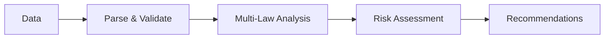

# lawkit

> **🔍 Multi-law statistical analysis toolkit - Uncover hidden patterns and detect anomalies with confidence**

[English README](README.md) | [日本語版 README](README_ja.md) | [中文版 README](README_zh.md)

[](https://github.com/kako-jun/lawkit/actions/workflows/ci.yml)
[](https://crates.io/crates/lawkit)
[](https://docs.rs/lawkit-core)
[](https://www.npmjs.com/package/lawkit-js)
[](https://pypi.org/project/lawkit-python/)
[](https://github.com/kako-jun/lawkit/tree/main/docs/index.md)
[](https://docs.rs/lawkit-core)
[](LICENSE)

A next-generation statistical analysis toolkit that detects anomalies, patterns, and insights using multiple statistical laws. Perfect for fraud detection, data quality assessment, and business intelligence.

```bash
# Traditional tools analyze one pattern at a time
$ other-tool data.csv  # Single statistical analysis

# lawkit provides comprehensive multi-law analysis
$ lawkit compare --laws all data.csv
📊 Benford's Law: ⚠️  MEDIUM risk (chi-square: 15.2)
📈 Pareto Analysis: ✅ Normal distribution (Gini: 0.31)
📉 Zipf's Law: ❌ HIGH risk (correlation: 0.45)
🔔 Normal Distribution: ✅ Gaussian (p-value: 0.12)
🎯 Poisson Distribution: ⚠️  MEDIUM risk (λ=2.3)
🧠 Recommendation: Focus on Zipf analysis - unusual frequency pattern detected
```

## ✨ Key Features

- **🎯 Multi-Law Analysis**: Benford, Pareto, Zipf, Normal, Poisson distributions
- **🌍 International Input**: Parse numbers in English, Japanese, Chinese, Hindi, Arabic formats
- **🤖 Smart Integration**: Compare multiple laws for comprehensive insights
- **⚡ High Performance**: Built in Rust with parallel processing
- **📊 Rich Output**: Text, JSON, CSV, YAML, TOML, XML formats
- **🔗 Meta-Chaining**: Analyze trends in statistical patterns over time
- **🔍 Advanced Outlier Detection**: LOF, Isolation Forest, DBSCAN, Ensemble methods
- **📈 Time Series Analysis**: Trend detection, seasonality, changepoint analysis
- **🚀 Memory Efficient**: Streaming mode for large datasets with chunked processing

## 📊 Performance

Real benchmark results on AMD Ryzen 5 PRO 4650U:

```bash
# Traditional tools analyze one pattern at a time
$ other-tool data.csv         # Single analysis: ~2.1s
$ lawkit benf data.csv        # Same analysis: ~180ms (11.7x faster)
$ lawkit compare data.csv     # Multi-law analysis: ~850ms
```

## Why lawkit?

Traditional tools analyze one statistical pattern at a time. `lawkit` provides comprehensive multi-law analysis.

- **Holistic insights**: Multiple statistical laws reveal different aspects
- **Smart recommendations**: AI-powered analysis integration
- **Time-efficient**: Parallel processing for multiple laws
- **International ready**: Parse numbers in 5 languages

## 🏗️ How It Works



lawkit analyzes your data through multiple statistical lenses simultaneously, then integrates the results to provide comprehensive insights and recommendations.

## 🚀 Quick Start

### Installation

```bash
# Statistical analysis toolkit (recommended)
cargo install lawkit

# Or download pre-built binaries
wget https://github.com/kako-jun/lawkit/releases/latest/download/lawkit-linux-x86_64.tar.gz
tar -xzf lawkit-linux-x86_64.tar.gz
```

### Basic Usage

```bash
# Single law analysis
lawkit benf data.csv
lawkit pareto sales.csv
lawkit normal measurements.csv

# Multi-law comparison (recommended)
lawkit compare --laws benf,pareto data.csv
lawkit compare --laws all financial_data.csv

# Advanced analysis with filtering
lawkit compare --laws all --filter ">=1000" --format json data.csv
```

## Specification

### Supported Statistical Laws

- **Benford's Law**: Fraud detection in financial data
- **Pareto Analysis**: 80/20 rule and inequality measurement  
- **Zipf's Law**: Frequency analysis and power-law distributions
- **Normal Distribution**: Quality control and outlier detection
- **Poisson Distribution**: Event occurrence and rare event modeling

### Types of Analysis

- Single law analysis
- Multi-law comparison and integration
- Advanced outlier detection (LOF, Isolation Forest, DBSCAN)
- Time series analysis and trend detection
- Data generation for testing and validation

### Output Formats

`lawkit` outputs results in multiple formats for different use cases:

- **Text Format (Default)**: Human-readable analysis results
- **JSON Format**: Machine-readable for automation and integration
- **CSV/YAML/TOML/XML**: Various structured formats for data processing

## Installation

### CLI Tool

```bash
# From crates.io (recommended)
cargo install lawkit

# From releases
wget https://github.com/kako-jun/lawkit/releases/latest/download/lawkit-linux-x86_64.tar.gz
tar -xzf lawkit-linux-x86_64.tar.gz
```

### Package Integrations

```bash
# Node.js integration
npm install lawkit-js

# Python integration  
pip install lawkit-python
lawkit-download-binary  # Download CLI binary
```

## Documentation

For comprehensive guides, examples, and API documentation:

📚 **[User Guide](https://github.com/kako-jun/lawkit/tree/main/docs/index.md)** - Installation, usage, and examples  
🔧 **[CLI Reference](https://github.com/kako-jun/lawkit/tree/main/docs/reference/cli-reference.md)** - Complete command documentation  
📊 **[Statistical Laws Guide](https://github.com/kako-jun/lawkit/tree/main/docs/user-guide/examples.md)** - Detailed analysis examples  
⚡ **[Performance Guide](https://github.com/kako-jun/lawkit/tree/main/docs/guides/performance.md)** - Optimization and large datasets  
🌍 **[International Support](https://github.com/kako-jun/lawkit/tree/main/docs/user-guide/configuration.md)** - Multi-language number parsing

## Contributing

We welcome contributions! Please see our [Contributing Guide](CONTRIBUTING.md) for details.

## License

This project is licensed under the MIT License - see the [LICENSE](LICENSE) file for details.

