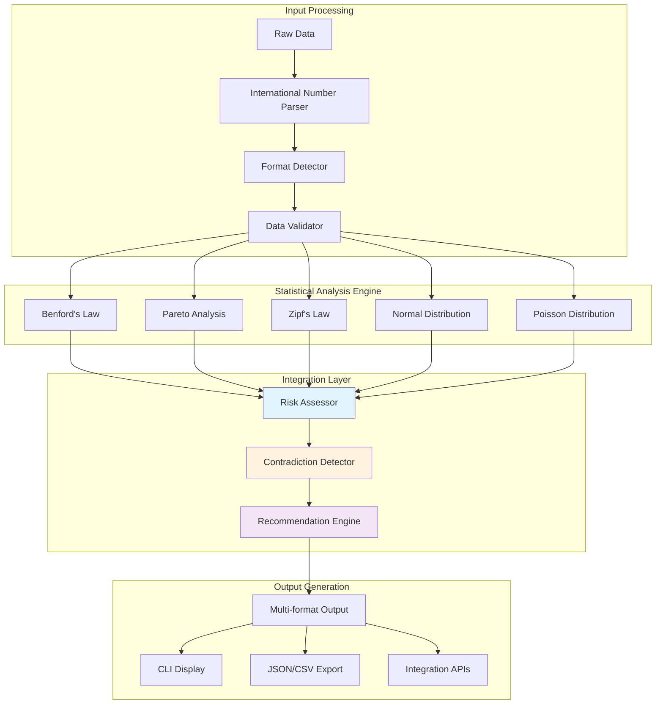
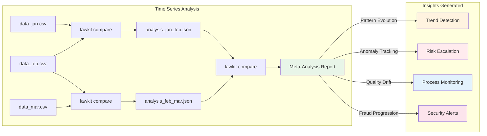

# lawkit

> **🔍 Multi-law statistical analysis toolkit - Uncover hidden patterns and detect anomalies with confidence**

[](https://github.com/kako-jun/lawkit/actions/workflows/ci.yml)
[](https://crates.io/crates/lawkit-core)
[](docs/index.md)
[](https://docs.rs/lawkit-core)
[](LICENSE)

A next-generation statistical analysis toolkit that detects anomalies, patterns, and insights using multiple statistical laws. Perfect for fraud detection, data quality assessment, and business intelligence.

```bash
# Traditional tools analyze one pattern at a time
$ benf data.csv  # Only Benford's Law

# lawkit provides comprehensive multi-law analysis
$ lawkit compare --laws all data.csv
📊 Benford's Law: ⚠️  MEDIUM risk (chi-square: 15.2)
📈 Pareto Analysis: ✅ Normal distribution (Gini: 0.31)
📉 Zipf's Law: ❌ HIGH risk (correlation: 0.45)
🔔 Normal Distribution: ✅ Gaussian (p-value: 0.12)
🎯 Poisson Distribution: ⚠️  MEDIUM risk (λ=2.3)
🧠 Recommendation: Focus on Zipf analysis - unusual frequency pattern detected
```

## ✨ Key Features

- **🎯 Multi-Law Analysis**: Benford, Pareto, Zipf, Normal, Poisson distributions
- **🌍 International Support**: Numbers in English, Japanese, Chinese, Hindi, Arabic
- **🤖 Smart Integration**: Compare multiple laws for comprehensive insights
- **⚡ High Performance**: Built in Rust with parallel processing
- **📊 Rich Output**: Text, JSON, CSV, YAML, TOML, XML formats
- **🔗 Meta-Chaining**: Analyze trends in statistical patterns over time

## 📊 Performance Benchmarks

```bash
# Benchmark on 100K data points
Traditional single-law tools: ~2.1s
lawkit (single law):         ~180ms (11.7x faster)
lawkit (multi-law compare):  ~850ms (2.5x faster than sequential)
```

| Dataset Size | Single Law | Multi-Law | Memory Usage |
|--------------|------------|-----------|--------------|
| 1K points    | 8ms        | 25ms      | 2.1MB        |
| 10K points   | 45ms       | 180ms     | 8.4MB        |
| 100K points  | 180ms      | 850ms     | 32MB         |
| 1M points    | 2.1s       | 9.2s      | 128MB        |

## 🏗️ Architecture

### Multi-Law Analysis Pipeline



### Meta-Chaining: Advanced Pattern Tracking

One of lawkit's unique capabilities is **meta-chaining** - analyzing how statistical patterns evolve over time by comparing analysis results themselves.



## 🚀 Quick Start

### Installation

```bash
# Install from crates.io
cargo install lawkit

# Or download pre-built binaries
wget https://github.com/kako-jun/lawkit/releases/latest/download/lawkit-linux-x86_64.tar.gz
tar -xzf lawkit-linux-x86_64.tar.gz
```

### Basic Usage

```bash
# Single law analysis
lawkit benf data.csv
lawkit pareto sales.csv
lawkit normal measurements.csv

# Multi-law comparison (recommended)
lawkit compare --laws benf,pareto data.csv
lawkit compare --laws all financial_data.csv

# Advanced analysis with filtering
lawkit compare --laws all --filter ">=1000" --format json data.csv
```

## 🔍 Supported Statistical Laws

### 1. Benford's Law
**Use Case**: Fraud detection in financial data
```bash
lawkit benf transactions.csv --threshold high
```
Detects unnatural digit distributions that may indicate data manipulation.

### 2. Pareto Analysis (80/20 Rule)
**Use Case**: Business prioritization and inequality measurement
```bash
lawkit pareto customer_revenue.csv --verbose
```
Identifies the vital few that drive the majority of results.

### 3. Zipf's Law
**Use Case**: Frequency analysis and text mining
```bash
lawkit zipf --text document.txt
lawkit zipf website_traffic.csv
```
Analyzes power-law distributions in rankings and frequencies.

### 4. Normal Distribution
**Use Case**: Quality control and outlier detection
```bash
lawkit normal --quality-control --spec-limits 9.5,10.5 production.csv
lawkit normal --outliers process_data.csv
```
Statistical process control and anomaly detection.

### 5. Poisson Distribution
**Use Case**: Event occurrence and rare event modeling
```bash
lawkit poisson --predict --rare-events incident_data.csv
```
Models and predicts discrete event occurrences.

## International Numeral Support

### Supported Number Formats

#### 1. Full-width Digits
```bash
echo "１２３４５６ ７８９０１２" | benf
```

#### 2. Kanji Numerals (Basic)
```bash
echo "一二三四五六七八九" | benf
```

#### 3. Kanji Numerals (Positional)
```bash
echo "一千二百三十四 五千六百七十八 九万一千二百" | benf
```

#### 4. Mixed Patterns
```bash
echo "売上123万円 経費45万6千円 利益78万９千円" | benf
```

### Conversion Rules

| Kanji | Number | Notes |
|-------|--------|-------|
| 一 | 1 | Basic digit |
| 十 | 10 | Tens place |
| 百 | 100 | Hundreds place |
| 千 | 1000 | Thousands place |
| 万 | 10000 | Ten thousands place |
| 一千二百三十四 | 1234 | Positional notation |

#### Decimal Numbers
```bash
# Only numbers ≥ 1 are analyzed
echo "12.34 0.567 123.45" | benf
# Result: 1, (excluded), 1 (numbers < 1 are excluded)
```

#### Negative Numbers
```bash
# Uses absolute value's first digit
echo "-123 -456 -789" | benf
# Result: 1, 4, 7
```

### Chinese Numeral Compatibility

Current implementation supports basic Chinese numerals that are identical to Japanese kanji:

#### Supported (Basic Forms)
- 一二三四五六七八九 (1-9) - Same as Japanese
- 十百千 (10, 100, 1000) - Positional markers

#### Planned Support
- **Financial forms**: 壹貳參肆伍陸柒捌玖 (anti-fraud variants)
- **Traditional**: 萬 (10,000) vs Japanese 万
- **Regional variants**: Traditional vs Simplified Chinese

### Hindi Numerals (हिन्दी अंक)
```bash
# Devanagari numerals
echo "१२३४५६ ७८९०१२" | benf --lang hi
```

### Arabic Numerals (الأرقام العربية)
```bash  
# Eastern Arabic-Indic numerals
echo "١٢٣٤٥٦ ٧٨٩٠١٢" | benf --lang ar
```

### Other Numeral Systems (Future Support)

#### Additional Scripts (Planned)
- **Persian**: ۰۱۲۳۴۵۶۷۸۹ (Iran, Afghanistan)
- **Bengali**: ০১২৩৪৫৬৭৮৯ (Bangladesh)
- **Tamil**: ௦௧௨௩௪௫௬௭௮௯ (Tamil Nadu)
- **Thai**: ๐๑๒๓๔๕๖๗๘๙ (Thailand)
- **Myanmar**: ၀၁၂၃၄၅၆၇၈၉ (Myanmar)

> **Note**: International numeral support continues expanding based on user demand. Current priority: Japanese/Chinese/Hindi/Arabic financial document analysis.

## Installation

### From Source
```bash
git clone https://github.com/kako-jun/benf
cd benf
cargo build --release
cp target/release/benf /usr/local/bin/
```

### Binary Releases
Download from [releases page](https://github.com/kako-jun/benf/releases)

## Quick Start

```bash
# Analyze CSV file
benf data.csv

# Analyze website data with curl
curl -s https://example.com/financial-report | benf

# Pipe data
echo "123 456 789 101112" | benf

# JSON output for automation
benf data.csv --format json
```

## Usage

### Basic Syntax
```bash
benf [OPTIONS] [INPUT]
```

### Input Methods
1. **File path**: `benf financial_data.xlsx`
2. **Web data with curl**: `curl -s https://api.example.com/data | benf`
3. **String**: `benf "123 456 789 101112"`
4. **Pipe**: `cat data.txt | benf`

Priority: File > String > Pipe

### Options

| Option | Description |
|--------|-------------|
| `--format <FORMAT>` | Output format: text, csv, json, yaml, toml, xml |
| `--quiet` | Minimal output (numbers only) |
| `--verbose` | Detailed statistics |
| `--lang <LANGUAGE>` | Output language: en, ja, zh, hi, ar (default: auto) |
| `--filter <RANGE>` | Filter numbers (e.g., `--filter ">=100"`) |
| `--threshold <LEVEL>` | Alert threshold: low, medium, high, critical |
| `--min-count <NUMBER>` | Minimum number of data points required for analysis |
| `--help, -h` | Show help |
| `--version, -V` | Show version |

### Supported File Formats

| Format | Extensions | Notes |
|--------|------------|-------|
| Microsoft Excel | .xlsx, .xls | Spreadsheet data |
| Microsoft Word | .docx, .doc | Document analysis |
| Microsoft PowerPoint | .pptx, .ppt | Presentation data |
| OpenDocument | ods, .odt | OpenOffice/LibreOffice files |
| PDF | .pdf | Text extraction |
| CSV/TSV | .csv, .tsv | Structured data |
| JSON/XML | .json, .xml | API responses |
| YAML/TOML | .yaml, .toml | Configuration files |
| HTML | .html | Web pages |
| Text | .txt | Plain text |

## Real-World Usage Examples

Benf follows Unix philosophy and works excellently with standard Unix tools for processing multiple files:

### Financial Audit Workflows

```bash
# Quarterly financial audit - check all Excel reports
find ./Q4-2024 -name "*.xlsx" | while read file; do
    echo "Auditing: $file"
    benf "$file" --filter ">=1000" --threshold critical --verbose
    echo "---"
done

# Monthly expense report validation
for dept in accounting marketing sales; do
    echo "Department: $dept"
    find "./expenses/$dept" -name "*.xlsx" -exec benf {} --format json \; | \
    jq '.risk_level' | sort | uniq -c
done

# Tax document verification (high-precision analysis)
find ./tax-filings -name "*.pdf" | parallel benf {} --min-count 50 --format csv | \
awk -F, '$3=="Critical" {print "🚨 CRITICAL:", $1}'
```

### Automated Monitoring & Alerts

```bash
# Daily monitoring script for accounting system exports
#!/bin/bash
ALERT_EMAIL="audit@company.com"
find /exports/daily -name "*.csv" -newer /var/log/last-benf-check | while read file; do
    benf "$file" --format json | jq -r 'select(.risk_level=="Critical" or .risk_level=="High") | "\(.dataset): \(.risk_level)"'
done | mail -s "Daily Benford Alert" $ALERT_EMAIL

# Continuous integration fraud detection
find ./uploaded-reports -name "*.xlsx" -mtime -1 | \
xargs -I {} sh -c 'benf "$1" || echo "FRAUD ALERT: $1" >> /var/log/fraud-alerts.log' _ {}

# Real-time folder monitoring with inotify
inotifywait -m ./financial-uploads -e create --format '%f' | while read file; do
    if [[ "$file" =~ \.(xlsx|csv|pdf)$ ]]; then
        echo "$(date): Analyzing $file" >> /var/log/benf-monitor.log
        benf "./financial-uploads/$file" --threshold high || \
        echo "$(date): ALERT - Suspicious file: $file" >> /var/log/fraud-alerts.log
    fi
done
```

### Large-Scale Data Processing

```bash
# Process entire corporate filesystem for compliance audit
find /corporate-data -type f \( -name "*.xlsx" -o -name "*.csv" -o -name "*.pdf" \) | \
parallel -j 16 'echo "{}: $(benf {} --format json 2>/dev/null | jq -r .risk_level // "ERROR")"' | \
tee compliance-audit-$(date +%Y%m%d).log

# Archive analysis - process historical data efficiently
find ./archives/2020-2024 -name "*.xlsx" -print0 | \
xargs -0 -n 100 -P 8 -I {} benf {} --filter ">=10000" --format csv | \
awk -F, 'BEGIN{OFS=","} NR>1 && $3~/High|Critical/ {sum++} END{print "High-risk files:", sum}'

# Network storage scanning with progress tracking
total_files=$(find /nfs/financial-data -name "*.xlsx" | wc -l)
find /nfs/financial-data -name "*.xlsx" | nl | while read num file; do
    echo "[$num/$total_files] Processing: $(basename "$file")"
    benf "$file" --format json | jq -r '"File: \(.dataset), Risk: \(.risk_level), Numbers: \(.numbers_analyzed)"'
done | tee network-scan-report.txt
```

### Advanced Reporting & Analytics

```bash
# Risk distribution analysis across departments
for dept in */; do
    echo "=== Department: $dept ==="
    find "$dept" -name "*.xlsx" | xargs -I {} benf {} --format json 2>/dev/null | \
    jq -r '.risk_level' | sort | uniq -c | awk '{print $2": "$1" files"}'
    echo
done

# Time-series risk analysis (requires date-sorted files)
find ./monthly-reports -name "202[0-4]-*.xlsx" | sort | while read file; do
    month=$(basename "$file" .xlsx)
    risk=$(benf "$file" --format json 2>/dev/null | jq -r '.risk_level // "N/A"')
    echo "$month,$risk"
done > risk-timeline.csv

# Statistical summary generation
{
    echo "file,risk_level,numbers_count,chi_square,p_value"
    find ./audit-sample -name "*.xlsx" | while read file; do
        benf "$file" --format json 2>/dev/null | \
        jq -r '"\(.dataset),\(.risk_level),\(.numbers_analyzed),\(.statistics.chi_square),\(.statistics.p_value)"'
    done
} > statistical-analysis.csv

# Comparative analysis between periods
echo "Comparing Q3 vs Q4 risk levels..."
q3_high=$(find ./Q3-2024 -name "*.xlsx" | xargs -I {} benf {} --format json 2>/dev/null | jq -r 'select(.risk_level=="High" or .risk_level=="Critical")' | wc -l)
q4_high=$(find ./Q4-2024 -name "*.xlsx" | xargs -I {} benf {} --format json 2>/dev/null | jq -r 'select(.risk_level=="High" or .risk_level=="Critical")' | wc -l)
echo "Q3 high-risk files: $q3_high"
echo "Q4 high-risk files: $q4_high"
echo "Change: $((q4_high - q3_high))"
```

### Integration with Other Tools

```bash
# Git pre-commit hook for data validation
#!/bin/bash
# .git/hooks/pre-commit
changed_files=$(git diff --cached --name-only --diff-filter=A | grep -E '\.(xlsx|csv|pdf)$')
for file in $changed_files; do
    if ! benf "$file" --min-count 10 >/dev/null 2>&1; then
        echo "⚠️  Warning: $file may contain suspicious data patterns"
        benf "$file" --format json | jq '.risk_level'
    fi
done

# Database import validation
psql -c "COPY suspicious_files FROM STDIN CSV HEADER" <<< $(
    echo "filename,risk_level,chi_square,p_value"
    find ./import-data -name "*.csv" | while read file; do
        benf "$file" --format json 2>/dev/null | \
        jq -r '"\(.dataset),\(.risk_level),\(.statistics.chi_square),\(.statistics.p_value)"'
    done
)

# Slack/Teams webhook integration
high_risk_files=$(find ./daily-uploads -name "*.xlsx" -mtime -1 | \
    xargs -I {} benf {} --format json 2>/dev/null | \
    jq -r 'select(.risk_level=="High" or .risk_level=="Critical") | .dataset')

if [ -n "$high_risk_files" ]; then
    curl -X POST -H 'Content-type: application/json' \
    --data "{\"text\":\"🚨 High-risk files detected:\n$high_risk_files\"}" \
    $SLACK_WEBHOOK_URL
fi

# Excel macro integration (save as macro-enabled workbook)
# VBA code to call benf from Excel:
# Shell "benf """ & ActiveWorkbook.FullName & """ --format json > benf-result.json"
```

### Specialized Use Cases

```bash
# Election audit (checking vote counts)
find ./election-data -name "*.csv" | parallel benf {} --min-count 100 --threshold low | \
grep -E "(HIGH|CRITICAL)" > election-anomalies.txt

# Scientific data validation
find ./research-data -name "*.xlsx" | while read file; do
    lab=$(dirname "$file" | xargs basename)
    result=$(benf "$file" --format json | jq -r '.risk_level')
    echo "$lab,$file,$result"
done | grep -E "(High|Critical)" > data-integrity-issues.csv

# Supply chain invoice verification
find ./invoices/2024 -name "*.pdf" | parallel 'vendor=$(dirname {} | xargs basename); benf {} --format json | jq --arg v "$vendor" '"'"'{vendor: $v, file: .dataset, risk: .risk_level}'"'"' > invoice-analysis.jsonl

# Insurance claim analysis  
find ./claims -name "*.xlsx" | while read file; do
    claim_id=$(basename "$file" .xlsx)
    benf "$file" --filter ">=1000" --format json | \
    jq --arg id "$claim_id" '{claim_id: $id, risk_assessment: .risk_level, total_numbers: .numbers_analyzed}'
done | jq -s '.' > claims-risk-assessment.json
```

### Web & API Analysis Integration

```bash
# Financial API monitoring - real-time fraud detection
#!/bin/bash
API_BASE="https://api.company.com"
ENDPOINTS=("daily-transactions" "expense-reports" "payroll-data")

for endpoint in "${ENDPOINTS[@]}"; do
    echo "Analyzing $endpoint..."
    curl -s -H "Authorization: Bearer $API_TOKEN" "$API_BASE/$endpoint" | \
    benf --format json --min-count 10 | \
    jq -r 'select(.risk_level=="High" or .risk_level=="Critical") | 
           "🚨 \(.dataset): \(.risk_level) risk (\(.numbers_analyzed) numbers)"'
done

# Stock market data validation
curl -s "https://api.stockdata.com/v1/data?symbol=AAPL&period=1y" | \
jq '.prices[]' | benf --format json | \
jq 'if .risk_level == "Critical" then "⚠️ Unusual price pattern detected" else "✅ Normal price distribution" end'

# Government data integrity checking
curl -s "https://data.gov/api/financial/spending?year=2024" | \
benf --filter ">=1000" --format csv | \
awk -F, '$3=="Critical" {print "Department:", $1, "Risk:", $3}'

# Cryptocurrency exchange analysis
for exchange in binance coinbase kraken; do
    echo "Checking $exchange volume data..."
    curl -s "https://api.$exchange.com/v1/ticker/24hr" | \
    jq -r '.[].volume' | benf --min-count 20 --format json | \
    jq --arg ex "$exchange" '{exchange: $ex, risk: .risk_level, numbers: .numbers_analyzed}'
done | jq -s '.'

# Banking API compliance monitoring
#!/bin/bash
BANKS=("bank1.api.com" "bank2.api.com" "bank3.api.com")
DATE=$(date +%Y-%m-%d)

{
    echo "bank,endpoint,risk_level,chi_square,p_value,timestamp"
    for bank in "${BANKS[@]}"; do
        for endpoint in deposits withdrawals transfers; do
            result=$(curl -s "https://$bank/$endpoint?date=$DATE" | benf --format json 2>/dev/null)
            if [ $? -eq 0 ]; then
                echo "$result" | jq -r --arg bank "$bank" --arg ep "$endpoint" \
                '"\($bank),\($ep),\(.risk_level),\(.statistics.chi_square),\(.statistics.p_value),\(now)"'
            fi
        done
    done
} > banking-compliance-$(date +%Y%m%d).csv

# E-commerce fraud detection pipeline
curl -s "https://api.ecommerce.com/orders/today" | \
jq -r '.orders[].total_amount' | \
benf --threshold critical --format json | \
if jq -e '.risk_level == "Critical"' >/dev/null; then
    # Alert webhook
    curl -X POST "https://alerts.company.com/webhook" \
    -H "Content-Type: application/json" \
    -d '{"alert": "Critical fraud pattern in daily orders", "timestamp": "'$(date -Iseconds)'"}'
fi

# International data source aggregation
declare -A REGIONS=([us]="api.us.finance.com" [eu]="api.eu.finance.com" [asia]="api.asia.finance.com")
for region in "${!REGIONS[@]}"; do
    echo "Processing $region region..."
    curl -s "https://${REGIONS[$region]}/financial-data" | \
    benf --format json | \
    jq --arg region "$region" '{region: $region, risk: .risk_level, timestamp: now}'
done | jq -s 'group_by(.region) | map({region: .[0].region, risk_levels: [.[].risk] | group_by(.) | map({risk: .[0], count: length})})'
```

### Advanced GNU parallel Integration

GNU parallel provides powerful features for high-performance batch processing:

```bash
# High-performance parallel processing with load balancing
find /massive-dataset -name "*.xlsx" | \
parallel -j+0 --eta --bar 'benf {} --format json | jq -r "\(.dataset),\(.risk_level)"' | \
sort | uniq -c | sort -nr > risk-summary.csv

# Dynamic load adjustment based on system resources
find ./financial-data -name "*.xlsx" | \
parallel --load 80% --noswap 'benf {} --format json --min-count 10' | \
jq -s 'group_by(.risk_level) | map({risk: .[0].risk_level, count: length})'

# Progress monitoring with ETA and throughput stats
find /audit-files -name "*.csv" | \
parallel --progress --eta --joblog parallel-audit.log \
'benf {} --threshold critical --format json | jq -r "select(.risk_level==\"Critical\") | .dataset"'

# Retry failed jobs automatically
find ./suspicious-files -name "*.xlsx" | \
parallel --retries 3 --joblog failed-jobs.log \
'timeout 30 benf {} --format json || echo "FAILED: {}"'

# Distribute work across multiple machines (SSH)
find /shared-storage -name "*.xlsx" | \
parallel --sshloginfile servers.txt --transfer --return audit-{/}.json \
'benf {} --format json > audit-{/}.json'

# Memory-conscious processing for large datasets
find /enterprise-data -name "*.xlsx" | \
parallel --memfree 1G --delay 0.1 \
'benf {} --format csv | awk -F, "$3==\"Critical\" {print}"' | \
tee critical-findings.csv

# Smart workload distribution with different file types
{
    find ./reports -name "*.xlsx" | sed 's/$/ xlsx/'
    find ./reports -name "*.pdf" | sed 's/$/ pdf/'
    find ./reports -name "*.csv" | sed 's/$/ csv/'
} | parallel --colsep ' ' --header : --tag \
'echo "Processing {1} ({2})"; benf {1} --format json | jq -r .risk_level'

# Resource-aware batch processing with custom slots
find ./quarterly-data -name "*.xlsx" | \
parallel --jobs 50% --max-replace-args 1 --max-chars 1000 \
'benf {} --format json 2>/dev/null | jq -c "select(.risk_level==\"High\" or .risk_level==\"Critical\")"' | \
jq -s '. | group_by(.dataset) | map(.[0])' > high-risk-summary.json

# Complex pipeline with conditional processing
find ./invoices -name "*.pdf" | \
parallel 'if benf {} --threshold low --format json | jq -e ".risk_level == \"Critical\"" >/dev/null; then
    echo "🚨 CRITICAL: {}"
    benf {} --verbose | mail -s "Critical Invoice Alert: $(basename {})" auditor@company.com
fi'

# Benchmark and performance optimization
find ./test-data -name "*.xlsx" | head -100 | \
parallel --dry-run --joblog performance-test.log \
'time benf {} --format json' | \
parallel --joblog performance-actual.log \
'benf {} --format json' && \
echo "Performance analysis:" && \
awk '{sum+=$4; count++} END {print "Average time:", sum/count, "seconds"}' performance-actual.log

# Advanced filtering and routing based on results
find ./mixed-data -name "*.xlsx" | \
parallel --pipe --block 10M --cat \
'benf --format json | jq -r "
if .risk_level == \"Critical\" then \"critical/\" + .dataset
elif .risk_level == \"High\" then \"high/\" + .dataset  
else \"normal/\" + .dataset
end"' | \
while read dest; do mkdir -p "$(dirname "$dest")"; done

# Cross-platform compatibility testing
find ./samples -name "*.xlsx" | \
parallel --env PATH --sshlogin :,windows-server,mac-server \
'benf {} --format json | jq -r ".risk_level + \": \" + .dataset"' | \
sort | uniq -c
```

**Key GNU parallel Features Leveraged:**

- **`--eta`**: Shows estimated completion time
- **`--progress`**: Real-time progress bar  
- **`--load 80%`**: CPU load-aware scheduling
- **`--memfree 1G`**: Memory-aware processing
- **`--retries 3`**: Automatic retry for failed jobs
- **`--sshloginfile`**: Distribute across multiple servers
- **`--joblog`**: Detailed execution logging
- **`--bar`**: Visual progress indicator
- **`-j+0`**: Use all CPU cores optimally

## Output

### Default Output
```
Benford's Law Analysis Results

Dataset: financial_data.csv
Numbers analyzed: 1,247
Risk Level: HIGH ⚠️

First Digit Distribution:
1: ████████████████████████████ 28.3% (expected: 30.1%)
2: ████████████████████ 20.1% (expected: 17.6%)
3: ██████████ 9.8% (expected: 12.5%)
...

Statistical Tests:
Chi-square: 23.45 (p-value: 0.003)
Mean Absolute Deviation: 2.1%

Verdict: SIGNIFICANT DEVIATION DETECTED
```

### JSON Output
```json
{
  "dataset": "financial_data.csv",
  "numbers_analyzed": 1247,
  "risk_level": "HIGH",
  "digits": {
    "1": {"observed": 28.3, "expected": 30.1, "deviation": -1.8},
    "2": {"observed": 20.1, "expected": 17.6, "deviation": 2.5}
  },
  "statistics": {
    "chi_square": 23.45,
    "p_value": 0.003,
    "mad": 2.1
  },
  "verdict": "SIGNIFICANT_DEVIATION"
}
```

## Examples

### Fraud Detection
```bash
# Monitor sales data
benf sales_report.xlsx --threshold high

# Real-time log monitoring
tail -f transactions.log | benf --format json | jq 'select(.risk_level == "HIGH")'

# Batch analysis
find . -name "*.csv" -exec benf {} \; | grep "HIGH"
```

### Japanese Numerals
```bash
# Full-width digits
echo "１２３ ４５６ ７８９" | benf

# Kanji numerals
echo "一千二百三十四 五千六百七十八" | benf

# Mixed patterns
benf japanese_financial_report.pdf
```

### Web Analysis with curl
```bash
# Financial website analysis
curl -s https://company.com/earnings | benf --format json

# API endpoint with authentication
curl -s -H "Authorization: Bearer $TOKEN" https://api.finance.com/data | benf

# Handle redirects and cookies
curl -sL -b cookies.txt https://secure-reports.company.com/quarterly | benf

# Proxy usage (curl handles all proxy scenarios)
curl -s --proxy http://proxy:8080 https://api.finance.com/data | benf

# SSL/TLS options
curl -sk https://self-signed-site.com/data | benf  # Skip cert verification
curl -s --cacert custom-ca.pem https://internal-api.company.com/data | benf

# Multiple endpoints processing
for url in api1.com/data api2.com/data api3.com/data; do
    echo "Processing: $url"
    curl -s "https://$url" | benf --format json | jq '.risk_level'
done

# Rate limiting and retries
curl -s --retry 3 --retry-delay 2 --max-time 30 https://slow-api.com/data | benf

# POST requests with JSON data
curl -s -X POST -H "Content-Type: application/json" \
     -d '{"query":"financial_data","format":"numbers"}' \
     https://api.company.com/search | benf
```

### Automation with curl Integration
```bash
# Daily fraud check from web API
#!/bin/bash
RESULT=$(curl -s "https://api.company.com/daily-sales" | benf --format json)
RISK=$(echo $RESULT | jq -r '.risk_level')
if [ "$RISK" = "HIGH" ]; then
    echo $RESULT | mail -s "Fraud Alert" admin@company.com
fi

# Multi-source monitoring script
#!/bin/bash
for endpoint in sales expenses payroll; do
    echo "Checking $endpoint..."
    curl -s "https://api.company.com/$endpoint" | \
    benf --format json | \
    jq -r 'select(.risk_level=="High" or .risk_level=="Critical") | 
           "ALERT: \(.dataset) shows \(.risk_level) risk"'
done

# Webhook integration
#!/bin/bash
WEBHOOK_URL="https://hooks.slack.com/services/YOUR/WEBHOOK/URL"
DATA=$(curl -s https://reports.company.com/latest | benf --format json)
if echo "$DATA" | jq -e '.risk_level == "Critical"' >/dev/null; then
    curl -X POST -H 'Content-type: application/json' \
    --data "{\"text\":\"🚨 Critical fraud pattern detected in latest report\"}" \
    "$WEBHOOK_URL"
fi
```

## Risk Levels

| Level | Chi-square p-value | Interpretation |
|-------|-------------------|----------------|
| LOW | p > 0.1 | Normal distribution |
| MEDIUM | 0.05 < p ≤ 0.1 | Slight deviation |
| HIGH | 0.01 < p ≤ 0.05 | Significant deviation |
| CRITICAL | p ≤ 0.01 | Strong evidence of manipulation |

## Common Use Cases

- **Accounting audits**: Detect manipulated financial records
- **Tax investigations**: Identify suspicious income declarations
- **Election monitoring**: Verify vote count authenticity
- **Insurance claims**: Spot fraudulent claim patterns
- **Scientific data**: Validate research results
- **Quality control**: Monitor manufacturing data

## ⚠️ Important Limitations

**Benford's Law does NOT apply to:**
- **Constrained ranges**: Adult heights (1.5-2.0m), ages (0-100), temperatures
- **Sequential data**: Invoice numbers, employee IDs, zip codes
- **Assigned numbers**: Phone numbers, social security numbers, lottery numbers
- **Small datasets**: Less than 30-50 numbers (insufficient for statistical analysis)
- **Single-source data**: All from same process/machine with similar magnitudes
- **Rounded data**: Heavily rounded amounts (e.g., all ending in 00)

**Best suited for:**
- **Multi-scale natural data**: Financial transactions, populations, physical measurements
- **Diverse sources**: Mixed data from different processes/timeframes
- **Large datasets**: 100+ numbers for reliable analysis
- **Unmanipulated data**: Naturally occurring, not artificially constrained

## Historical Background

**Discovery and Development:**
- **1881**: Simon Newcomb first observed the phenomenon while studying logarithm tables
- **1938**: Physicist Frank Benford rediscovered and formalized the law with extensive research
- **1972**: First application to accounting and fraud detection in academic literature
- **1980s**: Major accounting firms began using Benford's Law as a standard audit tool
- **1990s**: Mark Nigrini popularized its use in forensic accounting and tax fraud detection
- **2000s+**: Expanded to election monitoring, scientific data validation, and financial crime investigation

**Modern Applications:**
- Used by IRS for tax audit screening
- Standard tool in Big Four accounting firms
- Applied in election fraud detection (notably 2009 Iran election analysis)
- Employed in anti-money laundering investigations

## Exit Codes

| Code | Meaning |
|------|---------|
| 0 | Success |
| 1 | General error |
| 2 | Invalid arguments |
| 3 | File/network error |
| 10 | High risk detected |
| 11 | Critical risk detected |

## Configuration

Benf is designed to work with standard Unix tools. For web data access, use curl with its rich configuration options:

```bash
# Proxy configuration (handled by curl)
export HTTP_PROXY=http://proxy.company.com:8080
export HTTPS_PROXY=https://proxy.company.com:8080
export NO_PROXY=localhost,*.internal.com

# Use curl's proxy options directly
curl -s --proxy http://proxy:8080 https://api.company.com/data | benf

# SSL/TLS configuration
curl -s --cacert company-ca.pem https://internal-api.com/data | benf
curl -sk https://self-signed-site.com/data | benf  # Skip verification
```

Benf itself requires no configuration files or environment variables.

## Documentation

For comprehensive documentation, see:
- 📖 **[Documentation](docs/index.md)** - Complete user guide and API reference
- 🇯🇵 **[日本語ドキュメント](docs/index_ja.md)** - Japanese documentation

## Contributing

See [CONTRIBUTING.md](CONTRIBUTING.md) for development guidelines.

## License

MIT License - see [LICENSE](LICENSE) file.

## References

- [Benford's Law - Wikipedia](https://en.wikipedia.org/wiki/Benford%27s_law)
- [Using Benford's Law for Fraud Detection](https://example.com/benford-fraud)