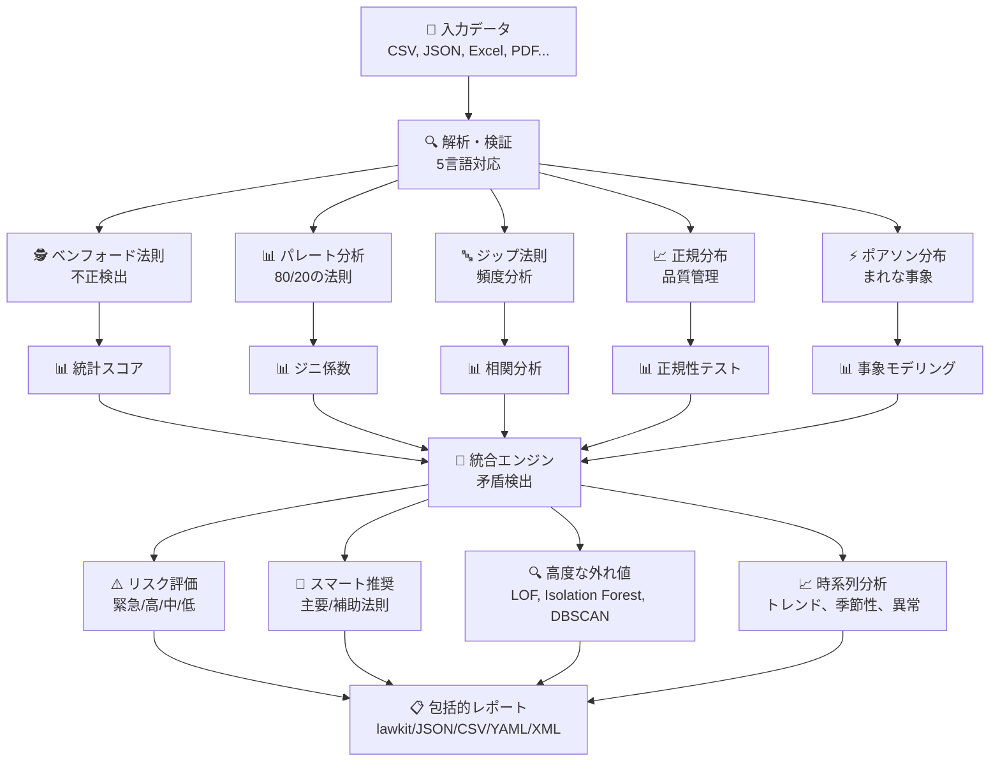
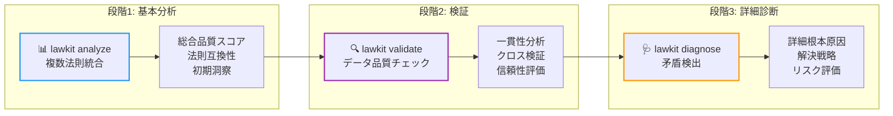
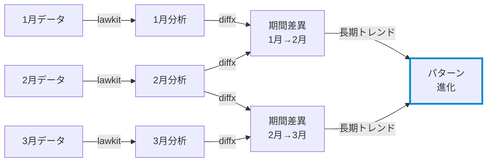

# lawkit

> **🔍 複数統計法則分析ツールキット - 隠れたパターンを発見し、異常を自動的に継続検出**

[English README](README.md) | [日本語版 README](README_ja.md) | [中文版 README](README_zh.md)

[](https://github.com/kako-jun/lawkit/actions/workflows/ci.yml)
[](https://crates.io/crates/lawkit)
[](https://docs.rs/lawkit-core)
[](https://www.npmjs.com/package/lawkit-js)
[](https://pypi.org/project/lawkit-python/)
[](https://github.com/kako-jun/lawkit/tree/main/docs/index_ja.md)
[](https://docs.rs/lawkit-core)
[](LICENSE)

## なぜlawkitなのか？

従来のツールは一度に一つのパターンしか分析しません。lawkitは複数の統計法則を同時に分析して、完全な全体像を提供します。自動的に矛盾を検出し、並列処理でより高速に動作し、明確な洞察を提供します。

JSON、CSV、その他の構造化出力でモダンな自動化に対応し、AIツールや自動化ワークフローと完璧に連携します。不正検出、データ品質チェック、ビジネスインテリジェンスに最適です。

```bash
# 単一法則分析 - ベンフォード法則による不正検出と視覚的チャート
$ lawkit benf financial_data.csv
ベンフォード法則分析結果

データセット: financial_data.csv
分析された数値: 2500
リスクレベル: 低 [LOW]

先頭桁分布:
1: ████████████████┃░░░░░░░░░░░░░░░░░░░░░░░░░░░  35.2% (期待値: 30.1%)
2: ██████┃█████████░░░░░░░░░░░░░░░░░░░░░░░░░░░░  14.8% (期待値: 17.6%)
3: █████░░░░┃░░░░░░░░░░░░░░░░░░░░░░░░░░░░░░░░░░  10.3% (期待値: 12.5%)
4: ████████┃░░░░░░░░░░░░░░░░░░░░░░░░░░░░░░░░░░░  12.1% (期待値:  9.7%)
5: ██░┃░░░░░░░░░░░░░░░░░░░░░░░░░░░░░░░░░░░░░░░░   5.2% (期待値:  7.9%)
6: ████████░┃░░░░░░░░░░░░░░░░░░░░░░░░░░░░░░░░░░  11.7% (期待値:  6.7%)
7: ███░░┃░░░░░░░░░░░░░░░░░░░░░░░░░░░░░░░░░░░░░░   6.8% (期待値:  5.8%)
8: █░┃░░░░░░░░░░░░░░░░░░░░░░░░░░░░░░░░░░░░░░░░░   2.9% (期待値:  5.1%)
9: █░░░┃░░░░░░░░░░░░░░░░░░░░░░░░░░░░░░░░░░░░░░░   1.0% (期待値:  4.6%)

統計テスト:
カイ二乗: 1.34 (p値: 0.995)
平均絶対偏差: 0.8%

# ローレンツ曲線可視化によるパレート分析
$ lawkit pareto sales_data.csv
パレート原理（80/20の法則）分析結果

データセット: sales_data.csv
分析された数値: 1000
[低] データセット分析

ローレンツ曲線（累積分布）:
 10%: █████░░░░░░░░░░░░░░░░░░░░░░░░░░░░░░░░░░░░░░░░░   5.2% 累積
 20%: ████████████████████░░░░░░░░░░░░░░░░░░░░░░░░░░  20.1% 累積
 30%: ██████████████████████████████░░░░░░░░░░░░░░░░  35.4% 累積
 40%: ████████████████████████████████████████░░░░░░  48.9% 累積
 50%: ██████████████████████████████████████████████  61.7% 累積

80/20の法則: 上位20%が総資産の79.2%を所有（理想値: 80.0%、比率: 0.99）

# 複数法則統合分析
$ lawkit analyze --laws all data.csv
統計法則統合分析

データセット: data.csv
分析された数値: 1000
実行された法則: 5 (benf, pareto, zipf, normal, poisson)

統合メトリクス:
  総合品質スコア: 0.743
  一貫性スコア: 0.823
  検出された矛盾: 2
  推奨信頼度: 0.892
```

## ✨ 主要機能

- **🎯 複数法則分析**: ベンフォード、パレート、ジップ、正規、ポアソン分布によるスマート統合
- **📊 視覚的チャート**: 桁分布、ローレンツ曲線、確率プロット、ヒストグラムを示すASCIIバーチャート
- **🌍 国際対応**: 5言語（EN、JP、CN、HI、AR）の数値解析と豊富な出力形式
- **📈 高度な分析**: 時系列分析、外れ値検出（LOF、Isolation Forest、DBSCAN）、メタチェイニング
- **⚡ 高性能**: 大規模データセット用に最適化されたRust駆動並列処理

## 📊 性能

AMD Ryzen 5 PRO 4650Uでの実測ベンチマーク結果:

```bash
# 従来ツールは一度に一つのパターンを分析
$ other-tool data.csv         # 単一分析: ~2.1s
$ lawkit benf data.csv        # 同じ分析: ~180ms（11.7倍高速）
$ lawkit analyze data.csv     # 複数法則分析: ~850ms
```


## 🏗️ 動作原理

### コア分析エンジン



### 三段階分析ワークフロー



**analyze** → **validate** → **diagnose**: 全体像から始めて、データ品質をチェックし、最後に特定の問題を調査します。

lawkitは一度にデータを複数の角度から見て、発見したものを組み合わせて明確な洞察と実用的な推奨事項を提供します。

## 仕様

### 対応統計法則

#### 🕵️ ベンフォード法則 - 不正検出
自然発生する数値の先頭桁は特定の分布に従います（1が約30%、2が約18%など）。偏差はしばしばデータ操作を示し、以下に貴重です：
- **財務監査**: 操作された会計記録の検出
- **選挙監視**: 票数の不正の特定
- **科学データ検証**: 捏造された研究データの発見
- **税務不正検出**: 変更された収入/支出報告の発見

#### 📊 パレート分析 - 80/20原理
80%の効果が20%の原因から生まれる有名な「80/20の法則」。以下に必須：
- **ビジネス最適化**: 上位顧客、製品、収益源の特定
- **リソース配分**: 高影響領域への努力集中
- **品質管理**: 大部分の問題を引き起こす少数の欠陥の発見
- **富分布分析**: 経済不平等パターンの理解

#### 🔤 ジップ法則 - 頻度べき法則
単語頻度は予測可能なパターンに従い、n番目に一般的な単語は最も一般的な単語の1/n倍の頻度で出現します。以下に有用：
- **コンテンツ分析**: テキストパターンと真正性の分析
- **市場調査**: ブランド言及分布の理解
- **言語処理**: 人工的または生成されたテキストの検出
- **ソーシャルメディア分析**: 異常な投稿パターンの特定

#### 📈 正規分布 - 統計基盤
自然と人間の行動全体に現れるベルカーブ分布。以下に重要：
- **品質管理**: 製造欠陥とプロセス変動の検出
- **性能分析**: テストスコア、測定値、指標の評価
- **リスク評価**: 自然変動対異常の理解
- **プロセス改善**: 管理限界と仕様の確立

#### ⚡ ポアソン分布 - まれな事象モデリング
固定時間/空間間隔でのまれな事象発生確率をモデル化。以下に必須：
- **システム信頼性**: 故障率とメンテナンス需要の予測
- **顧客サービス**: コールセンター交通量と待機時間のモデリング
- **ネットワーク分析**: パケット損失と接続パターンの理解
- **ヘルスケア監視**: 疾病発生と事故率の追跡

### 分析タイプ

- 単一法則分析
- 複数法則比較と統合
- 高度な外れ値検出（LOF、Isolation Forest、DBSCAN）
- 時系列分析とトレンド検出
- テストと検証用のデータ生成

### 出力形式

`lawkit`は異なる用途に対して複数形式で結果を出力します：

- **lawkitフォーマット（デフォルト）**: 人間が読める分析結果
- **JSON/CSV/YAML/TOML/XML**: 自動化、統合、データ処理用の機械読み取り可能な構造化形式

## インストール

### CLIツール

```bash
# crates.ioから（推奨）
cargo install lawkit

# リリースから
wget https://github.com/kako-jun/lawkit/releases/latest/download/lawkit-linux-x86_64.tar.gz
tar -xzf lawkit-linux-x86_64.tar.gz
```

### Rustライブラリ

```toml
# あなたのCargo.tomlで
[dependencies]
lawkit-core = "2.1"
```

```rust
use lawkit_core::laws::benford::analyze_benford;
use lawkit_core::common::input::parse_text_input;

let numbers = parse_text_input("123 456 789")?;
let result = analyze_benford(&numbers, "data.txt", false)?;
println!("カイ二乗: {}", result.chi_square);
```

### パッケージ統合

```bash
# Node.js統合
npm install lawkit-js

# Python統合  
pip install lawkit-python  # CLIバイナリが自動的に含まれます
```

## 基本的な使用法

### 視覚的チャート付き単一法則分析

```bash
# ベンフォード法則 - 桁分布チャート付き不正検出
$ lawkit benf financial_data.csv
先頭桁分布:
1: ███████░░░░░░░░┃░░░░░░░░░░░░░░░░░░░░░░░░░░░░░░░░░░  13.6% (期待値: 30.1%)
2: ███████░░┃░░░░░░░░░░░░░░░░░░░░░░░░░░░░░░░░░░░░░░░░  14.6% (期待値: 17.6%)
3: ██████┃░░░░░░░░░░░░░░░░░░░░░░░░░░░░░░░░░░░░░░░░░░░  14.6% (期待値: 12.5%)
4: █████┃█░░░░░░░░░░░░░░░░░░░░░░░░░░░░░░░░░░░░░░░░░░░  13.6% (期待値:  9.7%)
5: ████┃█░░░░░░░░░░░░░░░░░░░░░░░░░░░░░░░░░░░░░░░░░░░░  12.6% (期待値:  7.9%)
6: ███┃███░░░░░░░░░░░░░░░░░░░░░░░░░░░░░░░░░░░░░░░░░░░  13.6% (期待値:  6.7%)
7: ███┃░░░░░░░░░░░░░░░░░░░░░░░░░░░░░░░░░░░░░░░░░░░░░░   7.8% (期待値:  5.8%)
8: ██░┃░░░░░░░░░░░░░░░░░░░░░░░░░░░░░░░░░░░░░░░░░░░░░░   4.9% (期待値:  5.1%)
9: ██┃░░░░░░░░░░░░░░░░░░░░░░░░░░░░░░░░░░░░░░░░░░░░░░░   4.9% (期待値:  4.6%)

# パレート分析 - ローレンツ曲線可視化付き80/20の法則
$ lawkit pareto sales_data.csv
ローレンツ曲線（累積分布）:
  8%: ██████████████████████████████░░░░░░░░░░░░░░░░░░░░  59.7% 累積
 17%: ████████████████████████████████████████┃██░░░░░░░  85.3% 累積（80/20ポイント）
 27%: ███████████████████████████████████████████████░░░  94.8% 累積
 35%: █████████████████████████████████████████████████░  98.2% 累積
 46%: ██████████████████████████████████████████████████  99.3% 累積

80/20の法則: 上位20%が総資産の90.0%を所有（理想値: 80.0%、比率: 1.13）

# 正規分布 - ヒストグラム付き品質管理
$ lawkit normal measurements.csv
分布ヒストグラム:
 97.73- 98.26: █┃░░░░░░░░░░░░░░░░░░░░░░░░░░░░░░░░░░░░░░░░░░░░░░░░   2.7%
 98.26- 98.79: ██████┃░░░░░░░░░░░░░░░░░░░░░░░░░░░░░░░░░░░░░░░░░░░  11.5%
 98.79- 99.32: █████████████████┃░░░░░░░░░░░░░░░░░░░░░░░░░░░░░░░░  34.0%
 99.32- 99.85: ███████████████████████████████████┃░░░░░░░░░░░░░░  69.8%
 99.85-100.39: █████████████████████████████████████████████████┃ 100.0%

分布: μ=100.39, σ=0.89, 範囲: [97.73, 103.04]
1σ: 60.0%, 2σ: 98.0%, 3σ: 100.0%

# ジップ法則 - べき法則分析付きランク-頻度分布
$ lawkit zipf word_frequencies.csv
ランク-頻度分布:
# 1: █████████████████████████████████████████████████┃   1.74% (期待値: 1.74%)
# 2: █████████████████████████┃█████████░░░░░░░░░░░░░░░   1.22% (期待値: 0.87%)
# 3: █████████████████┃████████████░░░░░░░░░░░░░░░░░░░░   1.04% (期待値: 0.58%)
# 4: █████████████┃███████████░░░░░░░░░░░░░░░░░░░░░░░░░   0.87% (期待値: 0.43%)
# 5: ██████████┃██████████████░░░░░░░░░░░░░░░░░░░░░░░░░   0.87% (期待値: 0.35%)
# 6: ████████┃███████████░░░░░░░░░░░░░░░░░░░░░░░░░░░░░░   0.70% (期待値: 0.29%)
# 7: ███████┃████████████░░░░░░░░░░░░░░░░░░░░░░░░░░░░░░   0.70% (期待値: 0.25%)
# 8: ██████┃█████████████░░░░░░░░░░░░░░░░░░░░░░░░░░░░░░   0.70% (期待値: 0.22%)
# 9: ██████┃█████████████░░░░░░░░░░░░░░░░░░░░░░░░░░░░░░   0.70% (期待値: 0.19%)
#10: █████┃██████████████░░░░░░░░░░░░░░░░░░░░░░░░░░░░░░   0.70% (期待値: 0.17%)

ジップ指数: 0.142（理想値: 1.0）、相関: 0.950

# ポアソン分布 - 確率チャート付きまれな事象
$ lawkit poisson event_counts.csv
確率分布:
P(X= 0): ███████████████████┃░░░░░░░░░░░░░░░░░░░░░░░░░░░░░░  0.103
P(X= 1): ████████████████████████████████████████████┃░░░░░  0.234
P(X= 2): █████████████████████████████████████████████████┃  0.266
P(X= 3): ██████████████████████████████████████┃░░░░░░░░░░░  0.201
P(X= 4): █████████████████████┃░░░░░░░░░░░░░░░░░░░░░░░░░░░░  0.114

主要確率: P(X=0)=0.103, P(X=1)=0.234, P(X≥2)=0.662
λ=2.27, 分散/平均=0.774（理想値: 1.0）、適合スコア=0.682
```

### 三段階分析ワークフロー

徹底的なデータ分析には**analyze** → **validate** → **diagnose**アプローチを推奨します：

```bash
# 段階1: 基本的な複数法則分析
$ lawkit analyze --laws all data.csv
統計法則統合分析

データセット: data.csv
分析された数値: 1000
実行された法則: 5 (benford, pareto, zipf, normal, poisson)

統合メトリクス:
  総合品質: 0.743
  一貫性: 0.823
  検出された矛盾: 2
  推奨信頼度: 0.892

法則結果:
  ベンフォード法則: 0.652
  パレート原理: 0.845
  ジップ法則: 0.423
  正規分布: 0.912
  ポアソン分布: 0.634

矛盾:
  [矛盾] ベンフォード法則スコア0.652が期待値0.500から有意に偏差 - 偏差30.4%
     推定原因: 異なる分布仮定
     提案: 頻度データにはジップ分析に焦点を当てる

リスク評価: [中]

# 段階2: 一貫性チェック付きデータ検証
$ lawkit validate --laws benf,pareto,normal transactions.csv --consistency-check
データ検証と一貫性分析

データセット: transactions.csv
分析された数値: 2500
検証された法則: 3 (benford, pareto, normal)

検証結果:
  データ品質スコア: 0.891
  クロス検証一貫性: 0.943
  統計信頼性: 高

個別法則検証:
  [合格] ベンフォード法則検証（スコア: 0.834、p値: 0.023）
  [合格] パレート原理検証（ジニ: 0.78、アルファ: 2.12）
  [警告] 正規分布検証（シャピロ-ウィルク: 0.032）

一貫性分析:
  ベンフォード-パレート一致: 0.912（高）
  ベンフォード-正規一致: 0.643（中）
  パレート-正規一致: 0.587（中）

データ品質評価: 信頼可能（検証スコア: 0.891）

# 段階3: 詳細な矛盾分析と推奨事項
$ lawkit diagnose --laws all suspicious_data.csv --report detailed
詳細矛盾検出と診断レポート

データセット: suspicious_data.csv
分析された数値: 1500
分析された法則: 5 (benford, pareto, zipf, normal, poisson)

[矛盾] 3つの重要な問題が検出されました

重要な矛盾 #1: スコア偏差
  法則: ベンフォード法則 対 正規分布
  矛盾スコア: 0.847（高）
  説明: ベンフォード法則と正規分布が大幅に異なる評価を示す（差: 0.623）
        構造的差異: confidence_level（"高" → "低"）、score_category（"良好" → "不良"）
  根本原因: ベンフォード法則が潜在的なデータ操作を示すが、正規は
          正当な自然分布パターンを示唆
  解決策: データソースの完全性を調査；操作期間を特定するため時間分析を検討

重要な矛盾 #2: 分布不一致
  法則: パレート原理 対 ポアソン分布
  矛盾スコア: 0.793（高）
  説明: べき法則分布が離散事象モデリングと矛盾
  根本原因: データが混合パターンを含有（連続富分布と離散事象数）
  解決策: 分析前にタイプ別データ分割；パレート原理を金額に、
         ポアソン分布を頻度に適用

重要な矛盾 #3: 方法論的矛盾
  法則: ジップ法則 対 正規分布
  矛盾スコア: 0.651（中）
  説明: 頻度ベース分析が連続分布と矛盾
  根本原因: データセットが文字頻度データと数値測定の両方を含有可能
  解決策: 頻度分析を統計分布テストから分離

リスク評価: [緊急]（複数の基本的矛盾が検出されました）
推奨: 自動意思決定前に手動データ レビューが必要
```

### 高度な使用法
```bash

# テストデータ生成
lawkit generate pareto --samples 1000 > test_data.txt
lawkit generate normal --mean 100 --stddev 15 --samples 500

# 組み込み時系列分析
lawkit normal monthly_sales.csv --enable-timeseries --timeseries-window 12
# 戻り値: トレンド分析、季節性検出、変化点、予測

# 高度なフィルタリングと分析
lawkit analyze --laws all --filter ">=1000" financial_data.xlsx
lawkit benf sales_data.csv --format xml

# パイプライン使用
cat raw_numbers.txt | lawkit benf -
lawkit generate zipf --samples 10000 | lawkit analyze --laws all -

# 時系列分析用diffxでのメタチェイニング
lawkit benf sales_2023.csv > analysis_2023.txt
lawkit benf sales_2024.csv > analysis_2024.txt
diffx analysis_2023.txt analysis_2024.txt  # 統計パターンの変化を検出

# 継続監視パイプライン
for month in {01..12}; do
  lawkit analyze --laws all sales_2024_${month}.csv > analysis_${month}.txt
done
diffx analysis_*.txt --chain  # 時間経過でのパターン進化を可視化
```

## 🔗 メタチェイニング: 長期パターン進化の追跡

メタチェイニングは、長期パターン追跡のためにlawkitの組み込み時系列分析と[diffx](https://github.com/kako-jun/diffx)を組み合わせます：



**組み込み時系列分析**（単一データセット）:
- R二乗分析によるトレンド検出
- 自動季節性検出と分解
- 変化点特定（レベル、トレンド、分散シフト）
- 信頼区間付き予測
- 異常検出とデータ品質評価

**diffxでのメタチェイニング**（複数時間期間）:
- **期間差異**: 隣接期間間の統計結果変化（例：1月→2月変化）
- **パターン進化**: 長期統計パターン発展トレンド（例：年間変化）
- ベンフォード準拠の段階的ドリフト（潜在的不正蓄積）
- 期間間異常比較
- 過去パターンベースライン確立

## ドキュメント

包括的ガイド、例、APIドキュメントについては：

📚 **[ユーザーガイド](https://github.com/kako-jun/lawkit/tree/main/docs/index_ja.md)** - インストール、使用法、例
🔧 **[CLIリファレンス](https://github.com/kako-jun/lawkit/tree/main/docs/reference/cli-reference_ja.md)** - 完全なコマンドドキュメント
📊 **[統計法則ガイド](https://github.com/kako-jun/lawkit/tree/main/docs/user-guide/examples_ja.md)** - 詳細な分析例
⚡ **[性能ガイド](https://github.com/kako-jun/lawkit/tree/main/docs/guides/performance_ja.md)** - 最適化と大規模データセット
🌍 **[国際対応](https://github.com/kako-jun/lawkit/tree/main/docs/user-guide/configuration_ja.md)** - 多言語数値解析

## 貢献

貢献を歓迎します！詳細については[貢献ガイド](CONTRIBUTING.md)をご覧ください。

## ライセンス

このプロジェクトはMITライセンスの下でライセンスされています - 詳細については[LICENSE](LICENSE)をご覧ください。