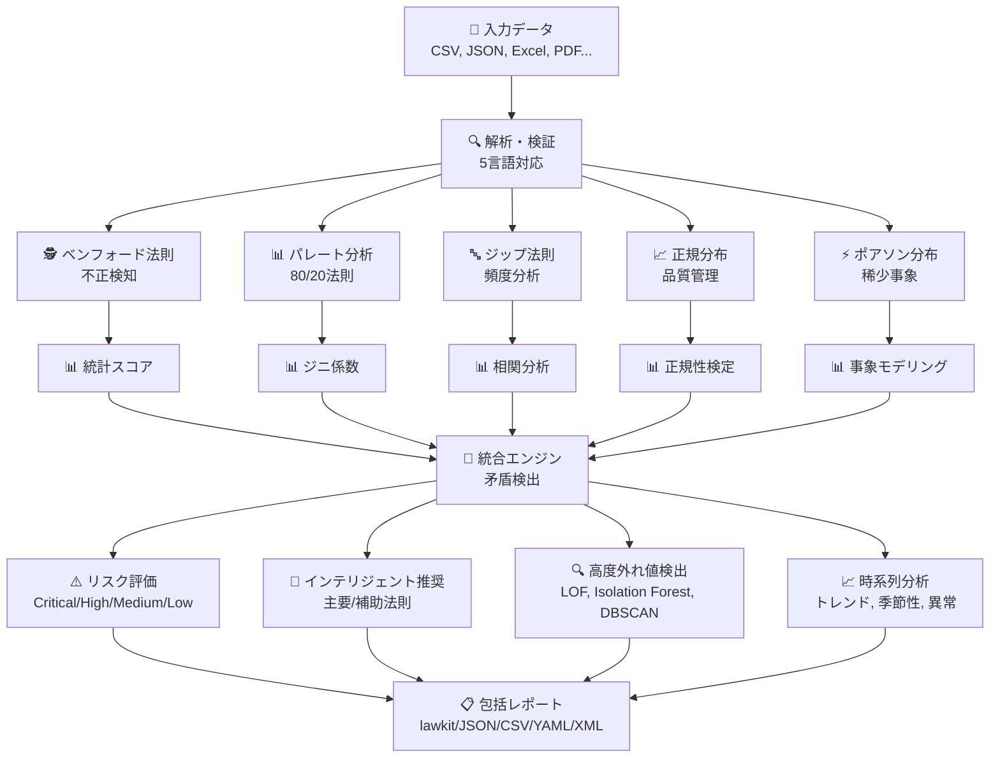
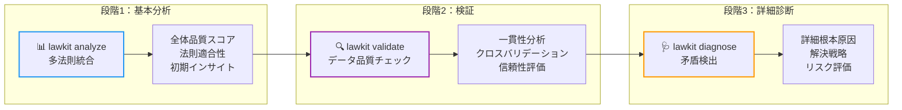
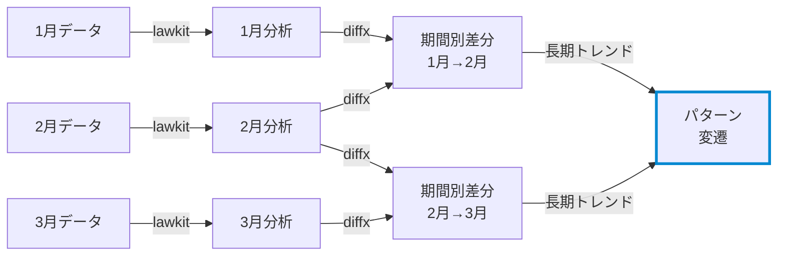

# lawkit

> **🔍 多法則統計分析ツールキット - 隠れたパターンを発見し、継続的に異常を自動検知**

[English README](README.md) | [日本語版 README](README_ja.md) | [中文版 README](README_zh.md)

[](https://github.com/kako-jun/lawkit/actions/workflows/ci.yml)
[](https://crates.io/crates/lawkit)
[](https://docs.rs/lawkit-core)
[](https://www.npmjs.com/package/lawkit-js)
[](https://pypi.org/project/lawkit-python/)
[](https://github.com/kako-jun/lawkit/tree/main/docs/index_ja.md)
[](https://docs.rs/lawkit-core)
[](LICENSE)

## なぜlawkitなのか？

従来ツールは一度に一つのパターンしか分析しません。lawkitは複数の統計法則を同時に分析して全体像を把握できます。矛盾を自動検出し、並列処理で高速動作し、明確な洞察を提供します。

JSON、CSV等の構造化出力で、AIツールや自動化ワークフローと完璧に連携するよう設計されています。不正検知、データ品質チェック、ビジネスインテリジェンスに最適。

```bash
# ビジュアルチャート付きベンフォード法則による不正検知
$ lawkit benf financial_data.csv
Benford Law Analysis Results

Dataset: financial_data.csv
Numbers analyzed: 2500
Risk Level: Low [LOW]

First Digit Distribution:
1: ████████████░░░░░░░░░░░░░░░░░░░░░░░░░░░░░░░░  30.1% (expected: 30.1%)
2: ███████░░░░░░░░░░░░░░░░░░░░░░░░░░░░░░░░░░░░░  17.6% (expected: 17.6%)
3: █████░░░░░░░░░░░░░░░░░░░░░░░░░░░░░░░░░░░░░░░  12.5% (expected: 12.5%)
4: ████░░░░░░░░░░░░░░░░░░░░░░░░░░░░░░░░░░░░░░░░   9.7% (expected:  9.7%)
5: ███░░░░░░░░░░░░░░░░░░░░░░░░░░░░░░░░░░░░░░░░░   7.9% (expected:  7.9%)
6: ███░░░░░░░░░░░░░░░░░░░░░░░░░░░░░░░░░░░░░░░░░   6.7% (expected:  6.7%)
7: ██░░░░░░░░░░░░░░░░░░░░░░░░░░░░░░░░░░░░░░░░░░   5.8% (expected:  5.8%)
8: ██░░░░░░░░░░░░░░░░░░░░░░░░░░░░░░░░░░░░░░░░░░   5.1% (expected:  5.1%)
9: ██░░░░░░░░░░░░░░░░░░░░░░░░░░░░░░░░░░░░░░░░░░   4.6% (expected:  4.6%)

統計検定:
Chi-square: 1.34 (p-value: 0.995)
Mean Absolute Deviation: 0.8%

# ローレンツ曲線可視化によるパレート分析
$ lawkit pareto sales_data.csv
Pareto Principle (80/20 Rule) Analysis Results

Dataset: sales_data.csv
Numbers analyzed: 1000
[LOW] Dataset analysis

Lorenz Curve (Cumulative Distribution):
 10%: █████░░░░░░░░░░░░░░░░░░░░░░░░░░░░░░░░░░░░░░░░░   5.2% cumulative
 20%: ████████████████████░░░░░░░░░░░░░░░░░░░░░░░░░░  20.1% cumulative
 30%: ██████████████████████████████░░░░░░░░░░░░░░░░  35.4% cumulative
 40%: ████████████████████████████████████████░░░░░░  48.9% cumulative
 50%: ██████████████████████████████████████████████  61.7% cumulative

80/20 Rule: Top 20% owns 79.2% of total wealth (Ideal: 80.0%, Ratio: 0.99)

# 多法則統合分析
$ lawkit analyze --laws all data.csv
Statistical Laws Integration Analysis

Dataset: data.csv
Numbers Analyzed: 1000
Laws Executed: 5 (benf, pareto, zipf, normal, poisson)

Integration Metrics:
  Overall Quality Score: 0.743
  Consistency Score: 0.823
  Conflicts Detected: 2
  Recommendation Confidence: 0.892
```

## ✨ 主な機能

- **🎯 多法則分析**: ベンフォード、パレート、ジップ、正規、ポアソン分布のスマート統合
- **📊 ビジュアルチャート**: 数字分布、ローレンツ曲線、確率プロット、ヒストグラムのASCII棒グラフ
- **🌍 国際対応**: 5言語対応数値解析（英日中印亜）と豊富な出力形式
- **📈 高度分析**: 時系列分析、外れ値検出（LOF・Isolation Forest・DBSCAN）、メタチェーン
- **⚡ 高性能**: Rust製並列処理による大規模データセット最適化

## 📊 パフォーマンス

AMD Ryzen 5 PRO 4650Uでの実際のベンチマーク結果：

```bash
# 従来ツールは一度に一つのパターンを分析
$ other-tool data.csv         # 単一分析: ~2.1秒
$ lawkit benf data.csv        # 同じ分析: ~180ms (11.7倍高速)
$ lawkit analyze data.csv     # 多法則分析: ~850ms
```


## 🏗️ 仕組み

### コア分析エンジン



### 3段階分析ワークフロー



**analyze** → **validate** → **diagnose**: まず全体を把握し、データ品質をチェックして、最後に具体的な問題を調査します。

lawkitは複数の角度からデータを同時に分析し、結果をまとめて分かりやすい洞察と実用的な推奨事項を提供します。

## 仕様

### 対応統計法則

#### 🕵️ ベンフォード法則 - 不正検知
自然発生数の最初の桁は特定の分布に従います（1が約30%、2が約18%など）。この分布からの逸脱は多くの場合データ操作を示すため、以下の分野で重要：
- **財務監査**: 操作された会計記録の検出
- **選挙監視**: 投票数の不正な操作の特定
- **科学データ検証**: 偽造された研究データの発見
- **税務不正検知**: 改竄された収入・支出報告の発見

#### 📊 パレート分析 - 80/20の原則
効果の80%が原因の20%から生まれるという有名な「80/20法則」。以下の用途に不可欠：
- **ビジネス最適化**: トップ顧客、製品、収益源の特定
- **リソース配分**: 高インパクトエリアへの努力集中
- **品質管理**: 最も多くの問題を引き起こす少数の欠陥の発見
- **富の分布分析**: 経済格差パターンの理解

#### 🔤 ジップ法則 - 頻度べき法則
単語の頻度は予測可能なパターンに従い、n番目に一般的な単語は最も一般的な単語の1/n倍の頻度で現れます。以下に有用：
- **コンテンツ分析**: テキストパターンと真正性の分析
- **市場調査**: ブランド言及分布の理解
- **言語処理**: 人工的または生成されたテキストの検出
- **ソーシャルメディア分析**: 異常な投稿パターンの特定

#### 📈 正規分布 - 統計の基礎
自然界や人間の行動全体に現れる釣鐘型分布。以下にとって重要：
- **品質管理**: 製造欠陥とプロセス変動の検出
- **パフォーマンス分析**: テストスコア、測定値、メトリクスの評価
- **リスク評価**: 自然変動と異常の理解
- **プロセス改善**: 管理限界と仕様の確立

#### ⚡ ポアソン分布 - 稀少事象モデリング
固定時間・空間間隔における稀少事象の発生確率をモデル化。以下に不可欠：
- **システム信頼性**: 故障率とメンテナンス需要の予測
- **顧客サービス**: コールセンターのトラフィックと待機時間のモデル化
- **ネットワーク分析**: パケット損失と接続パターンの理解
- **ヘルスケア監視**: 疾病アウトブレイクと事故率の追跡

### 分析タイプ

- 単一法則分析
- 多法則比較・統合
- 高度外れ値検出（LOF、Isolation Forest、DBSCAN）
- 時系列分析とトレンド検出
- テスト・検証用データ生成

### 出力形式

`lawkit`は様々な用途に対応した複数形式で結果を出力：

- **lawkit形式（デフォルト）**: 人間が読みやすい分析結果
- **JSON/CSV/YAML/TOML/XML**: 自動化・統合・データ処理用の機械可読構造化形式

## インストール

### CLIツール

```bash
# crates.ioから（推奨）
cargo install lawkit

# リリースから
wget https://github.com/kako-jun/lawkit/releases/latest/download/lawkit-linux-x86_64.tar.gz
tar -xzf lawkit-linux-x86_64.tar.gz
```

### Rustライブラリ

```toml
# Cargo.tomlに記載
[dependencies]
lawkit-core = "2.1"
```

```rust
use lawkit_core::laws::benford::analyze_benford;
use lawkit_core::common::input::parse_text_input;

let numbers = parse_text_input("123 456 789")?;
let result = analyze_benford(&numbers, "data.txt", false)?;
println!("カイ二乗値: {}", result.chi_square);
```

### 他言語用パッケージ

```bash
# Node.js統合
npm install lawkit-js

# Python統合
pip install lawkit-python
lawkit-download-binary  # CLIバイナリをダウンロード (pip installの後に使用可能)
```

## 基本的な使用方法

### ビジュアルチャート付き単一法則分析

```bash
# ベンフォード法則 - 数字分布チャートによる不正検知
$ lawkit benf financial_data.csv
First Digit Distribution:
1: ████████░░░░░░░░░░░░░░░░░░░░░░░░░░░░░░░░  20.0% (expected:  30.1%)
2: █████░░░░░░░░░░░░░░░░░░░░░░░░░░░░░░░░░░░  11.4% (expected:  17.6%)
3: ██░░░░░░░░░░░░░░░░░░░░░░░░░░░░░░░░░░░░░░   5.7% (expected:  12.5%)
4: ██████░░░░░░░░░░░░░░░░░░░░░░░░░░░░░░░░░░  14.3% (expected:   9.7%)
5: ███████░░░░░░░░░░░░░░░░░░░░░░░░░░░░░░░░░  17.1% (expected:   7.9%)
6: █░░░░░░░░░░░░░░░░░░░░░░░░░░░░░░░░░░░░░░░   2.9% (expected:   6.7%)
7: ██████░░░░░░░░░░░░░░░░░░░░░░░░░░░░░░░░░░  14.3% (expected:   5.8%)
8: █████░░░░░░░░░░░░░░░░░░░░░░░░░░░░░░░░░░░  11.4% (expected:   5.1%)
9: █░░░░░░░░░░░░░░░░░░░░░░░░░░░░░░░░░░░░░░░   2.9% (expected:   4.6%)

# パレート分析 - ローレンツ曲線可視化による80/20法則
$ lawkit pareto sales_data.csv
Lorenz Curve (Cumulative Distribution):
  7%: █████████████░░░░░░░░░░░░░░░░░░░░░░░░░░░░░░░░░░░░░  26.0% cumulative
 13%: ███████████████████████░░░░░░░░░░░░░░░░░░░░░░░░░░░  46.9% cumulative
 27%: ████████████████████████████████████░░░░░░░░░░░░░░  72.9% cumulative
 33%: ████████████████████████████████████████░░░░░░░░░░  80.7% cumulative
 47%: █████████████████████████████████████████████░░░░░  89.8% cumulative

80/20 Rule: Top 20% owns 62.5% of total wealth (Ideal: 80.0%, Ratio: 0.78)

# 正規分布 - ヒストグラムによる品質管理
$ lawkit normal measurements.csv
Distribution Histogram:
 71.36- 76.99: █░░░░░░░░░░░░░░░░░░░░░░░░░░░░░░░░░░░░░░░░░░░░░░░░░   2.7%
 76.99- 82.61: ██████░░░░░░░░░░░░░░░░░░░░░░░░░░░░░░░░░░░░░░░░░░░░  11.5%
 82.61- 88.24: █████████████████░░░░░░░░░░░░░░░░░░░░░░░░░░░░░░░░░  34.0%
 88.24- 93.87: ███████████████████████████████████░░░░░░░░░░░░░░░  69.8%
 93.87- 99.50: ██████████████████████████████████████████████████ 100.0%

Distribution: μ=99.50, σ=9.38, Range: [71.36, 127.64]

# ポアソン分布 - 確率チャートによる稀少事象分析
$ lawkit poisson event_counts.csv
Probability Distribution:
P(X= 0): █████████████████████████████░░░░░░░░░░░░░░░░░░░░░  0.180
P(X= 1): ██████████████████████████████████████████████████  0.309
P(X= 2): ███████████████████████████████████████████░░░░░░░  0.265
P(X= 3): ████████████████████████░░░░░░░░░░░░░░░░░░░░░░░░░░  0.151
P(X= 4): ██████████░░░░░░░░░░░░░░░░░░░░░░░░░░░░░░░░░░░░░░░░  0.065

Key Probabilities: P(X=0)=0.180, P(X=1)=0.309, P(X≥2)=0.511
```

### 3段階分析ワークフロー

しっかりとしたデータ分析には **analyze** → **validate** → **diagnose** の順番を推奨します：

```bash
# 段階1：基本的な多法則分析
$ lawkit analyze test_data.txt
Statistical Laws Integration Analysis

Dataset: test_data.txt
Numbers Analyzed: 500
Laws Executed: 4 (benf, pareto, zipf, normal)

Integration Metrics:
  Overall Quality Score: 0.239
  Consistency Score: 0.484
  Conflicts Detected: 10
  Recommendation Confidence: 0.100

Law Results:
  Benford Law: 0.944
  Pareto Principle: -0.868
  Normal Distribution: 0.125
  Zipf Law: 0.813

Conflicts:
  [CONFLICT] Benford Law score 0.944 significantly deviates from expected 0.254 - deviation 272.2%
     Likely Cause: Benford Law may not be compatible with the data pattern
     Suggestion: Please review application conditions and data quality for Benford Law

# 段階2：整合性チェック付きデータ検証
$ lawkit validate --laws benf,pareto,normal test_data.txt --consistency-check
Data Validation and Consistency Check

Dataset: test_data.txt
Threshold: 0.500
Consistency Score: 0.484

[WARNING] Consistency below threshold
Recommendation: Review data quality and collection methods

Statistical Laws Integration Analysis

Dataset: test_data.txt
Numbers Analyzed: 500
Laws Executed: 4 (benf, pareto, zipf, normal)

Integration Metrics:
  Overall Quality Score: 0.239
  Consistency Score: 0.484
  Conflicts Detected: 10
  Recommendation Confidence: 0.100

Law Results:
  Benford Law: 0.944
  Zipf Law: 0.813
  Pareto Principle: -0.868

# 段階3：詳細な矛盾分析と推奨事項
$ lawkit diagnose --laws all test_data.txt --report detailed
Statistical Laws Integration Analysis

Dataset: test_data.txt
Numbers Analyzed: 500
Laws Executed: 4 (benf, pareto, zipf, normal)

Integration Metrics:
  Overall Quality Score: 0.239
  Consistency Score: 0.484
  Conflicts Detected: 10
  Recommendation Confidence: 0.100

Law Results:
  Benford Law: 0.944
  Pareto Principle: -0.868
  Normal Distribution: 0.125
  Zipf Law: 0.813

Conflicts:
  [CONFLICT] Benford Law score 0.944 significantly deviates from expected 0.254 - deviation 272.2%
     Likely Cause: Benford Law may not be compatible with the data pattern
     Suggestion: Please review application conditions and data quality for Benford Law
  [CONFLICT] Law 'normal' score (0.125) significantly deviates from expected (0.254) - deviation: 50.8%
     Likely Cause: Law 'normal' may not be compatible with the data pattern
     Suggestion: Please review application conditions and data quality for law 'normal'
  [CONFLICT] Law 'pareto' score (-0.868) significantly deviates from expected (0.254) - deviation: 442.1%
     Likely Cause: Law 'pareto' may not be compatible with the data pattern
     Suggestion: Please review application conditions and data quality for law 'pareto'
```

### 高度な使用方法
```bash

# テストデータ生成
lawkit generate pareto --samples 1000 > test_data.txt
lawkit generate normal --mean 100 --stddev 15 --samples 500

# 内蔵時系列分析
lawkit normal monthly_sales.csv --enable-timeseries --timeseries-window 12
# 返却値: トレンド分析、季節性検出、変化点、予測

# 高度なフィルタリングと分析
lawkit analyze --laws all --filter ">=1000" financial_data.xlsx
lawkit benf --column "amount" sales_data.csv --format xml

# パイプライン使用
cat raw_numbers.txt | lawkit benf -
lawkit generate zipf --size 10000 | lawkit analyze --laws all -

# diffxによる時系列分析のメタチェーン
lawkit benf sales_2023.csv > analysis_2023.txt
lawkit benf sales_2024.csv > analysis_2024.txt
diffx analysis_2023.txt analysis_2024.txt  # 統計パターンの変化を検出

# 継続的モニタリングパイプライン
for month in {01..12}; do
  lawkit analyze --laws all sales_2024_${month}.csv > analysis_${month}.txt
done
diffx analysis_*.txt --chain  # 時間経過によるパターン進化を可視化
```

## 🔗 メタチェーン：長期パターン変遷の追跡

メタチェーンはlawkitの内蔵時系列分析と[diffx](https://github.com/kako-jun/diffx)を組み合わせた長期パターン追跡：



**内蔵時系列分析** (単一データセット):
- R二乗分析によるトレンド検出
- 自動季節性検出と分解
- 変化点識別（レベル、トレンド、分散変化）
- 信頼区間付き予測
- 異常検出とデータ品質評価

**diffxとのメタチェーン** (複数時期):
- **期間別差分**: 隣接する期間での統計結果の違い（例：1月→2月の変化）
- **パターン変遷**: 長期的な統計パターンの進化傾向（例：年間を通じた変化）
- ベンフォード準拠度の段階的逸脱（不正蓄積可能性）
- 期間を跨いだ異常比較
- 歴史パターンベースライン確立

## ドキュメント

包括的なガイド、サンプル、APIドキュメントについては：

📚 **[ユーザーガイド](https://github.com/kako-jun/lawkit/tree/main/docs/index_ja.md)** - インストール、使用方法、サンプル  
🔧 **[CLIリファレンス](https://github.com/kako-jun/lawkit/tree/main/docs/reference/cli-reference_ja.md)** - 完全なコマンドドキュメント  
📊 **[統計法則ガイド](https://github.com/kako-jun/lawkit/tree/main/docs/user-guide/examples_ja.md)** - 詳細な分析サンプル  
⚡ **[パフォーマンスガイド](https://github.com/kako-jun/lawkit/tree/main/docs/guides/performance_ja.md)** - 最適化と大規模データセット  
🌍 **[国際サポート](https://github.com/kako-jun/lawkit/tree/main/docs/user-guide/configuration_ja.md)** - 多言語数字解析

## 貢献

貢献を歓迎します！詳細は[CONTRIBUTING](CONTRIBUTING.md)を参照してください。

## ライセンス

このプロジェクトはMITライセンスの下でライセンスされています - 詳細は[LICENSE](LICENSE)を参照してください。