# lawkit

> **🔍 多法則統計分析ツールキット - 隠れたパターンを発見し、確信を持って異常を検知**

[English README](README.md) | [日本語版 README](README_ja.md) | [中文版 README](README_zh.md)

[](https://github.com/kako-jun/lawkit/actions/workflows/ci.yml)
[](https://crates.io/crates/lawkit)
[](https://docs.rs/lawkit-core)
[](https://www.npmjs.com/package/lawkit-js)
[](https://pypi.org/project/lawkit-python/)
[](https://github.com/kako-jun/lawkit/tree/main/docs/index_ja.md)
[](https://docs.rs/lawkit-core)
[](LICENSE)

## なぜlawkitなのか？

従来ツールは一度に一つのパターンしか分析しません。lawkitは複数の統計法則を同時に分析して全体像を把握できます。矛盾を自動検出し、並列処理で高速動作し、明確な洞察を提供します。

JSON、CSV等の構造化出力で、AIツールや自動化ワークフローと完璧に連携するよう設計されています。不正検知、データ品質チェック、ビジネスインテリジェンスに最適。

```bash
# 単一法則分析 - ベンフォード法則
$ lawkit benf financial_data.csv
Benford Law Analysis Results

Dataset: financial_data.csv
Numbers analyzed: 2500
Chi-square: 12.834
p-value: 0.117
Attention: PASS

# パレート分布データの生成
$ lawkit generate pareto --size 100 | head -5
4.312
1.827
12.543
2.156
6.789

# 包括的な多法則比較
$ lawkit compare --laws all data.csv
Statistical Laws Integration Analysis

Dataset: data.csv
Numbers analyzed: 1000
Laws executed: 5 (benford, pareto, zipf, normal, poisson)

Integration Metrics:
  Overall Quality: 0.743
  Consistency: 0.823
  Conflicts Detected: 2
  Recommendation Confidence: 0.892

Law Results:
  Benford Law: 0.652
  Pareto Analysis: 0.845
  Zipf Law: 0.423
  Normal Distribution: 0.912
  Poisson Distribution: 0.634

Conflicts:
  ⚠️ Benford and Zipf laws show conflicting patterns
     Cause: Different distribution assumptions
     Suggestion: Focus on Zipf analysis for frequency data

Risk Assessment: MEDIUM (Score: 0.743)
```

## ✨ 主な機能

- **🎯 多法則分析**: ベンフォード、パレート、ジップ、正規、ポアソン分布のスマート統合
- **🌍 国際対応**: 5言語対応数値解析（英日中印亜）と豊富な出力形式
- **📈 高度分析**: 時系列分析、外れ値検出（LOF・Isolation Forest・DBSCAN）、メタチェーン
- **⚡ 高性能**: Rust製並列処理による大規模データセット最適化

## 📊 パフォーマンス

AMD Ryzen 5 PRO 4650Uでの実際のベンチマーク結果：

```bash
# 従来ツールは一度に一つのパターンを分析
$ other-tool data.csv         # 単一分析: ~2.1秒
$ lawkit benf data.csv        # 同じ分析: ~180ms (11.7倍高速)
$ lawkit compare data.csv     # 多法則分析: ~850ms
```


## 🏗️ 仕組み

```mermaid
graph TB
    A[📄 入力データ<br/>CSV, JSON, Excel, PDF...] --> B[🔍 解析・検証<br/>5言語対応]
    
    B --> C1[🕵️ ベンフォード法則<br/>不正検知]
    B --> C2[📊 パレート分析<br/>80/20法則]
    B --> C3[🔤 ジップ法則<br/>頻度分析]
    B --> C4[📈 正規分布<br/>品質管理]
    B --> C5[⚡ ポアソン分布<br/>稀少事象]
    
    C1 --> D1[📊 統計スコア]
    C2 --> D2[📊 ジニ係数]
    C3 --> D3[📊 相関分析]
    C4 --> D4[📊 正規性検定]
    C5 --> D5[📊 事象モデリング]
    
    D1 --> E[🧠 統合エンジン<br/>矛盾検出]
    D2 --> E
    D3 --> E
    D4 --> E
    D5 --> E
    
    E --> F1[⚠️ リスク評価<br/>Critical/High/Medium/Low]
    E --> F2[🎯 インテリジェント推奨<br/>主要/補助法則]
    E --> F3[🔍 高度外れ値検出<br/>LOF, Isolation Forest, DBSCAN]
    E --> F4[📈 時系列分析<br/>トレンド, 季節性, 異常]
    
    F1 --> G[📋 包括レポート<br/>Diffai/JSON/CSV/YAML/XML]
    F2 --> G
    F3 --> G
    F4 --> G
```



lawkitは複数の統計レンズを通してデータを同時に分析し、結果を統合して包括的な洞察と推奨事項を提供します。


## 仕様

### 対応統計法則

#### 🕵️ ベンフォード法則 - 不正検知
自然発生数の最初の桁は特定の分布に従います（1が約30%、2が約18%など）。この分布からの逸脱は多くの場合データ操作を示すため、以下の分野で重要：
- **財務監査**: 操作された会計記録の検出
- **選挙監視**: 投票数の不正な操作の特定
- **科学データ検証**: 偽造された研究データの発見
- **税務不正検知**: 改竄された収入・支出報告の発見

#### 📊 パレート分析 - 80/20の原則
効果の80%が原因の20%から生まれるという有名な「80/20法則」。以下の用途に不可欠：
- **ビジネス最適化**: トップ顧客、製品、収益源の特定
- **リソース配分**: 高インパクトエリアへの努力集中
- **品質管理**: 最も多くの問題を引き起こす少数の欠陥の発見
- **富の分布分析**: 経済格差パターンの理解

#### 🔤 ジップ法則 - 頻度べき法則
単語の頻度は予測可能なパターンに従い、n番目に一般的な単語は最も一般的な単語の1/n倍の頻度で現れます。以下に有用：
- **コンテンツ分析**: テキストパターンと真正性の分析
- **市場調査**: ブランド言及分布の理解
- **言語処理**: 人工的または生成されたテキストの検出
- **ソーシャルメディア分析**: 異常な投稿パターンの特定

#### 📈 正規分布 - 統計の基礎
自然界や人間の行動全体に現れる釣鐘型分布。以下にとって重要：
- **品質管理**: 製造欠陥とプロセス変動の検出
- **パフォーマンス分析**: テストスコア、測定値、メトリクスの評価
- **リスク評価**: 自然変動と異常の理解
- **プロセス改善**: 管理限界と仕様の確立

#### ⚡ ポアソン分布 - 稀少事象モデリング
固定時間・空間間隔における稀少事象の発生確率をモデル化。以下に不可欠：
- **システム信頼性**: 故障率とメンテナンス需要の予測
- **顧客サービス**: コールセンターのトラフィックと待機時間のモデル化
- **ネットワーク分析**: パケット損失と接続パターンの理解
- **ヘルスケア監視**: 疾病アウトブレイクと事故率の追跡

### 分析タイプ

- 単一法則分析
- 多法則比較・統合
- 高度外れ値検出（LOF、Isolation Forest、DBSCAN）
- 時系列分析とトレンド検出
- テスト・検証用データ生成

### 出力形式

`lawkit`は様々な用途に対応した複数形式で結果を出力：

- **Diffai形式（デフォルト）**: 人間が読みやすい分析結果（[diffx](https://github.com/kako-jun/diffx)形式のスーパーセット）
- **JSON/CSV/YAML/TOML/XML**: 自動化・統合・データ処理用の機械可読構造化形式

## インストール

### CLIツール

```bash
# crates.ioから（推奨）
cargo install lawkit

# リリースから
wget https://github.com/kako-jun/lawkit/releases/latest/download/lawkit-linux-x86_64.tar.gz
tar -xzf lawkit-linux-x86_64.tar.gz
```

### Rustライブラリ

```toml
# Cargo.tomlに記載
[dependencies]
lawkit-core = "2.1"
```

```rust
use lawkit_core::laws::benford::analyze_benford;
use lawkit_core::common::input::parse_text_input;

let numbers = parse_text_input("123 456 789")?;
let result = analyze_benford(&numbers, "data.txt", false)?;
println!("カイ二乗値: {}", result.chi_square);
```

### 他言語用パッケージ

```bash
# Node.js統合
npm install lawkit-js

# Python統合
pip install lawkit-python
lawkit-download-binary  # CLIバイナリをダウンロード (pip installの後に使用可能)
```

## 基本的な使用方法

```bash
# 様々な入力形式での単一法則分析
lawkit benf financial_data.csv
lawkit pareto sales_report.json
lawkit zipf word_frequencies.txt
lawkit normal measurements.xlsx
lawkit poisson server_logs.tsv

# 異なる出力形式での多法則比較
lawkit compare --laws all transactions.csv
lawkit compare --laws all inventory.json --format yaml
lawkit compare --laws benf,zipf document.txt --format json

# テストデータ生成
lawkit generate pareto --size 1000 > test_data.txt
lawkit generate normal --mean 100 --std 15 --size 500

# 内蔵時系列分析
lawkit normal monthly_sales.csv --enable-timeseries --timeseries-window 12
# 返却値: トレンド分析、季節性検出、変化点、予測

# 高度なフィルタリングと分析
lawkit compare --laws all --filter ">=1000" financial_data.xlsx
lawkit benf --column "amount" sales_data.csv --format xml

# パイプライン使用
cat raw_numbers.txt | lawkit benf -
lawkit generate zipf --size 10000 | lawkit compare --laws all -

# diffxによる時系列分析のメタチェーン
lawkit benf sales_2023.csv > analysis_2023.txt
lawkit benf sales_2024.csv > analysis_2024.txt
diffx analysis_2023.txt analysis_2024.txt  # 統計パターンの変化を検出

# 継続的モニタリングパイプライン
for month in {01..12}; do
  lawkit compare --laws all sales_2024_${month}.csv > analysis_${month}.txt
done
diffx analysis_*.txt --chain  # 時間経過によるパターン進化を可視化
```

## 🔗 メタチェーン：パターン変遷の追跡

メタチェーンはlawkitの内蔵時系列分析とdiffxを組み合わせた長期パターン追跡：

```mermaid
graph LR
    A[1月データ] -->|lawkit| B[1月分析]
    C[2月データ] -->|lawkit| D[2月分析]
    E[3月データ] -->|lawkit| F[3月分析]
    
    B -->|diffx| G[パターン変化<br/>1月→2月]
    D -->|diffx| G
    D -->|diffx| H[パターン変化<br/>2月→3月]
    F -->|diffx| H
    
    G -->|トレンド| I[パターン<br/>変遷]
    H -->|トレンド| I
    
    style I fill:#e1f5fe,stroke:#0288d1,stroke-width:3px
```



**内蔵時系列分析** (単一データセット):
- R二乗分析によるトレンド検出
- 自動季節性検出と分解
- 変化点識別（レベル、トレンド、分散変化）
- 信頼区間付き予測
- 異常検出とデータ品質評価

**diffxとのメタチェーン** (複数時期):
- ベンフォード準拠度の段階的逸脱（不正蓄積可能性）
- 統計パターンの長期進化
- 期間を跨いだ異常比較
- 歴史パターンベースライン確立

## ドキュメント

包括的なガイド、サンプル、APIドキュメントについては：

📚 **[ユーザーガイド](https://github.com/kako-jun/lawkit/tree/main/docs/index_ja.md)** - インストール、使用方法、サンプル  
🔧 **[CLIリファレンス](https://github.com/kako-jun/lawkit/tree/main/docs/reference/cli-reference_ja.md)** - 完全なコマンドドキュメント  
📊 **[統計法則ガイド](https://github.com/kako-jun/lawkit/tree/main/docs/user-guide/examples_ja.md)** - 詳細な分析サンプル  
⚡ **[パフォーマンスガイド](https://github.com/kako-jun/lawkit/tree/main/docs/guides/performance_ja.md)** - 最適化と大規模データセット  
🌍 **[国際サポート](https://github.com/kako-jun/lawkit/tree/main/docs/user-guide/configuration_ja.md)** - 多言語数字解析

## 貢献

貢献を歓迎します！詳細は[CONTRIBUTING](CONTRIBUTING.md)を参照してください。

## ライセンス

このプロジェクトはMITライセンスの下でライセンスされています - 詳細は[LICENSE](LICENSE)を参照してください。