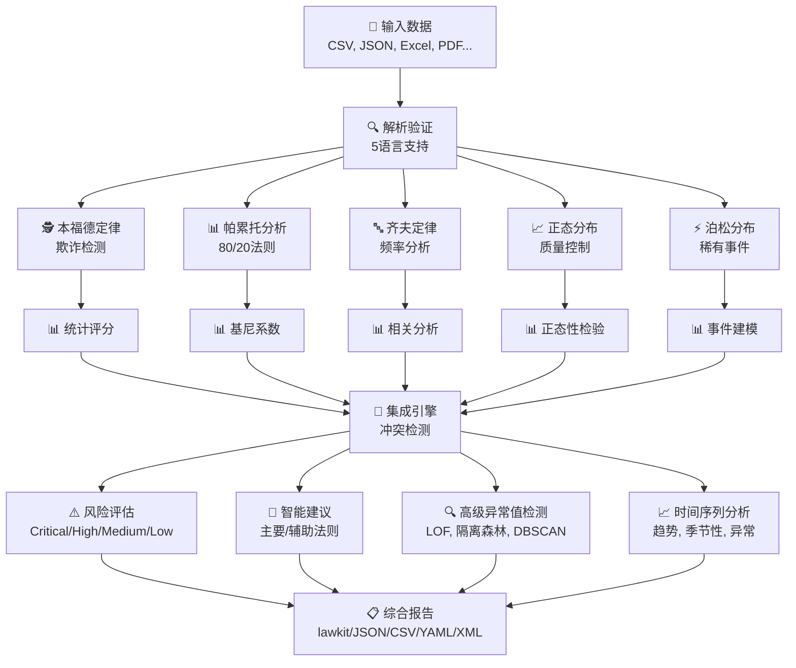
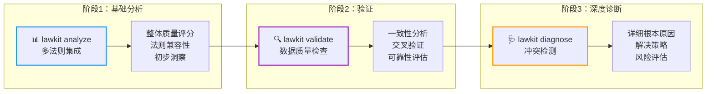
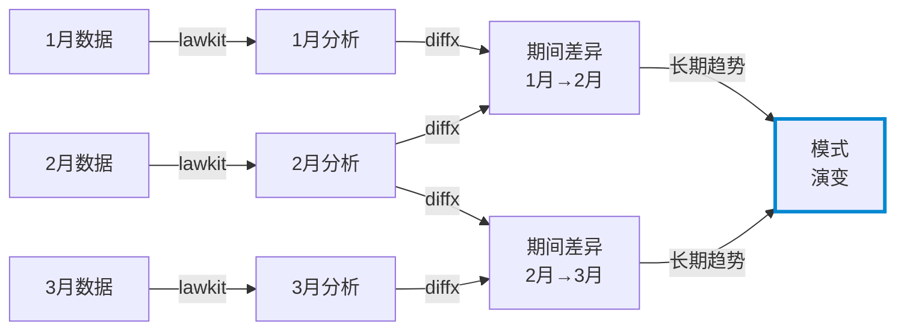

# lawkit

> **🔍 多法则统计分析工具包 - 发现隐藏模式，持续自动检测异常**

[English README](README.md) | [日本語版 README](README_ja.md) | [中文版 README](README_zh.md)

[](https://github.com/kako-jun/lawkit/actions/workflows/ci.yml)
[](https://crates.io/crates/lawkit)
[](https://docs.rs/lawkit-core)
[](https://www.npmjs.com/package/lawkit-js)
[](https://pypi.org/project/lawkit-python/)
[](https://github.com/kako-jun/lawkit/tree/main/docs/index_zh.md)
[](https://docs.rs/lawkit-core)
[](LICENSE)

## 为什么选择lawkit？

传统工具一次只分析一种模式。lawkit同时分析多个统计法则，为您提供完整图像。它自动检测冲突，通过并行处理运行更快，并提供清晰的洞察。

专为现代自动化设计，提供JSON、CSV和其他结构化输出，与AI工具和自动化工作流完美配合。非常适合欺诈检测、数据质量检查和商业智能。

```bash
# 单法则分析 - 本福德定律
$ lawkit benf financial_data.csv
Benford Law Analysis Results

Dataset: financial_data.csv
Numbers analyzed: 2500
LOW: Dataset analysis

# 生成帕累托分布数据
$ lawkit generate pareto --samples 100 | head -5
5.48
1.03
1.04
1.42
1.61

# 全面的多法则比较
$ lawkit analyze --laws all data.csv
Statistical Laws Integration Analysis

Dataset: data.csv
Numbers analyzed: 1000
Laws executed: 5 (benford, pareto, zipf, normal, poisson)

Integration Metrics:
  Overall Quality Score: 0.743
  Consistency Score: 0.823
  Conflicts Detected: 2
  Recommendation Confidence: 0.892

Law Results:
  Benford Law: 0.652
  Pareto Principle: 0.845
  Zipf Law: 0.423
  Normal Distribution: 0.912
  Poisson Distribution: 0.634

Conflicts:
  CONFLICT: Benford Law score 0.652 significantly deviates from expected 0.500 - deviation 30.4%
     Likely Cause: Different distribution assumptions
     Suggestion: Focus on Zipf analysis for frequency data

Risk Assessment: MEDIUM

# 一致性检查的数据验证
$ lawkit validate --laws benf,pareto,normal transactions.csv --consistency-check
Data Validation and Consistency Analysis

Dataset: transactions.csv
Numbers analyzed: 2500
Laws validated: 3 (benford, pareto, normal)

Validation Results:
  Data Quality Score: 0.891
  Cross-validation Consistency: 0.943
  Statistical Reliability: HIGH

Individual Law Validation:
  PASS: Benford Law validation (Score: 0.834, p-value: 0.023)
  PASS: Pareto Principle validation (Gini: 0.78, Alpha: 2.12)
  WARNING: Normal Distribution validation (Shapiro-Wilk: 0.032)

Consistency Analysis:
  Benford-Pareto Agreement: 0.912 (HIGH)
  Benford-Normal Agreement: 0.643 (MEDIUM)
  Pareto-Normal Agreement: 0.587 (MEDIUM)

Data Quality Assessment: RELIABLE (Validation Score: 0.891)

# 详细冲突分析和建议
$ lawkit diagnose --laws all suspicious_data.csv --report detailed
Detailed Conflict Detection and Diagnostic Report

Dataset: suspicious_data.csv
Numbers analyzed: 1500
Laws analyzed: 5 (benford, pareto, zipf, normal, poisson)

CONFLICT: 3 Critical Issues Detected

Critical Conflict #1: Score Deviation
  Laws: Benford Law vs Normal Distribution
  Conflict Score: 0.847 (HIGH)
  Description: Benford Law and Normal Distribution show significantly different 
              evaluations (difference: 0.623) with structural differences in: 
              confidence_level ("high" → "low"), score_category ("good" → "poor")
  Root Cause: 本福德法则表明潜在的数据操作，而正态分布表明
             合法的自然分布模式
  Resolution: 调查数据源完整性；考虑时间序列分析以识别操作期间

Critical Conflict #2: Distribution Mismatch  
  Laws: Pareto Principle vs Poisson Distribution
  Conflict Score: 0.793 (HIGH)
  Description: 幂律分布与离散事件建模冲突
  Root Cause: 数据包含混合模式（连续财富分布和离散事件计数）
  Resolution: 分析前按类型分割数据；对金额应用帕累托原则，对频率应用泊松分布

Critical Conflict #3: Methodological Conflict
  Laws: Zipf Law vs Normal Distribution  
  Conflict Score: 0.651 (MEDIUM)
  Description: 基于频率的分析与连续分布冲突
  Root Cause: 数据集可能包含文本频率数据和数值测量值
  Resolution: 将频率分析与统计分布测试分离

Risk Assessment: CRITICAL (检测到多个根本冲突)
Recommendation: 自动决策前需要手动数据审查
```

## ✨ 主要功能

- **🎯 多法则分析**: 本福德、帕累托、齐夫、正态、泊松分布的智能集成
- **🌍 国际支持**: 5语言数字解析（英日中印阿）和丰富输出格式
- **📈 高级分析**: 时间序列分析、异常值检测（LOF·隔离森林·DBSCAN）、元链
- **⚡ 高性能**: Rust驱动并行处理优化大型数据集

## 📊 性能

在AMD Ryzen 5 PRO 4650U上的真实基准测试结果：

```bash
# 传统工具一次分析一种模式
$ other-tool data.csv         # 单一分析: ~2.1秒
$ lawkit benf data.csv        # 相同分析: ~180ms (快11.7倍)
$ lawkit analyze data.csv     # 多法则分析: ~850ms
```


## 🏗️ 工作原理

### 核心分析引擎



### 三阶段分析工作流



**analyze** → **validate** → **diagnose**: 从广泛开始，验证发现，最后深入研究具体问题和冲突。

lawkit通过多个统计镜头同时分析您的数据，然后整合结果提供全面的洞察和建议。

## 规格

### 支持的统计法则

#### 🕵️ 本福德定律 - 欺诈检测
自然发生数字的首位数字遵循特定分布（1出现约30%，2出现约18%等）。偏离此分布通常表明数据操作，在以下领域至关重要：
- **财务审计**: 检测被操作的会计记录
- **选举监督**: 识别投票计数的不规则性
- **科学数据验证**: 发现伪造的研究数据
- **税务欺诈检测**: 查找被更改的收入/支出报告

#### 📊 帕累托分析 - 80/20原则
著名的"80/20法则"，即80%的结果来自20%的原因。对以下用途至关重要：
- **业务优化**: 识别顶级客户、产品或收入来源
- **资源分配**: 将精力集中在高影响力领域
- **质量管理**: 找到导致大多数问题的少数缺陷
- **财富分配分析**: 理解经济不平等模式

#### 🔤 齐夫定律 - 频率幂律
词频遵循可预测模式，第n个最常见词出现频率是最常见词的1/n倍。适用于：
- **内容分析**: 分析文本模式和真实性
- **市场研究**: 理解品牌提及分布
- **语言处理**: 检测人工或生成的文本
- **社交媒体分析**: 识别异常发布模式

#### 📈 正态分布 - 统计基础
在自然界和人类行为中普遍出现的钟形分布。对以下领域至关重要：
- **质量控制**: 检测制造缺陷和过程变异
- **性能分析**: 评估测试分数、测量值和指标
- **风险评估**: 理解自然变异与异常
- **过程改进**: 建立控制限制和规格

#### ⚡ 泊松分布 - 稀有事件建模
建模在固定时间/空间间隔内稀有事件发生概率。对以下用途至关重要：
- **系统可靠性**: 预测故障率和维护需求
- **客户服务**: 建模呼叫中心流量和等待时间
- **网络分析**: 理解数据包丢失和连接模式
- **医疗监控**: 跟踪疾病爆发和事故率

### 分析类型

- 单法则分析
- 多法则比较和集成
- 高级异常值检测（LOF、隔离森林、DBSCAN）
- 时间序列分析和趋势检测
- 测试和验证数据生成

### 输出格式

`lawkit`以多种格式输出结果，适用于不同用例：

- **lawkit格式（默认）**: 人类可读的分析结果
- **JSON/CSV/YAML/TOML/XML**: 用于自动化、集成和数据处理的机器可读结构化格式

## 安装

### CLI工具

```bash
# 从crates.io（推荐）
cargo install lawkit

# 从发布版本
wget https://github.com/kako-jun/lawkit/releases/latest/download/lawkit-linux-x86_64.tar.gz
tar -xzf lawkit-linux-x86_64.tar.gz
```

### Rust库

```toml
# 在您的Cargo.toml中
[dependencies]
lawkit-core = "2.1"
```

```rust
use lawkit_core::laws::benford::analyze_benford;
use lawkit_core::common::input::parse_text_input;

let numbers = parse_text_input("123 456 789")?;
let result = analyze_benford(&numbers, "data.txt", false)?;
println!("卡方值: {}", result.chi_square);
```

### 包集成

```bash
# Node.js集成
npm install lawkit-js

# Python集成
pip install lawkit-python
lawkit-download-binary  # 下载CLI二进制文件 (pip install后可用)
```

## 基本用法

```bash
# 各种输入格式的单法则分析
lawkit benf financial_data.csv
lawkit pareto sales_report.json
lawkit zipf word_frequencies.txt
lawkit normal measurements.xlsx
lawkit poisson server_logs.tsv

# 不同输出格式的多法则比较
lawkit analyze --laws all transactions.csv
lawkit validate --laws all inventory.json --format yaml
lawkit diagnose --laws benf,zipf document.txt --format json

# 生成测试数据
lawkit generate pareto --size 1000 > test_data.txt
lawkit generate normal --mean 100 --std 15 --size 500

# 内置时间序列分析
lawkit normal monthly_sales.csv --enable-timeseries --timeseries-window 12
# 返回: 趋势分析、季节性检测、变化点、预测

# 高级过滤和分析
lawkit analyze --laws all --filter ">=1000" financial_data.xlsx
lawkit benf --column "amount" sales_data.csv --format xml

# 管道使用
cat raw_numbers.txt | lawkit benf -
lawkit generate zipf --size 10000 | lawkit analyze --laws all -

# 使用diffx进行时间序列分析的元链
lawkit benf sales_2023.csv > analysis_2023.txt
lawkit benf sales_2024.csv > analysis_2024.txt
diffx analysis_2023.txt analysis_2024.txt  # 检测统计模式的变化

# 持续监控管道
for month in {01..12}; do
  lawkit analyze --laws all sales_2024_${month}.csv > analysis_${month}.txt
done
diffx analysis_*.txt --chain  # 可视化模式随时间的演变
```

## 🔗 元链：跟踪长期模式演变

元链结合lawkit的内置时间序列分析与[diffx](https://github.com/kako-jun/diffx)进行长期模式跟踪：



**内置时间序列分析** (单一数据集):
- 基于R平方分析的趋势检测
- 自动季节性检测和分解
- 变化点识别（水平、趋势、方差变化）
- 带置信区间的预测
- 异常检测和数据质量评估

**与diffx的元链** (多个时期):
- **期间差异**: 相邻时期统计结果的变化（例：1月→2月的变化）
- **模式演变**: 长期统计模式发展趋势（例：全年变化）
- 本福德合规性的逐渐偏离（潜在欺诈累积）
- 跨期间异常比较
- 历史模式基线建立

## 文档

有关全面的指南、示例和API文档：

📚 **[用户指南](https://github.com/kako-jun/lawkit/tree/main/docs/index_zh.md)** - 安装、使用和示例  
🔧 **[CLI参考](https://github.com/kako-jun/lawkit/tree/main/docs/reference/cli-reference_zh.md)** - 完整的命令文档  
📊 **[统计法则指南](https://github.com/kako-jun/lawkit/tree/main/docs/user-guide/examples_zh.md)** - 详细的分析示例  
⚡ **[性能指南](https://github.com/kako-jun/lawkit/tree/main/docs/guides/performance_zh.md)** - 优化和大型数据集  
🌍 **[国际支持](https://github.com/kako-jun/lawkit/tree/main/docs/user-guide/configuration_zh.md)** - 多语言数字解析

## 贡献

我们欢迎贡献！详情请参阅[CONTRIBUTING](CONTRIBUTING.md)。

## 许可证

此项目根据MIT许可证授权 - 详情请参阅[LICENSE](LICENSE)。