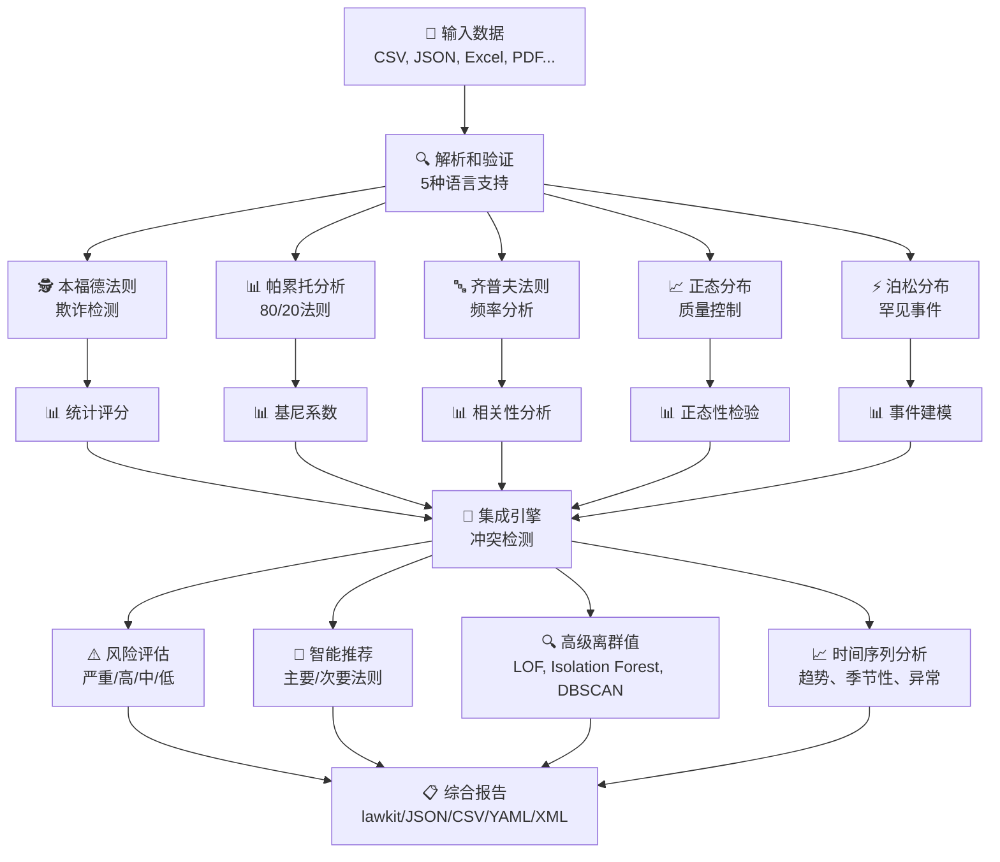
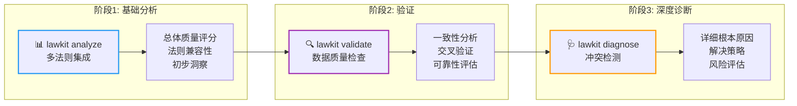
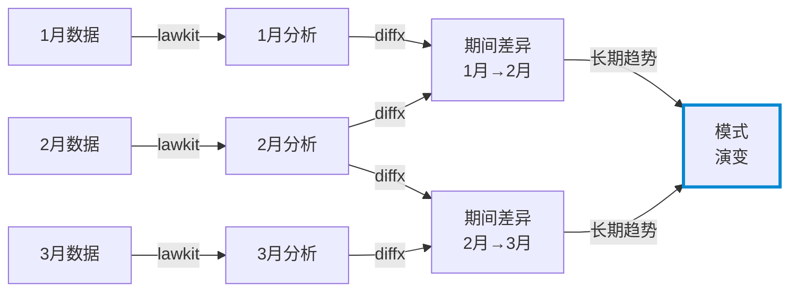

# lawkit

> **🔍 多法则统计分析工具包 - 发现隐藏模式并自动持续检测异常**

[English README](README.md) | [日本語版 README](README_ja.md) | [中文版 README](README_zh.md)

[](https://github.com/kako-jun/lawkit/actions/workflows/ci.yml)
[](https://crates.io/crates/lawkit)
[](https://docs.rs/lawkit-core)
[](https://www.npmjs.com/package/lawkit-js)
[](https://pypi.org/project/lawkit-python/)
[](https://github.com/kako-jun/lawkit/tree/main/docs/index.md)
[](https://docs.rs/lawkit-core)
[](LICENSE)

## 为什么选择lawkit？

传统工具一次只能分析一种模式。lawkit同时分析多个统计法则，为您提供完整的全貌。它自动检测冲突，通过并行处理运行更快，并提供清晰的洞察。

专为现代自动化设计，提供JSON、CSV和其他结构化输出，与AI工具和自动化工作流完美配合。非常适合欺诈检测、数据质量检查和商业智能。

```bash
# 单法则分析 - 本福德法则欺诈检测和可视化图表
$ lawkit benf financial_data.csv
本福德法则分析结果

数据集: financial_data.csv
分析数字: 2500
风险级别: 低 [LOW]

首位数字分布:
1: ████████████████┃░░░░░░░░░░░░░░░░░░░░░░░░░░░  35.2% (期望值: 30.1%)
2: ██████┃█████████░░░░░░░░░░░░░░░░░░░░░░░░░░░░  14.8% (期望值: 17.6%)
3: █████░░░░┃░░░░░░░░░░░░░░░░░░░░░░░░░░░░░░░░░░  10.3% (期望值: 12.5%)
4: ████████┃░░░░░░░░░░░░░░░░░░░░░░░░░░░░░░░░░░░  12.1% (期望值:  9.7%)
5: ██░┃░░░░░░░░░░░░░░░░░░░░░░░░░░░░░░░░░░░░░░░░   5.2% (期望值:  7.9%)
6: ████████░┃░░░░░░░░░░░░░░░░░░░░░░░░░░░░░░░░░░  11.7% (期望值:  6.7%)
7: ███░░┃░░░░░░░░░░░░░░░░░░░░░░░░░░░░░░░░░░░░░░   6.8% (期望值:  5.8%)
8: █░┃░░░░░░░░░░░░░░░░░░░░░░░░░░░░░░░░░░░░░░░░░   2.9% (期望值:  5.1%)
9: █░░░┃░░░░░░░░░░░░░░░░░░░░░░░░░░░░░░░░░░░░░░░   1.0% (期望值:  4.6%)

统计检验:
卡方值: 1.34 (p值: 0.995)
平均绝对偏差: 0.8%

# 洛伦兹曲线可视化的帕累托分析
$ lawkit pareto sales_data.csv
帕累托原理（80/20法则）分析结果

数据集: sales_data.csv
分析数字: 1000
[低] 数据集分析

洛伦兹曲线（累积分布）:
 10%: █████░░░░░░░░░░░░░░░░░░░░░░░░░░░░░░░░░░░░░░░░░   5.2% 累积
 20%: ████████████████████░░░░░░░░░░░░░░░░░░░░░░░░░░  20.1% 累积
 30%: ██████████████████████████████░░░░░░░░░░░░░░░░  35.4% 累积
 40%: ████████████████████████████████████████░░░░░░  48.9% 累积
 50%: ██████████████████████████████████████████████  61.7% 累积

80/20法则: 前20%拥有总财富的79.2%（理想值: 80.0%，比率: 0.99）

# 多法则集成分析
$ lawkit analyze --laws all data.csv
统计法则集成分析

数据集: data.csv
分析数字: 1000
执行法则: 5 (benf, pareto, zipf, normal, poisson)

集成指标:
  总体质量评分: 0.743
  一致性评分: 0.823
  检测到的冲突: 2
  推荐置信度: 0.892
```

## ✨ 主要特性

- **🎯 多法则分析**: 本福德、帕累托、齐普夫、正态、泊松分布的智能集成
- **📊 可视化图表**: 显示数字分布、洛伦兹曲线、概率图和直方图的ASCII条形图
- **🌍 国际支持**: 解析5种语言（EN、JP、CN、HI、AR）的数字，提供丰富的输出格式
- **📈 高级分析**: 时间序列分析、离群值检测（LOF、Isolation Forest、DBSCAN）、元链接
- **⚡ 高性能**: 针对大型数据集优化的Rust驱动并行处理

## 📊 性能

在AMD Ryzen 5 PRO 4650U上的真实基准测试结果:

```bash
# 传统工具一次只能分析一种模式
$ other-tool data.csv         # 单一分析: ~2.1s
$ lawkit benf data.csv        # 相同分析: ~180ms（快11.7倍）
$ lawkit analyze data.csv     # 多法则分析: ~850ms
```


## 🏗️ 工作原理

### 核心分析引擎



### 三阶段分析工作流



**analyze** → **validate** → **diagnose**: 从宽泛的概览开始，然后检查数据质量，最后调查任何具体问题。

lawkit一次性从多个角度查看您的数据，然后结合发现的内容为您提供清晰的洞察和实用的建议。

## 规格说明

### 支持的统计法则

#### 🕵️ 本福德法则 - 欺诈检测
自然出现数字的首位数字遵循特定分布（1出现约30%，2出现约18%等）。偏差通常表明数据操纵，对以下方面非常有价值：
- **财务审计**: 检测被操纵的会计记录
- **选举监控**: 识别票数异常
- **科学数据验证**: 发现伪造的研究数据
- **税务欺诈检测**: 查找更改的收入/支出报告

#### 📊 帕累托分析 - 80/20原理
著名的"80/20法则"，即80%的效果来自20%的原因。对以下方面至关重要：
- **业务优化**: 识别顶级客户、产品或收入来源
- **资源分配**: 将精力集中在高影响区域
- **质量管理**: 找到造成大部分问题的少数缺陷
- **财富分布分析**: 理解经济不平等模式

#### 🔤 齐普夫法则 - 频率幂律
词频遵循可预测的模式，第n个最常见词的出现频率是最常见词的1/n。对以下方面有用：
- **内容分析**: 分析文本模式和真实性
- **市场研究**: 理解品牌提及分布
- **语言处理**: 检测人工或生成的文本
- **社交媒体分析**: 识别异常发布模式

#### 📈 正态分布 - 统计基础
在自然界和人类行为中普遍出现的钟形曲线分布。对以下方面至关重要：
- **质量控制**: 检测制造缺陷和过程变异
- **性能分析**: 评估测试分数、测量值和指标
- **风险评估**: 理解自然变异与异常
- **过程改进**: 建立控制限和规格

#### ⚡ 泊松分布 - 罕见事件建模
建模在固定时间/空间间隔内发生罕见事件的概率。对以下方面至关重要：
- **系统可靠性**: 预测故障率和维护需求
- **客户服务**: 建模呼叫中心流量和等待时间
- **网络分析**: 理解数据包丢失和连接模式
- **医疗监控**: 跟踪疾病爆发和事故率

### 分析类型

- 单法则分析
- 多法则比较和集成
- 高级离群值检测（LOF、Isolation Forest、DBSCAN）
- 时间序列分析和趋势检测
- 测试和验证的数据生成

### 输出格式

`lawkit`为不同用例输出多种格式的结果：

- **lawkit格式（默认）**: 人类可读的分析结果
- **JSON/CSV/YAML/TOML/XML**: 用于自动化、集成和数据处理的机器可读结构化格式

## 安装

### CLI工具

```bash
# 从crates.io安装（推荐）
cargo install lawkit

# 从发布版本安装
wget https://github.com/kako-jun/lawkit/releases/latest/download/lawkit-linux-x86_64.tar.gz
tar -xzf lawkit-linux-x86_64.tar.gz
```

### Rust库

```toml
# 在您的Cargo.toml中
[dependencies]
lawkit-core = "2.1"
```

```rust
use lawkit_core::laws::benford::analyze_benford;
use lawkit_core::common::input::parse_text_input;

let numbers = parse_text_input("123 456 789")?;
let result = analyze_benford(&numbers, "data.txt", false)?;
println!("卡方值: {}", result.chi_square);
```

### 包集成

```bash
# Node.js集成
npm install lawkit-js

# Python集成  
pip install lawkit-python  # 自动包含CLI二进制文件
```

## 基本用法

### 带可视化图表的单法则分析

```bash
# 本福德法则 - 带数字分布图表的欺诈检测
$ lawkit benf financial_data.csv
首位数字分布:
1: ███████░░░░░░░░┃░░░░░░░░░░░░░░░░░░░░░░░░░░░░░░░░░░  13.6% (期望值: 30.1%)
2: ███████░░┃░░░░░░░░░░░░░░░░░░░░░░░░░░░░░░░░░░░░░░░░  14.6% (期望值: 17.6%)
3: ██████┃░░░░░░░░░░░░░░░░░░░░░░░░░░░░░░░░░░░░░░░░░░░  14.6% (期望值: 12.5%)
4: █████┃█░░░░░░░░░░░░░░░░░░░░░░░░░░░░░░░░░░░░░░░░░░░  13.6% (期望值:  9.7%)
5: ████┃█░░░░░░░░░░░░░░░░░░░░░░░░░░░░░░░░░░░░░░░░░░░░  12.6% (期望值:  7.9%)
6: ███┃███░░░░░░░░░░░░░░░░░░░░░░░░░░░░░░░░░░░░░░░░░░░  13.6% (期望值:  6.7%)
7: ███┃░░░░░░░░░░░░░░░░░░░░░░░░░░░░░░░░░░░░░░░░░░░░░░   7.8% (期望值:  5.8%)
8: ██░┃░░░░░░░░░░░░░░░░░░░░░░░░░░░░░░░░░░░░░░░░░░░░░░   4.9% (期望值:  5.1%)
9: ██┃░░░░░░░░░░░░░░░░░░░░░░░░░░░░░░░░░░░░░░░░░░░░░░░   4.9% (期望值:  4.6%)

# 帕累托分析 - 带洛伦兹曲线可视化的80/20法则
$ lawkit pareto sales_data.csv
洛伦兹曲线（累积分布）:
  8%: ██████████████████████████████░░░░░░░░░░░░░░░░░░░░  59.7% 累积
 17%: ████████████████████████████████████████┃██░░░░░░░  85.3% 累积（80/20点）
 27%: ███████████████████████████████████████████████░░░  94.8% 累积
 35%: █████████████████████████████████████████████████░  98.2% 累积
 46%: ██████████████████████████████████████████████████  99.3% 累积

80/20法则: 前20%拥有总财富的90.0%（理想值: 80.0%，比率: 1.13）

# 正态分布 - 带直方图的质量控制
$ lawkit normal measurements.csv
分布直方图:
 97.73- 98.26: █┃░░░░░░░░░░░░░░░░░░░░░░░░░░░░░░░░░░░░░░░░░░░░░░░░   2.7%
 98.26- 98.79: ██████┃░░░░░░░░░░░░░░░░░░░░░░░░░░░░░░░░░░░░░░░░░░░  11.5%
 98.79- 99.32: █████████████████┃░░░░░░░░░░░░░░░░░░░░░░░░░░░░░░░░  34.0%
 99.32- 99.85: ███████████████████████████████████┃░░░░░░░░░░░░░░  69.8%
 99.85-100.39: █████████████████████████████████████████████████┃ 100.0%

分布: μ=100.39, σ=0.89, 范围: [97.73, 103.04]
1σ: 60.0%, 2σ: 98.0%, 3σ: 100.0%

# 齐普夫法则 - 带幂律分析的等级-频率分布
$ lawkit zipf word_frequencies.csv
等级-频率分布:
# 1: █████████████████████████████████████████████████┃   1.74% (期望值: 1.74%)
# 2: █████████████████████████┃█████████░░░░░░░░░░░░░░░   1.22% (期望值: 0.87%)
# 3: █████████████████┃████████████░░░░░░░░░░░░░░░░░░░░   1.04% (期望值: 0.58%)
# 4: █████████████┃███████████░░░░░░░░░░░░░░░░░░░░░░░░░   0.87% (期望值: 0.43%)
# 5: ██████████┃██████████████░░░░░░░░░░░░░░░░░░░░░░░░░   0.87% (期望值: 0.35%)
# 6: ████████┃███████████░░░░░░░░░░░░░░░░░░░░░░░░░░░░░░   0.70% (期望值: 0.29%)
# 7: ███████┃████████████░░░░░░░░░░░░░░░░░░░░░░░░░░░░░░   0.70% (期望值: 0.25%)
# 8: ██████┃█████████████░░░░░░░░░░░░░░░░░░░░░░░░░░░░░░   0.70% (期望值: 0.22%)
# 9: ██████┃█████████████░░░░░░░░░░░░░░░░░░░░░░░░░░░░░░   0.70% (期望值: 0.19%)
#10: █████┃██████████████░░░░░░░░░░░░░░░░░░░░░░░░░░░░░░   0.70% (期望值: 0.17%)

齐普夫指数: 0.142（理想值: 1.0），相关性: 0.950

# 泊松分布 - 带概率图表的罕见事件
$ lawkit poisson event_counts.csv
概率分布:
P(X= 0): ███████████████████┃░░░░░░░░░░░░░░░░░░░░░░░░░░░░░░  0.103
P(X= 1): ████████████████████████████████████████████┃░░░░░  0.234
P(X= 2): █████████████████████████████████████████████████┃  0.266
P(X= 3): ██████████████████████████████████████┃░░░░░░░░░░░  0.201
P(X= 4): █████████████████████┃░░░░░░░░░░░░░░░░░░░░░░░░░░░░  0.114

关键概率: P(X=0)=0.103, P(X=1)=0.234, P(X≥2)=0.662
λ=2.27, 方差/均值=0.774（理想值: 1.0），拟合评分=0.682
```

### 三阶段分析工作流

我们推荐采用**analyze** → **validate** → **diagnose**方法进行彻底的数据分析：

```bash
# 阶段1: 基础多法则分析
$ lawkit analyze --laws all data.csv
统计法则集成分析

数据集: data.csv
分析数字: 1000
执行法则: 5 (benford, pareto, zipf, normal, poisson)

集成指标:
  总体质量: 0.743
  一致性: 0.823
  检测到的冲突: 2
  推荐置信度: 0.892

法则结果:
  本福德法则: 0.652
  帕累托原理: 0.845
  齐普夫法则: 0.423
  正态分布: 0.912
  泊松分布: 0.634

冲突:
  [冲突] 本福德法则评分0.652显著偏离期望值0.500 - 偏差30.4%
     可能原因: 不同的分布假设
     建议: 对频率数据重点关注齐普夫分析

风险评估: [中等]

# 阶段2: 带一致性检查的数据验证
$ lawkit validate --laws benf,pareto,normal transactions.csv --consistency-check
数据验证和一致性分析

数据集: transactions.csv
分析数字: 2500
验证法则: 3 (benford, pareto, normal)

验证结果:
  数据质量评分: 0.891
  交叉验证一致性: 0.943
  统计可靠性: 高

单个法则验证:
  [通过] 本福德法则验证（评分: 0.834，p值: 0.023）
  [通过] 帕累托原理验证（基尼: 0.78，阿尔法: 2.12）
  [警告] 正态分布验证（夏皮罗-威尔克: 0.032）

一致性分析:
  本福德-帕累托一致性: 0.912（高）
  本福德-正态一致性: 0.643（中等）
  帕累托-正态一致性: 0.587（中等）

数据质量评估: 可靠（验证评分: 0.891）

# 阶段3: 深度冲突分析和建议
$ lawkit diagnose --laws all suspicious_data.csv --report detailed
详细冲突检测和诊断报告

数据集: suspicious_data.csv
分析数字: 1500
分析法则: 5 (benford, pareto, zipf, normal, poisson)

[冲突] 检测到3个关键问题

关键冲突 #1: 评分偏差
  法则: 本福德法则 vs 正态分布
  冲突评分: 0.847（高）
  描述: 本福德法则和正态分布显示显著不同的评估（差异: 0.623）
        结构性差异: confidence_level（"高" → "低"），score_category（"好" → "差"）
  根本原因: 本福德法则表明潜在的数据操纵，而正态分布
          建议合法的自然分布模式
  解决方案: 调查数据源完整性；考虑时间分析以识别操纵期间

关键冲突 #2: 分布不匹配
  法则: 帕累托原理 vs 泊松分布
  冲突评分: 0.793（高）
  描述: 幂律分布与离散事件建模冲突
  根本原因: 数据包含混合模式（连续财富分布和离散事件计数）
  解决方案: 在分析前按类型分割数据；将帕累托原理应用于金额，
          将泊松分布应用于频率

关键冲突 #3: 方法论冲突
  法则: 齐普夫法则 vs 正态分布
  冲突评分: 0.651（中等）
  描述: 基于频率的分析与连续分布冲突
  根本原因: 数据集可能包含文本频率数据和数值测量
  解决方案: 将频率分析与统计分布测试分开

风险评估: [严重]（检测到多个基本冲突）
建议: 在自动决策前需要手动数据审查
```

### 高级用法
```bash

# 生成测试数据
lawkit generate pareto --samples 1000 > test_data.txt
lawkit generate normal --mean 100 --stddev 15 --samples 500

# 内置时间序列分析
lawkit normal monthly_sales.csv --enable-timeseries --timeseries-window 12
# 返回: 趋势分析、季节性检测、变化点、预测

# 高级过滤和分析
lawkit analyze --laws all --filter ">=1000" financial_data.xlsx
lawkit benf sales_data.csv --format xml

# 管道用法
cat raw_numbers.txt | lawkit benf -
lawkit generate zipf --samples 10000 | lawkit analyze --laws all -

# 与diffx的元链接用于时间序列分析
lawkit benf sales_2023.csv > analysis_2023.txt
lawkit benf sales_2024.csv > analysis_2024.txt
diffx analysis_2023.txt analysis_2024.txt  # 检测统计模式的变化

# 持续监控管道
for month in {01..12}; do
  lawkit analyze --laws all sales_2024_${month}.csv > analysis_${month}.txt
done
diffx analysis_*.txt --chain  # 可视化模式随时间的演变
```

## 🔗 元链接: 跟踪长期模式演变

元链接结合lawkit的内置时间序列分析与[diffx](https://github.com/kako-jun/diffx)进行长期模式跟踪：



**内置时间序列分析**（单一数据集）:
- 基于R平方分析的趋势检测
- 自动季节性检测和分解
- 变化点识别（水平、趋势、方差偏移）
- 带置信区间的预测
- 异常检测和数据质量评估

**与diffx的元链接**（多个时间期间）:
- **期间差异**: 相邻期间间统计结果的变化（例如，1月→2月变化）
- **模式演变**: 长期统计模式发展趋势（例如，全年变化）
- 本福德合规性的渐进偏移（潜在欺诈积累）
- 跨期间异常比较
- 历史模式基线建立

## 文档

有关综合指南、示例和API文档：

📚 **[用户指南](https://github.com/kako-jun/lawkit/tree/main/docs/index.md)** - 安装、用法和示例
🔧 **[CLI参考](https://github.com/kako-jun/lawkit/tree/main/docs/reference/cli-reference.md)** - 完整命令文档
📊 **[统计法则指南](https://github.com/kako-jun/lawkit/tree/main/docs/user-guide/examples.md)** - 详细分析示例
⚡ **[性能指南](https://github.com/kako-jun/lawkit/tree/main/docs/guides/performance.md)** - 优化和大型数据集
🌍 **[国际支持](https://github.com/kako-jun/lawkit/tree/main/docs/user-guide/configuration.md)** - 多语言数字解析

## 贡献

我们欢迎贡献！详情请参阅我们的[贡献指南](CONTRIBUTING.md)。

## 许可证

本项目基于MIT许可证 - 详情请参阅[LICENSE](LICENSE)。