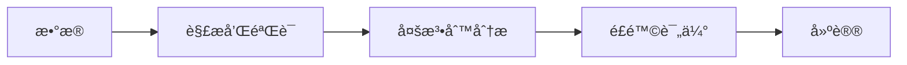

# lawkit

> **🔠多法则统计分æ工具包 - å‘ç°éšè—模å¼ï¼Œè‡ªä¿¡æ£€æµ‹å¼‚常**

[English README](README.md) | [日本èªç‰ˆ README](README_ja.md) | [中文版 README](README_zh.md)

[](https://github.com/kako-jun/lawkit/actions/workflows/ci.yml)
[](https://crates.io/crates/lawkit)
[](https://docs.rs/lawkit-core)
[](https://www.npmjs.com/package/lawkit-js)
[](https://pypi.org/project/lawkit-python/)
[](https://github.com/kako-jun/lawkit/tree/main/docs/index_zh.md)
[](https://docs.rs/lawkit-core)
[](LICENSE)

使用多ç§ç»Ÿè®¡æ³•åˆ™æ£€æµ‹å¼‚常ã€æ¨¡å¼å’Œæ´å¯Ÿçš„下一代统计分æ工具包。é常适åˆæ¬ºè¯ˆæ£€æµ‹ã€æ•°æ®è´¨é‡è¯„估和商业智能。

```bash
# 传统工具一次åªåˆ†æ一ç§æ¨¡å¼
$ other-tool data.csv  # å•ä¸€ç»Ÿè®¡åˆ†æ

# lawkitæ供全é¢çš„多法则分æ
$ lawkit compare --laws all data.csv
📊 本ç¦å¾·å®šå¾‹: âš ï¸  中等é£é™© (å¡æ–¹: 15.2)
📈 帕累托分æ: ✅ æ­£æ€åˆ†å¸ƒ (基尼: 0.31)
📉 é½å¤«å®šå¾‹: ⌠高é£é™© (相关: 0.45)
🔔 æ­£æ€åˆ†å¸ƒ: ✅ 高斯分布 (p值: 0.12)
🯠泊æ¾åˆ†å¸ƒ: âš ï¸  中等é£é™© (λ=2.3)
🧠 建议: 关注é½å¤«åˆ†æ - 检测到异常频ç‡æ¨¡å¼
```

## ✨ 主è¦åŠŸèƒ½

- **🯠多法则分æ**: 本ç¦å¾·ã€å¸•ç´¯æ‰˜ã€é½å¤«ã€æ­£æ€ã€æ³Šæ¾åˆ†å¸ƒ
- **🌠国际输入**: 解æ英语ã€æ—¥è¯­ã€ä¸­æ–‡ã€å°åœ°è¯­ã€é˜¿æ‹‰ä¼¯è¯­æ ¼å¼æ•°å­—
- **🤖 智能集æˆ**: 多法则比较è·å¾—å…¨é¢æ´å¯Ÿ
- **âš¡ 高性能**: 使用Rustæ„建，支æŒå¹¶è¡Œå¤„ç†
- **📊 丰富输出**: 文本ã€JSONã€CSVã€YAMLã€TOMLã€XMLæ ¼å¼
- **🔗 元链**: 统计模å¼çš„时间åºåˆ—趋势分æ
- **🔠高级异常值检测**: LOFã€éš”离森æ—ã€DBSCANã€é›†æˆæ–¹æ³•
- **📈 时间åºåˆ—分æ**: 趋势检测ã€å­£èŠ‚性ã€å˜åŒ–点分æ
- **🚀 内存高效**: 大å‹æ•°æ®é›†æµå¼å¤„ç†æ¨¡å¼

## 📊 性能

在AMD Ryzen 5 PRO 4650U上的真å®åŸºå‡†æµ‹è¯•ç»“æœï¼š

```bash
# 传统工具一次分æ一ç§æ¨¡å¼
$ other-tool data.csv         # å•ä¸€åˆ†æ: ~2.1秒
$ lawkit benf data.csv        # 相åŒåˆ†æ: ~180ms (å¿«11.7å€)
$ lawkit compare data.csv     # 多法则分æ: ~850ms
```

## 为什么选择lawkit？

传统工具一次åªåˆ†æ一ç§ç»Ÿè®¡æ¨¡å¼ã€‚`lawkit`æ供全é¢çš„多法则分æ。

- **整体æ´å¯Ÿ**: 多个统计法则æ­ç¤ºä¸åŒæ–¹é¢
- **智能建议**: AI支æŒçš„分æ集æˆ
- **时间高效**: 多法则并行处ç†
- **国际就绪**: 5ç§è¯­è¨€æ•°å­—解æ

## ğŸ—ï¸ å·¥ä½œåŸç†


```mermaid
graph LR
    A[æ•°æ®] --> B[解æ和验è¯]
    B --> C[多法则分æ]
    C --> D[é£é™©è¯„ä¼°]
    D --> E[建议]
```

lawkit通过多个统计镜头åŒæ—¶åˆ†æ您的数æ®ï¼Œç„¶åæ•´åˆç»“æœæ供全é¢çš„æ´å¯Ÿå’Œå»ºè®®ã€‚

## 🚀 快速开始

### 安装

```bash
# 统计分æ工具包（æ¨è）
cargo install lawkit

# 或下载预æ„建二进制文件
wget https://github.com/kako-jun/lawkit/releases/latest/download/lawkit-linux-x86_64.tar.gz
tar -xzf lawkit-linux-x86_64.tar.gz
```

### 基本用法

```bash
# å•æ³•åˆ™åˆ†æ
lawkit benf data.csv
lawkit pareto sales.csv
lawkit normal measurements.csv

# 多法则比较（æ¨è）
lawkit compare --laws benf,pareto data.csv
lawkit compare --laws all financial_data.csv

# 带过滤的高级分æ
lawkit compare --laws all --filter ">=1000" --format json data.csv
```

## 规格

### 支æŒçš„统计法则

- **本ç¦å¾·å®šå¾‹**: 财务数æ®æ¬ºè¯ˆæ£€æµ‹
- **帕累托分æ**: 80/20法则和ä¸å¹³ç­‰æµ‹é‡  
- **é½å¤«å®šå¾‹**: 频ç‡åˆ†æ和幂律分布
- **æ­£æ€åˆ†å¸ƒ**: è´¨é‡æ§åˆ¶å’Œå¼‚常值检测
- **泊æ¾åˆ†å¸ƒ**: 事件å‘生和稀有事件建模

### 分æç±»å‹

- å•æ³•åˆ™åˆ†æ
- 多法则比较和集æˆ
- 高级异常值检测（LOFã€éš”离森æ—ã€DBSCAN）
- 时间åºåˆ—分æ和趋势检测
- 测试和验è¯æ•°æ®ç”Ÿæˆ

### 输出格å¼

`lawkit`以多ç§æ ¼å¼è¾“出结æœï¼Œé€‚用äºä¸åŒç”¨ä¾‹ï¼š

- **文本格å¼ï¼ˆé»˜è®¤ï¼‰**: 人类å¯è¯»çš„分æ结æœ
- **JSONæ ¼å¼**: 用äºè‡ªåŠ¨åŒ–和集æˆçš„机器å¯è¯»æ ¼å¼
- **CSV/YAML/TOML/XML**: å„ç§ç»“æ„化数æ®å¤„ç†æ ¼å¼

## 安装

### CLI工具

```bash
# ä»crates.io（æ¨è）
cargo install lawkit

# ä»å‘布版本
wget https://github.com/kako-jun/lawkit/releases/latest/download/lawkit-linux-x86_64.tar.gz
tar -xzf lawkit-linux-x86_64.tar.gz
```

### 包集æˆ

```bash
# Node.js集æˆ
npm install lawkit-js

# Python集æˆ
pip install lawkit-python
lawkit-download-binary  # 下载CLI二进制文件
```

## 文档

有关全é¢çš„指å—ã€ç¤ºä¾‹å’ŒAPI文档：

📚 **[用户指å—](https://github.com/kako-jun/lawkit/tree/main/docs/index_zh.md)** - 安装ã€ä½¿ç”¨å’Œç¤ºä¾‹  
🔧 **[CLIå‚考](https://github.com/kako-jun/lawkit/tree/main/docs/reference/cli-reference_zh.md)** - 完整的命令文档  
📊 **[统计法则指å—](https://github.com/kako-jun/lawkit/tree/main/docs/user-guide/examples_zh.md)** - 详细的分æ示例  
âš¡ **[性能指å—](https://github.com/kako-jun/lawkit/tree/main/docs/guides/performance_zh.md)** - 优化和大å‹æ•°æ®é›†  
🌠**[国际支æŒ](https://github.com/kako-jun/lawkit/tree/main/docs/user-guide/configuration_zh.md)** - 多语言数字解æ

## 贡献

我们欢è¿è´¡çŒ®ï¼è¯¦æƒ…请å‚阅我们的[贡献指å—](CONTRIBUTING.md)。

## 许å¯è¯

此项目根æ®MIT许å¯è¯æˆæƒ - 详情请å‚阅[LICENSE](LICENSE)文件。