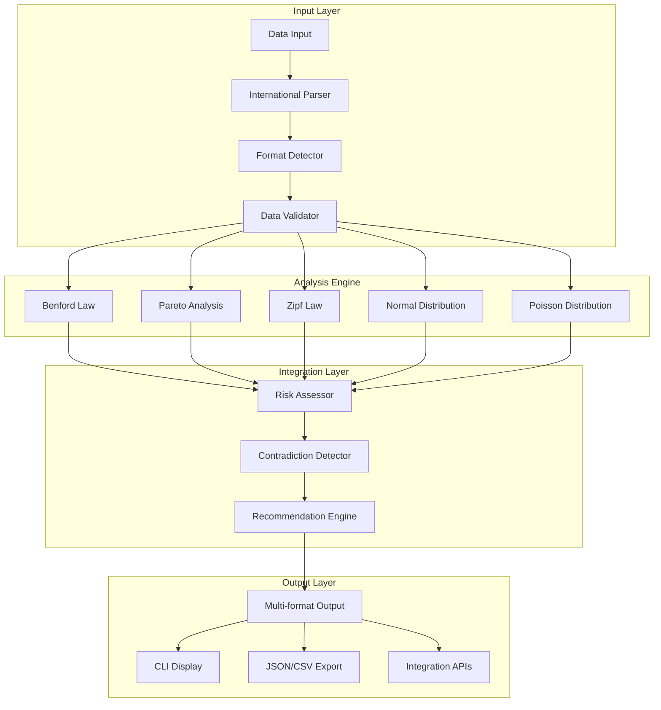

# lawkit Architecture Guide

This guide explains the architectural design and implementation details of lawkit, a comprehensive statistical law analysis toolkit.

## Overview

lawkit implements a modular architecture that supports multiple statistical laws through a unified framework. The system is designed for extensibility, performance, and international compatibility.

## Core Architecture

### Multi-Law Framework



### Statistical Law Implementations

#### 1. Benford Law Engine
- **Purpose**: Fraud detection in numerical datasets
- **Algorithm**: First-digit frequency distribution analysis
- **Output**: Risk assessment with statistical significance testing
- **Use Cases**: Financial auditing, data quality assessment

#### 2. Pareto Analysis Engine
- **Purpose**: 80/20 principle and inequality measurement
- **Algorithm**: Cumulative distribution analysis with Gini coefficient
- **Output**: Concentration ratios and business insights
- **Use Cases**: Business optimization, quality control

#### 3. Zipf Law Engine
- **Purpose**: Frequency analysis and power-law detection
- **Algorithm**: Rank-frequency correlation analysis
- **Output**: Power-law parameters and text analytics
- **Use Cases**: Natural language processing, content analysis

#### 4. Normal Distribution Engine
- **Purpose**: Statistical process control and outlier detection
- **Algorithm**: Multiple normality tests (Shapiro-Wilk, Anderson-Darling, Kolmogorov-Smirnov)
- **Output**: Process capability metrics and control limits
- **Use Cases**: Quality control, experimental validation

#### 5. Poisson Distribution Engine
- **Purpose**: Event occurrence modeling and prediction
- **Algorithm**: Maximum likelihood estimation with goodness-of-fit testing
- **Output**: Rate parameters and probability forecasts
- **Use Cases**: Risk management, capacity planning

## Data Processing Pipeline

### International Number Support

lawkit supports number formats from multiple languages and writing systems:

- **ASCII Numbers**: 1234.56
- **Japanese**: １２３４．５６ (full-width), 一千二百三十四 (kanji)
- **Chinese**: 一千二百三十四点五六 (traditional notation)
- **Hindi**: १२३४.५६ (Devanagari numerals)
- **Arabic**: ١٢٣٤.٥٦ (Eastern Arabic-Indic numerals)

### Processing Stages

1. **Input Parsing**: Multi-format file support (CSV, JSON, Excel, PDF, etc.)
2. **Number Extraction**: International numeral system recognition
3. **Data Validation**: Quality checks and minimum sample size enforcement
4. **Statistical Analysis**: Law-specific computations
5. **Integration Analysis**: Cross-law comparison and contradiction detection
6. **Output Generation**: Multi-format results with recommendations

## Advanced Features

### Outlier Detection

lawkit implements ensemble outlier detection methods:

- **LOF (Local Outlier Factor)**: Density-based anomaly detection
- **Isolation Forest**: Tree-based isolation method
- **DBSCAN**: Clustering-based outlier identification
- **Ensemble Methods**: Combination of multiple techniques for robust detection

### Time Series Analysis

For temporal data analysis:

- **Trend Detection**: Statistical trend identification
- **Seasonality Analysis**: Periodic pattern recognition
- **Change Point Detection**: Structural break identification
- **Forecasting**: Predictive modeling based on statistical laws

### Memory Optimization

- **Streaming Processing**: Large dataset handling with constant memory usage
- **Chunked Analysis**: Parallel processing of data segments
- **Resource Monitoring**: Memory and CPU usage tracking

## Extension Framework

### Adding New Statistical Laws

The architecture supports easy extension through the `StatisticalLaw` trait:

```rust
pub trait StatisticalLaw {
    type Input;
    type Output;
    type Config;
    
    fn analyze(&self, data: Self::Input, config: Self::Config) -> Result<Self::Output>;
    fn validate(&self, data: &Self::Input) -> Result<()>;
    fn name(&self) -> &'static str;
}
```

### Integration Points

- **Risk Assessment**: Unified risk scoring across all laws
- **Contradiction Detection**: Cross-law validation and conflict identification
- **Recommendation Engine**: AI-powered analysis suggestions
- **Output Formatting**: Consistent multi-format output generation

## Performance Characteristics

### Computational Complexity

- **Benford Law**: O(n) - linear in dataset size
- **Pareto Analysis**: O(n log n) - dominated by sorting
- **Zipf Law**: O(n log n) - frequency counting and sorting
- **Normal Distribution**: O(n) - statistical computations
- **Poisson Distribution**: O(n) - parameter estimation

### Memory Usage

- **Streaming Mode**: O(1) - constant memory regardless of dataset size
- **Standard Mode**: O(n) - linear memory usage
- **Parallel Processing**: O(n/p) - divided among p processors

### Scalability

lawkit is designed to handle datasets from small samples (100+ data points) to enterprise-scale datasets (millions of records) through:

- **Parallel Processing**: Multi-threaded analysis
- **Memory Management**: Efficient data structures and optimized processing
- **Incremental Analysis**: Progressive result computation

## Quality Assurance

### Testing Strategy

- **Unit Tests**: Individual component validation
- **Integration Tests**: End-to-end workflow testing
- **Property-Based Tests**: Statistical property verification
- **Performance Tests**: Scalability and resource usage validation

### Statistical Accuracy

All implementations are validated against:

- **Theoretical Distributions**: Mathematical correctness verification
- **Known Datasets**: Benchmark comparison with expected results
- **Cross-Validation**: Multiple statistical test confirmation
- **Peer Review**: Academic and industry validation

## Deployment Architecture

### Command Line Interface

- **Subcommand Structure**: `lawkit <law> [options] <input>`
- **Configuration Management**: CLI arguments and configuration files
- **Error Handling**: Comprehensive error reporting and recovery
- **International Number Support**: Automatic recognition of 5 language number formats

### Library Integration

- **Rust Crate**: Core functionality as `lawkit-core`
- **Node.js Package**: `lawkit-js` with automatic binary download
- **Python Package**: `lawkit-python` with CLI integration
- **WebAssembly**: Browser-compatible statistical analysis (planned)

### Future Extensions (Planned)

- **RESTful API**: HTTP API for web integration
- **GraphQL Support**: Flexible query interface  
- **WebSocket Streaming**: Real-time analysis updates
- **Authentication**: Token-based access control

This architecture ensures lawkit remains maintainable, extensible, and performant while providing accurate statistical analysis across multiple domains and use cases.