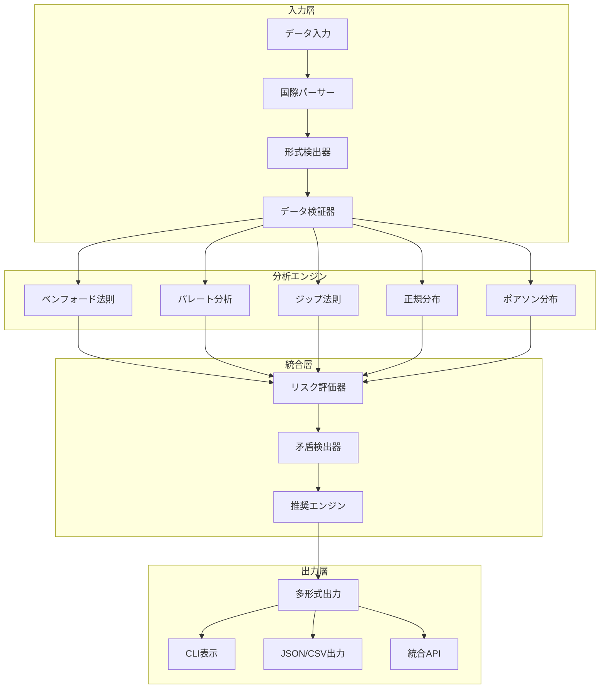

# lawkit アーキテクチャガイド

このガイドでは、包括的な統計法則分析ツールキットであるlawkitのアーキテクチャ設計と実装詳細について説明します。

## 概要

lawkitは、統一されたフレームワークを通じて複数の統計法則をサポートするモジュラーアーキテクチャを実装しています。システムは拡張性、性能、国際互換性を念頭に設計されています。

## コアアーキテクチャ

### 多法則フレームワーク



### 統計法則実装

#### 1. ベンフォード法則エンジン
- **目的**: 数値データセットにおける不正検知
- **アルゴリズム**: 先頭桁頻度分布分析
- **出力**: 統計的有意性検定を伴うリスク評価
- **用途**: 財務監査、データ品質評価

#### 2. パレート分析エンジン
- **目的**: 80/20の法則と不平等測定
- **アルゴリズム**: ジニ係数を用いた累積分布分析
- **出力**: 集中度比率とビジネス洞察
- **用途**: ビジネス最適化、品質管理

#### 3. ジップ法則エンジン
- **目的**: 頻度分析とべき法則検出
- **アルゴリズム**: ランク-頻度相関分析
- **出力**: べき法則パラメータとテキスト分析
- **用途**: 自然言語処理、コンテンツ分析

#### 4. 正規分布エンジン
- **目的**: 統計的工程管理と外れ値検出
- **アルゴリズム**: 複数の正規性検定（Shapiro-Wilk、Anderson-Darling、Kolmogorov-Smirnov）
- **出力**: 工程能力指標と管理限界
- **用途**: 品質管理、実験検証

#### 5. ポアソン分布エンジン
- **目的**: 事象発生モデリングと予測
- **アルゴリズム**: 適合度検定を伴う最尤推定
- **出力**: 率パラメータと確率予測
- **用途**: リスク管理、容量計画

## データ処理パイプライン

### 国際数字サポート

lawkitは複数の言語と文字体系の数字形式をサポートします：

- **ASCII数字**: 1234.56
- **日本語**: １２３４．５６（全角）、一千二百三十四（漢数字）
- **中国語**: 一千二百三十四点五六（伝統記法）
- **ヒンディー語**: १२३४.५६（デーヴァナーガリー数字）
- **アラビア語**: ١٢٣٤.٥٦（東アラビア・インド数字）

### 処理段階

1. **入力解析**: 多形式ファイルサポート（CSV、JSON、Excel、PDFなど）
2. **数字抽出**: 国際数字システム認識
3. **データ検証**: 品質チェックと最小サンプルサイズ強制
4. **統計分析**: 法則固有の計算
5. **統合分析**: 法則間比較と矛盾検出
6. **出力生成**: 推奨事項を含む多形式結果

## 高度機能

### 外れ値検出

lawkitはアンサンブル外れ値検出手法を実装：

- **LOF（局所外れ値因子）**: 密度ベース異常検知
- **Isolation Forest**: 木ベース分離手法
- **DBSCAN**: クラスタリングベース外れ値識別
- **アンサンブル手法**: 堅牢な検出のための複数技術の組み合わせ

### 時系列分析

時間的データ分析用：

- **トレンド検出**: 統計的トレンド識別
- **季節性分析**: 周期パターン認識
- **変化点検出**: 構造変化識別
- **予測**: 統計法則に基づく予測モデリング

### メモリ最適化

- **ストリーミング処理**: 一定メモリ使用での大規模データセット処理
- **チャンク分析**: データセグメントの並列処理
- **リソース監視**: メモリとCPU使用量追跡

## 拡張フレームワーク

### 新しい統計法則の追加

アーキテクチャは`StatisticalLaw`トレイトを通じた簡単な拡張をサポート：

```rust
pub trait StatisticalLaw {
    type Input;
    type Output;
    type Config;
    
    fn analyze(&self, data: Self::Input, config: Self::Config) -> Result<Self::Output>;
    fn validate(&self, data: &Self::Input) -> Result<()>;
    fn name(&self) -> &'static str;
}
```

### 統合ポイント

- **リスク評価**: 全法則にわたる統一リスクスコアリング
- **矛盾検出**: 法則間検証と競合識別
- **推奨エンジン**: AI搭載分析提案
- **出力フォーマット**: 一貫した多形式出力生成

## 性能特性

### 計算複雑度

- **ベンフォード法則**: O(n) - データセットサイズに線形
- **パレート分析**: O(n log n) - ソートが支配的
- **ジップ法則**: O(n log n) - 頻度カウントとソート
- **正規分布**: O(n) - 統計計算
- **ポアソン分布**: O(n) - パラメータ推定

### メモリ使用量

- **ストリーミングモード**: O(1) - データセットサイズに関係なく一定メモリ
- **標準モード**: O(n) - 線形メモリ使用
- **並列処理**: O(n/p) - p個のプロセッサに分割

### スケーラビリティ

lawkitは小規模サンプル（100+データポイント）から企業規模データセット（数百万レコード）まで処理できるよう設計：

- **並列処理**: マルチスレッド分析
- **メモリ管理**: 効率的データ構造とストリーミング
- **増分分析**: 漸進的結果計算

## 品質保証

### テスト戦略

- **単体テスト**: 個別コンポーネント検証
- **統合テスト**: エンドツーエンドワークフローテスト
- **プロパティベーステスト**: 統計プロパティ検証
- **性能テスト**: スケーラビリティとリソース使用検証

### 統計精度

全実装は以下に対して検証済み：

- **理論分布**: 数学的正確性検証
- **既知データセット**: 期待結果とのベンチマーク比較
- **交差検証**: 複数統計検定確認
- **ピアレビュー**: 学術・業界検証

## 配布アーキテクチャ

### コマンドラインインターフェース

- **サブコマンド構造**: `lawkit <法則> [オプション] <入力>`
- **設定管理**: CLI引数と設定ファイル
- **エラーハンドリング**: 包括的エラー報告と回復
- **国際数字サポート**: 5言語数字フォーマット自動認識

### ライブラリ統合

- **Rustクレート**: `lawkit-core`としてのコア機能
- **Node.jsパッケージ**: 自動バイナリダウンロード付き`lawkit-js`
- **Pythonパッケージ**: CLI統合付き`lawkit-python`
- **WebAssembly**: ブラウザ互換統計分析（予定）

### 将来拡張（予定）

- **RESTful API**: ウェブ統合用HTTP API
- **GraphQLサポート**: 柔軟なクエリインターフェース
- **WebSocketストリーミング**: リアルタイム分析更新
- **認証**: トークンベースアクセス制御

このアーキテクチャにより、lawkitは複数のドメインと用途にわたって正確な統計分析を提供しながら、保守性、拡張性、性能を維持します。