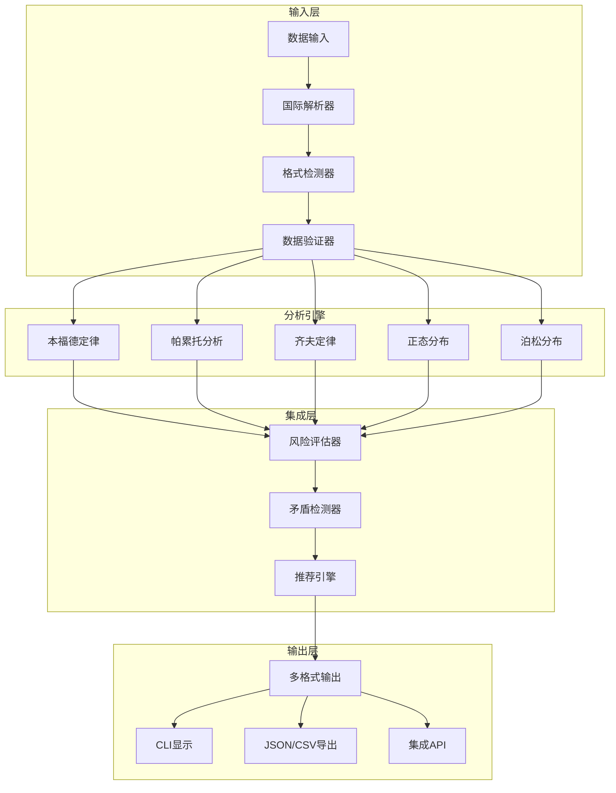

# lawkit 架构指南

本指南介绍了lawkit（一个全面的统计法则分析工具包）的架构设计和实现细节。

## 概述

lawkit实现了一个模块化架构，通过统一框架支持多种统计法则。系统设计注重可扩展性、性能和国际兼容性。

## 核心架构

### 多法则框架



### 统计法则实现

#### 1. 本福德定律引擎
- **目的**: 数值数据集中的欺诈检测
- **算法**: 首位数字频率分布分析
- **输出**: 带统计显著性检验的风险评估
- **用例**: 财务审计、数据质量评估

#### 2. 帕累托分析引擎
- **目的**: 80/20法则和不平等测量
- **算法**: 基尼系数的累积分布分析
- **输出**: 集中度比率和商业洞察
- **用例**: 业务优化、质量控制

#### 3. 齐夫定律引擎
- **目的**: 频率分析和幂律检测
- **算法**: 排名-频率相关分析
- **输出**: 幂律参数和文本分析
- **用例**: 自然语言处理、内容分析

#### 4. 正态分布引擎
- **目的**: 统计过程控制和异常值检测
- **算法**: 多重正态性检验（Shapiro-Wilk、Anderson-Darling、Kolmogorov-Smirnov）
- **输出**: 过程能力指标和控制限
- **用例**: 质量控制、实验验证

#### 5. 泊松分布引擎
- **目的**: 事件发生建模和预测
- **算法**: 带拟合优度检验的最大似然估计
- **输出**: 率参数和概率预测
- **用例**: 风险管理、容量规划

## 数据处理管道

### 国际数字支持

lawkit支持多种语言和书写系统的数字格式：

- **ASCII数字**: 1234.56
- **日语**: １２３４．５６（全角）、一千二百三十四（汉字）
- **中文**: 一千二百三十四点五六（传统记法）
- **印地语**: १२३४.५६（天城文数字）
- **阿拉伯语**: ١٢٣٤.٥٦（东阿拉伯-印度数字）

### 处理阶段

1. **输入解析**: 多格式文件支持（CSV、JSON、Excel、PDF等）
2. **数字提取**: 国际数字系统识别
3. **数据验证**: 质量检查和最小样本量强制
4. **统计分析**: 法则特定计算
5. **集成分析**: 法则间比较和矛盾检测
6. **输出生成**: 带推荐的多格式结果

## 高级功能

### 异常值检测

lawkit实现集成异常值检测方法：

- **LOF（局部异常因子）**: 基于密度的异常检测
- **隔离森林**: 基于树的隔离方法
- **DBSCAN**: 基于聚类的异常值识别
- **集成方法**: 多种技术组合实现鲁棒检测

### 时间序列分析

用于时间数据分析：

- **趋势检测**: 统计趋势识别
- **季节性分析**: 周期模式识别
- **变化点检测**: 结构断点识别
- **预测**: 基于统计法则的预测建模

### 内存优化

- **流式处理**: 恒定内存使用处理大型数据集
- **分块分析**: 数据段并行处理
- **资源监控**: 内存和CPU使用跟踪

## 扩展框架

### 添加新统计法则

架构通过`StatisticalLaw`特征支持简易扩展：

```rust
pub trait StatisticalLaw {
    type Input;
    type Output;
    type Config;
    
    fn analyze(&self, data: Self::Input, config: Self::Config) -> Result<Self::Output>;
    fn validate(&self, data: &Self::Input) -> Result<()>;
    fn name(&self) -> &'static str;
}
```

### 集成点

- **风险评估**: 所有法则的统一风险评分
- **矛盾检测**: 法则间验证和冲突识别
- **推荐引擎**: AI驱动的分析建议
- **输出格式**: 一致的多格式输出生成

## 性能特征

### 计算复杂度

- **本福德定律**: O(n) - 数据集大小线性
- **帕累托分析**: O(n log n) - 排序主导
- **齐夫定律**: O(n log n) - 频率计数和排序
- **正态分布**: O(n) - 统计计算
- **泊松分布**: O(n) - 参数估计

### 内存使用

- **流式模式**: O(1) - 无论数据集大小恒定内存
- **标准模式**: O(n) - 线性内存使用
- **并行处理**: O(n/p) - 分配给p个处理器

### 可扩展性

lawkit设计用于处理从小样本（100+数据点）到企业级数据集（数百万记录）：

- **并行处理**: 多线程分析
- **内存管理**: 高效数据结构和流式处理
- **增量分析**: 渐进式结果计算

## 质量保证

### 测试策略

- **单元测试**: 单个组件验证
- **集成测试**: 端到端工作流测试
- **基于属性的测试**: 统计属性验证
- **性能测试**: 可扩展性和资源使用验证

### 统计准确性

所有实现都已通过以下验证：

- **理论分布**: 数学正确性验证
- **已知数据集**: 与期望结果的基准比较
- **交叉验证**: 多统计检验确认
- **同行评议**: 学术和行业验证

## 部署架构

### 命令行界面

- **子命令结构**: `lawkit <法则> [选项] <输入>`
- **可用命令**: benf, pareto, zipf, normal, poisson, analyze, validate, diagnose, generate, list, selftest
- **配置管理**: CLI参数和运行时选项
- **错误处理**: 全面错误报告和恢复
- **国际数字支持**: 5种语言数字格式自动识别

### 库集成

- **Rust Crate**: 作为`lawkit-core`的核心功能
- **Node.js包**: 带自动二进制下载的`lawkit-js`
- **Python包**: 带CLI集成的`lawkit-python`
- **WebAssembly**: 浏览器兼容统计分析（计划中）

### 未来扩展（计划中）

- **集成分析**: analyze, validate, diagnose 命令实现全面数据评估
- **RESTful API**: 用于Web集成的HTTP API
- **GraphQL支持**: 灵活查询接口
- **WebSocket流**: 实时分析更新
- **身份验证**: 基于令牌的访问控制

此架构确保lawkit在提供跨多个领域和用例的准确统计分析的同时，保持可维护性、可扩展性和高性能。