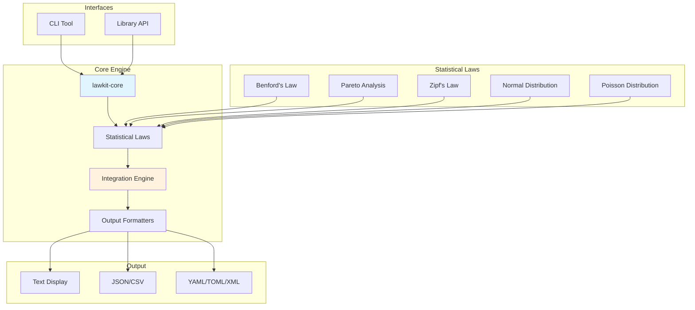
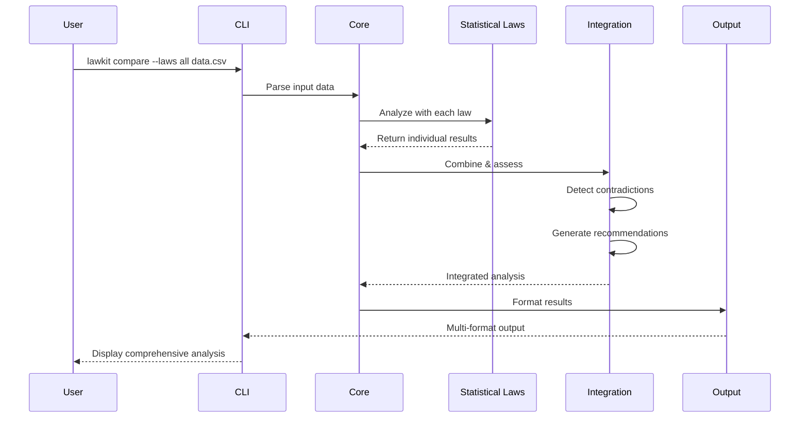

# lawkit Documentation

lawkit is a comprehensive statistical law analysis toolkit that supports multiple statistical distributions and international number formats.

## Overview

lawkit provides powerful tools for:
- **Benford's Law Analysis**: Fraud detection and data quality assessment
- **Pareto Analysis**: 80/20 rule and inequality measurement
- **Zipf's Law Analysis**: Frequency distribution and text analysis
- **Normal Distribution Analysis**: Statistical quality control and outlier detection
- **Poisson Distribution Analysis**: Event occurrence and rare event modeling
- **Integration Analysis**: Multi-law comparison and anomaly detection

## Key Features

- 🌍 **International Support**: Numbers in English, Japanese, Chinese, Hindi, Arabic
- 📊 **Multiple Output Formats**: Text, JSON, CSV, YAML, TOML, XML
- 🔍 **Advanced Filtering**: Range-based data filtering and threshold customization
- 📈 **Risk Assessment**: Built-in anomaly detection and risk evaluation
- 🎯 **Quality Control**: Statistical process control and capability analysis
- 🔗 **Integration**: Compare multiple laws for comprehensive analysis

## Quick Links

- [Usage Guide](usage.md) - Complete usage examples and CLI reference
- [FAQ](faq.md) - Frequently asked questions and troubleshooting
- [CI/CD Integration](ci-cd.md) - Integration with continuous integration systems
- [Contributing](../CONTRIBUTING.md) - How to contribute to the project

## Installation

### From Releases

Download the latest binary from [GitHub Releases](https://github.com/kako-jun/lawkit/releases).

### From Source

```bash
git clone https://github.com/kako-jun/lawkit.git
cd lawkit
cargo build --release
```

### As a Library

Add to your `Cargo.toml`:

```toml
[dependencies]
lawkit-core = "2.0"
```

## Quick Start

### Basic Analysis

```bash
# Benford's law analysis
lawkit benf data.csv

# Pareto analysis with detailed output
lawkit pareto --verbose data.csv

# Multi-law comparison
lawkit compare --laws benf,pareto data.csv
```

### Advanced Usage

```bash
# Filter data and output JSON
lawkit benf --filter ">=100,<10000" --format json data.csv

# Japanese language output
lawkit pareto --lang ja data.csv

# Quality control analysis
lawkit normal --quality-control --spec-limits 8.0,12.0 measurements.csv
```

## Architecture

### System Overview



lawkit is built as a workspace with two main components:

- **lawkit-core**: Core library with statistical analysis algorithms
- **lawkit-cli**: Command-line interface for interactive use

This design allows lawkit to be used both as a standalone CLI tool and as a library in other Rust applications.

### Multi-Law Integration Flow



## Supported Formats

### Input Formats
- CSV, TSV
- JSON, YAML, TOML
- Excel (.xlsx, .xls)
- OpenDocument (.ods, .odt)
- PDF (text extraction)
- Word documents (.docx)
- PowerPoint (.pptx)
- Plain text
- HTML (table extraction)

### Output Formats
- Text (human-readable)
- JSON (structured data)
- CSV (tabular data)
- YAML (configuration-friendly)
- TOML (Rust-friendly)
- XML (enterprise integration)

## Statistical Laws

### Benford's Law
First-digit frequency analysis for fraud detection and data quality assessment.

### Pareto Principle
80/20 rule analysis with Gini coefficient calculation and business insights.

### Zipf's Law
Power-law distribution analysis for text, frequency data, and ranking systems.

### Normal Distribution
Normality testing, outlier detection, and statistical quality control.

### Poisson Distribution
Event occurrence modeling, rare event analysis, and time series analysis.

### Integration Analysis
Multi-law comparison with contradiction detection and recommendation system.

## International Number Support

lawkit supports numbers in multiple formats:
- **English**: 1,234.56
- **Japanese**: １，２３４．５６ / 一千二百三十四
- **Chinese**: 1,234.56 / 一千二百三十四
- **Hindi**: १,२३४.५६
- **Arabic**: ١٬٢٣٤٫٥٦

## Support

- 📖 [Documentation](index.md)
- 🐛 [Bug Reports](https://github.com/kako-jun/lawkit/issues)
- 💬 [Discussions](https://github.com/kako-jun/lawkit/discussions)
- 📧 [Contact](mailto:kako.jun.42@gmail.com)

## License

MIT License - see [LICENSE](../LICENSE) for details.