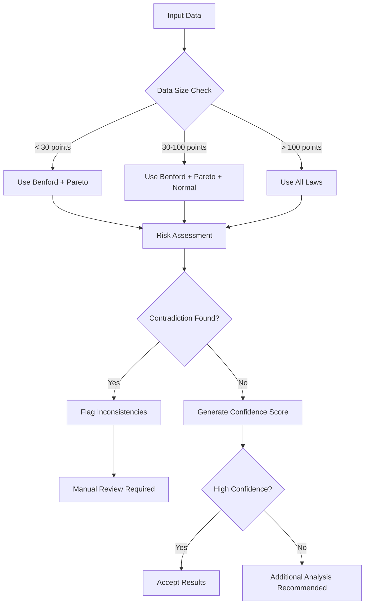

# Usage Guide

This guide covers all aspects of using lawkit for statistical analysis.

## Table of Contents

- [Basic Commands](#basic-commands)
- [Statistical Laws](#statistical-laws)
- [Input Formats](#input-formats)
- [Output Formats](#output-formats)
- [Filtering and Thresholds](#filtering-and-thresholds)
- [Multi-language Support](#multi-language-support)
- [Integration Analysis](#integration-analysis)
- [Advanced Features](#advanced-features)

## Basic Commands

### Command Structure

```bash
lawkit <SUBCOMMAND> [OPTIONS] <INPUT>
```

### Available Subcommands

- `benf` - Benford's law analysis
- `pareto` - Pareto principle analysis
- `zipf` - Zipf's law analysis
- `normal` - Normal distribution analysis
- `poisson` - Poisson distribution analysis
- `analyze` - Multi-law integration analysis and recommendations
- `list` - List available statistical laws

### Common Options

- `--format <FORMAT>` - Output format (text, json, csv, yaml, toml, xml)
- `--optimize` - Enable optimizations for large datasets
- `--quiet` - Minimal output
- `--verbose` - Detailed analysis
- `--filter <RANGE>` - Filter data by range
- `--min-count <NUMBER>` - Minimum data points required

## Statistical Laws

### Benford Law

Analyzes first-digit frequency distribution for fraud detection.

```bash
# Basic analysis
lawkit benf data.csv

# Detailed analysis with custom threshold
lawkit benf --verbose --threshold critical data.csv

# Filter large numbers only
lawkit benf --filter ">=1000" financial_data.csv
```

**Use Cases:**
- Financial fraud detection
- Data quality assessment
- Accounting anomaly detection
- Scientific data validation

### Pareto Analysis

Implements the 80/20 rule with Gini coefficient calculation.

```bash
# Basic Pareto analysis
lawkit pareto sales_data.csv

# Verbose output with business insights
lawkit pareto --verbose --format json revenue.csv

# Filter by value range
lawkit pareto --filter "100-10000" customer_values.csv
```

**Use Cases:**
- Business priority analysis
- Resource allocation
- Customer segmentation
- Quality management

### Zipf Law

Analyzes power-law distributions and frequency patterns.

```bash
# Analyze word frequencies in text
lawkit zipf --text document.txt

# Analyze numerical data
lawkit zipf --verbose city_populations.csv

# Multi-language text analysis (automatic language detection)
lawkit zipf --text japanese_text.txt
```

**Use Cases:**
- Text analysis and linguistics
- Population distribution
- Website traffic analysis
- Social media analytics

### Normal Distribution

Statistical analysis with normality testing and quality control.

```bash
# Basic normality testing
lawkit normal measurements.csv

# Specific normality test
lawkit normal --test shapiro data.csv

# Outlier detection
lawkit normal --outliers --outlier-method zscore data.csv

# Quality control analysis
lawkit normal --quality-control --spec-limits 8.0,12.0 production_data.csv
```

**Use Cases:**
- Quality control
- Process monitoring
- Outlier detection
- Statistical validation

### Poisson Distribution

Event occurrence analysis and rare event modeling.

```bash
# Basic Poisson analysis
lawkit poisson event_counts.csv

# Goodness-of-fit testing
lawkit poisson --test chi-square data.csv

# Event prediction
lawkit poisson --predict --max-events 15 incidents.csv

# Rare events analysis
lawkit poisson --rare-events --verbose defect_data.csv
```

**Use Cases:**
- Defect analysis
- Call center modeling
- Network traffic analysis
- Epidemiological studies

## Input Formats

lawkit automatically detects file formats and supports:

### Structured Data
```bash
# CSV files
lawkit benf data.csv

# Excel files
lawkit pareto spreadsheet.xlsx

# JSON data
lawkit zipf data.json

# YAML configuration
lawkit normal config.yaml
```

### Document Formats
```bash
# PDF text extraction
lawkit zipf --text document.pdf

# Word documents
lawkit benf report.docx

# PowerPoint presentations
lawkit pareto presentation.pptx
```

### Direct Input
```bash
# Pipe data
echo "123,456,789" | lawkit benf

# Command line string
lawkit pareto "100,200,300,400,500"

# Standard input
cat data.txt | lawkit zipf --text
```

## Output Formats

### Text (Default)
Human-readable output with formatted tables and summaries.

```bash
lawkit benf data.csv
# Output: Formatted tables with analysis results
```

### JSON
Structured data for programmatic use.

```bash
lawkit benf --format json data.csv
# Output: {"first_digit_distribution": {...}, "chi_square": 12.34, ...}
```

### CSV
Tabular format for spreadsheet applications.

```bash
lawkit pareto --format csv data.csv
# Output: Comma-separated values with headers
```

### Other Formats
```bash
# YAML format
lawkit normal --format yaml data.csv

# TOML format (Rust-friendly)
lawkit poisson --format toml data.csv

# XML format (enterprise integration)
lawkit analyze --format xml data.csv
```

## Filtering and Thresholds

### Range Filtering

Filter input data by numerical ranges:

```bash
# Greater than or equal to 100
lawkit benf --filter ">=100" data.csv

# Less than 1000
lawkit pareto --filter "<1000" data.csv

# Range between 50 and 500
lawkit zipf --filter "50-500" data.csv

# Multiple conditions
lawkit normal --filter ">=10,<100" data.csv
```

### Threshold Customization

Set custom anomaly detection thresholds:

```bash
# Predefined levels
lawkit benf --threshold low data.csv      # More permissive
lawkit benf --threshold medium data.csv   # Balanced
lawkit benf --threshold high data.csv     # Strict
lawkit benf --threshold critical data.csv # Very strict

# Auto-detection (default)
lawkit benf --threshold auto data.csv
```

### Minimum Data Points

Ensure sufficient data for reliable analysis:

```bash
# Require at least 100 data points
lawkit benf --min-count 100 data.csv

# Default minimums vary by law:
# - Benford: 5 points
# - Pareto: 5 points
# - Zipf: 5 points
# - Normal: 8 points
# - Poisson: 10 points
```

## Multi-language Support

### International Number Recognition

```bash
# English output (unified across all analysis)
lawkit benf data.csv

# International numbers are automatically recognized
echo "１２３４５６" | lawkit benf      # Japanese numbers
echo "一千二百三十四" | lawkit benf    # Chinese numbers
echo "१२३४५६" | lawkit benf        # Hindi numbers
echo "١٢٣٤٥٦" | lawkit benf        # Arabic numbers
```

### International Numbers

lawkit automatically recognizes international number formats:

- **English**: `1,234.56`, `1234.56`
- **Japanese**: `１，２３４．５６`, `1,234.56`, `一千二百三十四`
- **Chinese**: `1,234.56`, `一千二百三十四`
- **Hindi**: `१,२३४.५६`, `1,234.56`
- **Arabic**: `١٬٢٣٤٫٥٦`, `1,234.56`

## Integration Analysis

Analyze with multiple statistical laws for comprehensive analysis:

```bash
# Analyze with two laws
lawkit analyze --laws benf,pareto data.csv

# Analyze with all applicable laws
lawkit analyze --laws all data.csv

# Verbose analysis with recommendations
lawkit analyze --laws benf,pareto,normal --verbose data.csv

# Output in JSON format
lawkit analyze --laws all --format json data.csv
```

### Integration Features

- **Contradiction Detection**: Identifies conflicting results between laws
- **Confidence Scoring**: Rates the reliability of each analysis
- **Recommendation System**: Suggests the most appropriate statistical law
- **Meta-Analysis**: Combines insights from multiple perspectives

### Multi-Law Decision Flow



## Advanced Features

### Quality Control Analysis

```bash
# Process capability analysis
lawkit normal --quality-control --spec-limits 5.0,15.0 process_data.csv

# Control chart analysis
lawkit normal --quality-control --verbose manufacturing_data.csv
```

### Outlier Detection

```bash
# Z-score method (default)
lawkit normal --outliers data.csv

# Modified Z-score method
lawkit normal --outliers --outlier-method modified data.csv

# Interquartile range method
lawkit normal --outliers --outlier-method iqr data.csv
```

### Event Prediction

```bash
# Predict event probabilities
lawkit poisson --predict event_data.csv

# Specify maximum events to predict
lawkit poisson --predict --max-events 20 incidents.csv
```

### Text Analysis

```bash
# Word frequency analysis
lawkit zipf --text document.txt

# Multi-language text processing (automatic language detection)
lawkit zipf --text japanese_document.txt
```

## Examples by Use Case

### Financial Fraud Detection

```bash
# Benford's law on transaction amounts
lawkit benf --filter ">=100" --threshold high transactions.csv

# Pareto analysis of transaction volumes
lawkit pareto --verbose --format json daily_volumes.csv

# Multi-law comparison
lawkit analyze --laws benf,pareto financial_data.csv
```

### Quality Control

```bash
# Normal distribution analysis with control limits
lawkit normal --quality-control --spec-limits 9.5,10.5 measurements.csv

# Outlier detection in manufacturing
lawkit normal --outliers --outlier-method zscore production_data.csv

# Poisson analysis for defect rates
lawkit poisson --verbose --test all defect_counts.csv
```

### Text Analytics

```bash
# Zipf's law on word frequencies
lawkit zipf --text --verbose document.txt

# Multi-language document analysis (automatic language detection)
lawkit zipf --text multilingual_doc.txt
```

### Business Intelligence

```bash
# Customer value analysis (Pareto)
lawkit pareto --verbose customer_revenue.csv

# Event occurrence modeling (Poisson)
lawkit poisson --predict --rare-events incident_reports.csv

# Comprehensive business data analysis
lawkit analyze --laws pareto,normal,poisson --verbose business_metrics.csv
```

## Error Handling

lawkit provides clear error messages for common issues:

- **Insufficient data**: Warns when data doesn't meet minimum requirements
- **Invalid formats**: Suggests correct input formats
- **Missing files**: Provides helpful file path guidance
- **Invalid parameters**: Explains correct parameter usage

## Performance Tips

- Use `--quiet` for faster processing of large datasets
- Filter data with `--filter` to reduce processing time
- Use appropriate `--min-count` values for your use case
- Consider output format: JSON is faster for large results than formatted text