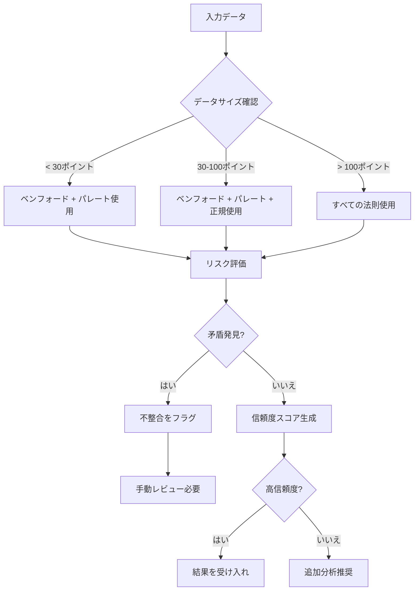

# 使用ガイド

このガイドではlawkitを統計分析に使用するすべての側面について説明します。

## 目次

- [基本コマンド](#basic-commands)
- [統計法則](#statistical-laws)
- [入力形式](#input-formats)
- [出力形式](#output-formats)
- [閾値](#thresholds)
- [多言語サポート](#multi-language-support)
- [統合分析](#integration-analysis)
- [高度な機能](#advanced-features)

## 基本コマンド

### コマンド構造

```bash
lawkit <SUBCOMMAND> [OPTIONS] <INPUT>
```

### 利用可能なサブコマンド

- `benf` - ベンフォードの法則分析
- `pareto` - パレートの原理分析
- `zipf` - ジップの法則分析
- `normal` - 正規分布分析
- `poisson` - ポアソン分布分析
- `analyze` - 多法則統合分析と推奨事項
- `validate` - 統計法則を使用したデータ品質検証
- `diagnose` - 統計法則を使用したデータ問題診断
- `generate` - テスト用サンプルデータ生成
- `list` - 利用可能な統計法則の一覧表示
- `selftest` - インストール確認のセルフテスト実行

### 共通オプション

- `--format <FORMAT>` - 出力形式 (text, json, csv, yaml, toml, xml)
- `--quiet` - 最小限の出力
- `--verbose` - 詳細分析
- `--threshold <LEVEL>` - 分析閾値設定 (low, medium, high, critical, auto)
- `--focus <FOCUS>` - 分析焦点領域 (analyzeコマンド用)
- `--purpose <PURPOSE>` - 分析目的 (analyzeコマンド用)
- `--recommend` - 推奨事項表示 (analyzeコマンド用)
- `--samples <NUMBER>` - 生成するサンプル数 (generateコマンド用)

## 統計法則

### ベンフォードの法則

不正検出のための第一桁頻度分布を分析します。

```bash
# 基本分析
lawkit benf data.csv

# カスタム閾値での詳細分析
lawkit benf --verbose --threshold critical data.csv

# JSON出力形式
lawkit benf --format json data.csv
```

**使用例:**
- 金融不正検出
- データ品質評価
- 会計異常検出
- 科学データ検証

### パレート分析

ジニ係数計算を含む80/20の法則を実装します。

```bash
# 基本的なパレート分析
lawkit pareto sales_data.csv

# ビジネス洞察を含む詳細出力
lawkit pareto --verbose --format json revenue.csv

# カスタム閾値分析
lawkit pareto --threshold high customer_values.csv
```

**使用例:**
- ビジネス優先度分析
- リソース配分
- 顧客セグメンテーション
- 品質管理

### ジップの法則

べき法則分布と頻度パターンを分析します。

```bash
# 数値データの分析
lawkit zipf data.csv

# 詳細出力での詳細分析
lawkit zipf --verbose city_populations.csv

# JSON出力形式
lawkit zipf --format json data.csv
```

**使用例:**
- テキスト分析と言語学
- 人口分布
- ウェブサイトトラフィック分析
- ソーシャルメディア分析

### 正規分布

正規性検定と品質管理を含む統計分析。

```bash
# 基本的な正規性検定
lawkit normal measurements.csv

# 詳細出力での詳細分析
lawkit normal --verbose data.csv

# JSON出力形式
lawkit normal --format json data.csv

# カスタム閾値分析
lawkit normal --threshold high production_data.csv
```

**使用例:**
- 品質管理
- プロセス監視
- 外れ値検出
- 統計的検証

### ポアソン分布

イベント発生分析と稀なイベントのモデリング。

```bash
# 基本的なポアソン分析
lawkit poisson event_counts.csv

# 詳細出力での詳細分析
lawkit poisson --verbose data.csv

# JSON出力形式
lawkit poisson --format json incidents.csv

# カスタム閾値分析
lawkit poisson --threshold high defect_data.csv
```

**使用例:**
- 欠陥分析
- コールセンターモデリング
- ネットワークトラフィック分析
- 疫学研究

## 入力形式

lawkitはファイル形式を自動検出し、以下をサポートします:

### 構造化データ
```bash
# CSVファイル
lawkit benf data.csv

# Excelファイル
lawkit pareto spreadsheet.xlsx

# JSONデータ
lawkit zipf data.json

# YAML設定
lawkit normal config.yaml
```

### ドキュメント形式
```bash
# テキストファイル
lawkit benf document.txt

# Wordドキュメント
lawkit benf report.docx

# PowerPointプレゼンテーション
lawkit pareto presentation.pptx
```

### 直接入力
```bash
# パイプデータ
echo "123,456,789" | lawkit benf

# コマンドライン文字列
lawkit pareto "100,200,300,400,500"

# 標準入力
cat data.txt | lawkit zipf
```

## 出力形式

### テキスト (デフォルト)
書式設定されたテーブルと要約を含む人間が読める出力。

```bash
lawkit benf data.csv
# 出力: 分析結果を含む書式設定されたテーブル
```

### JSON
プログラマティック使用のための構造化データ。

```bash
lawkit benf --format json data.csv
# 出力: {"first_digit_distribution": {...}, "chi_square": 12.34, ...}
```

### CSV
スプレッドシートアプリケーション用の表形式。

```bash
lawkit pareto --format csv data.csv
# 出力: ヘッダー付きのカンマ区切り値
```

### その他の形式
```bash
# YAML形式
lawkit normal --format yaml data.csv

# TOML形式 (Rust対応)
lawkit poisson --format toml data.csv

# XML形式 (エンタープライズ統合)
lawkit analyze --laws benf,pareto --format xml data.csv
```

## 閾値

### 閾値カスタマイズ

異常検出のためのカスタム分析閾値を設定:

```bash
# 定義済みレベル
lawkit benf --threshold low data.csv      # より寛容
lawkit benf --threshold medium data.csv   # バランス
lawkit benf --threshold high data.csv     # 厳格
lawkit benf --threshold critical data.csv # 非常に厳格

# 自動検出 (デフォルト)
lawkit benf --threshold auto data.csv
```

### データ要件

最小データ要件は法則により異なります:
- **ベンフォード**: 5ポイント (推奨: 100+)
- **パレート**: 5ポイント (推奨: 20+)
- **ジップ**: 5ポイント (推奨: 50+)
- **正規**: 8ポイント (推奨: 30+)
- **ポアソン**: 10ポイント (推奨: 50+)

## 多言語サポート

### 国際数字認識

```bash
# 英語出力 (すべての分析で統一)
lawkit benf data.csv

# 国際数字は自動認識されます
echo "１２３４５６" | lawkit benf      # 日本語数字
echo "一千二百三十四" | lawkit benf    # 中国語数字
echo "१२३४५६" | lawkit benf        # ヒンディー語数字
echo "١٢٣٤٥٦" | lawkit benf        # アラビア語数字
```

### 国際数字

lawkitは国際数字形式を自動認識します:

- **英語**: `1,234.56`, `1234.56`
- **日本語**: `１，２３４．５６`, `1,234.56`, `一千二百三十四`
- **中国語**: `1,234.56`, `一千二百三十四`
- **ヒンディー語**: `१,२३४.५६`, `1,234.56`
- **アラビア語**: `١٬٢٣٤٫٥٦`, `1,234.56`

## 統合分析

### 統合分析

包括的分析のために複数の統計法則で分析:

```bash
# 2つの法則で分析
lawkit analyze --laws benf,pareto data.csv

# 適用可能なすべての法則で分析
lawkit analyze --laws all data.csv

# 推奨事項付き詳細分析
lawkit analyze --laws benf,pareto,normal --verbose --recommend data.csv

# 特定の分析領域に焦点
lawkit analyze --laws all --focus fraud-detection data.csv

# 分析目的を指定
lawkit analyze --laws all --purpose quality-assessment data.csv

# JSON形式で出力
lawkit analyze --laws all --format json data.csv
```

### 統合機能

- **矛盾検出**: 法則間の競合する結果を特定
- **信頼度スコアリング**: 各分析の信頼性を評価
- **推奨システム**: 最も適切な統計法則を提案
- **メタ分析**: 複数の視点からの洞察を組み合わせ

### 多法則決定フロー



## 高度な機能

### データ生成

```bash
# テスト用サンプルデータ生成
lawkit generate --samples 1000 | lawkit benf

# データ生成してファイルに保存
lawkit generate --samples 500 > test_data.csv

# 特定の法則用データ生成
lawkit generate --samples 100 | lawkit pareto
```

### データ検証

```bash
# 複数法則でデータ品質検証
lawkit validate --laws all data.csv

# 特定焦点での検証
lawkit validate --laws benf,pareto --focus fraud-detection data.csv

# 推奨事項付き検証
lawkit validate --laws all --recommend data.csv
```

### データ診断

```bash
# データ問題の診断
lawkit diagnose --laws all data.csv

# 特定目的での診断
lawkit diagnose --laws all --purpose quality-assessment data.csv

# 詳細付き詳細診断
lawkit diagnose --laws all --verbose data.csv
```

### セルフテスト

```bash
# インストール確認セルフテスト実行
lawkit selftest

# 詳細セルフテスト実行
lawkit selftest --verbose
```

## 使用例別例

### 金融不正検出

```bash
# 取引金額でのベンフォードの法則
lawkit benf --threshold high transactions.csv

# 取引ボリュームのパレート分析
lawkit pareto --verbose --format json daily_volumes.csv

# 不正検出焦点での多法則比較
lawkit analyze --laws benf,pareto --focus fraud-detection financial_data.csv
```

### 品質管理

```bash
# 品質管理のための正規分布分析
lawkit normal --threshold high measurements.csv

# 製造業でのデータ品質検証
lawkit validate --laws normal,poisson --purpose quality-control production_data.csv

# 欠陥率のポアソン分析
lawkit poisson --verbose defect_counts.csv
```

### 統計分析

```bash
# 数値分布でのジップの法則
lawkit zipf --verbose data.csv

# 包括的洞察のための多法則分析
lawkit analyze --laws all --verbose data.csv
```

### ビジネスインテリジェンス

```bash
# 顧客価値分析 (パレート)
lawkit pareto --verbose customer_revenue.csv

# イベント発生モデリング (ポアソン)
lawkit poisson --verbose incident_reports.csv

# 包括的ビジネスデータ分析
lawkit analyze --laws pareto,normal,poisson --purpose business-analysis --verbose business_metrics.csv
```

## エラーハンドリング

lawkitは一般的な問題に対して明確なエラーメッセージを提供します:

- **データ不足**: データが最小要件を満たさない場合の警告
- **無効な形式**: 正しい入力形式の提案
- **ファイル未発見**: 有用なファイルパスガイダンス
- **無効なパラメータ**: 正しいパラメータ使用法の説明

## パフォーマンスのヒント

- 大きなデータセットの高速処理には `--quiet` を使用
- 使用例に適した `--threshold` で適切な閾値を使用
- 出力形式を考慮: JSONは書式設定されたテキストより大きな結果で高速
- 利用可能なすべての統計法則を確認するには `lawkit list` を使用