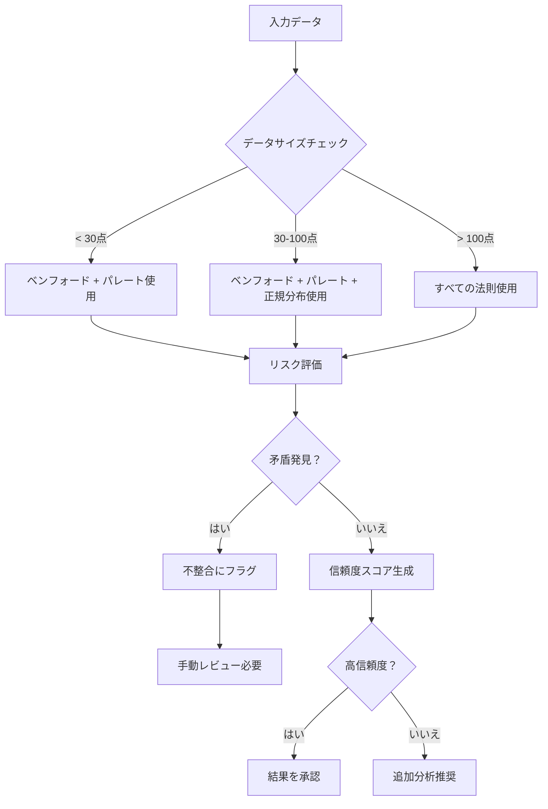

# 使用ガイド

このガイドでは、lawkitを使った統計分析のすべての側面をカバーします。

## 目次

- [基本コマンド](#基本コマンド)
- [統計法則](#統計法則)
- [入力フォーマット](#入力フォーマット)
- [出力フォーマット](#出力フォーマット)
- [フィルタリングと閾値](#フィルタリングと閾値)
- [多言語サポート](#多言語サポート)
- [統合分析](#統合分析)
- [高度な機能](#高度な機能)

## 基本コマンド

### コマンド構造

```bash
lawkit <サブコマンド> [オプション] <入力>
```

### 利用可能なサブコマンド

- `benf` - ベンフォード法則分析
- `pareto` - パレート原理分析
- `zipf` - ジップ法則分析
- `normal` - 正規分布分析
- `poisson` - ポアソン分布分析
- `compare` - 複数法則統合分析
- `list` - 利用可能な統計法則一覧

### 共通オプション

- `--format <フォーマット>` - 出力形式 (text, json, csv, yaml, toml, xml)
- `--lang <言語>` - 出力言語 (en, ja, zh, hi, ar, auto)
- `--quiet` - 最小限の出力
- `--verbose` - 詳細分析
- `--filter <範囲>` - データの範囲フィルタ
- `--min-count <数値>` - 必要最小データ点数

## 統計法則

### ベンフォード法則

不正検知のための第一桁頻度分布を分析します。

```bash
# 基本分析
lawkit benf data.csv

# カスタム閾値での詳細分析
lawkit benf --verbose --threshold critical data.csv

# 大きな数値のみフィルタ
lawkit benf --filter ">=1000" financial_data.csv
```

**使用例:**
- 金融不正検知
- データ品質評価
- 会計異常検知
- 科学データ検証

### パレート分析

ジニ係数計算による80/20ルールを実装します。

```bash
# 基本パレート分析
lawkit pareto sales_data.csv

# ビジネス洞察付き詳細出力
lawkit pareto --verbose --format json revenue.csv

# 値の範囲でフィルタ
lawkit pareto --filter "100-10000" customer_values.csv
```

**使用例:**
- ビジネス優先度分析
- リソース配分
- 顧客セグメンテーション
- 品質管理

### ジップ法則

べき乗分布と頻度パターンを分析します。

```bash
# テキスト内の単語頻度分析
lawkit zipf --text document.txt

# 数値データ分析
lawkit zipf --verbose city_populations.csv

# 多言語テキスト分析
lawkit zipf --text --lang ja japanese_text.txt
```

**使用例:**
- テキスト分析と言語学
- 人口分布
- ウェブサイトトラフィック分析
- ソーシャルメディア分析

### 正規分布

正規性検定と品質管理を含む統計分析。

```bash
# 基本正規性検定
lawkit normal measurements.csv

# 特定の正規性検定
lawkit normal --test shapiro data.csv

# 異常値検出
lawkit normal --outliers --outlier-method zscore data.csv

# 品質管理分析
lawkit normal --quality-control --spec-limits 8.0,12.0 production_data.csv
```

**使用例:**
- 品質管理
- プロセス監視
- 異常値検出
- 統計的検証

### ポアソン分布

イベント発生分析と稀少事象モデリング。

```bash
# 基本ポアソン分析
lawkit poisson event_counts.csv

# 適合度検定
lawkit poisson --test chi-square data.csv

# イベント予測
lawkit poisson --predict --max-events 15 incidents.csv

# 稀少事象分析
lawkit poisson --rare-events --verbose defect_data.csv
```

**使用例:**
- 欠陥分析
- コールセンターモデリング
- ネットワークトラフィック分析
- 疫学研究

## 入力フォーマット

lawkitはファイル形式を自動検出し、以下をサポートします：

### 構造化データ
```bash
# CSVファイル
lawkit benf data.csv

# Excelファイル
lawkit pareto spreadsheet.xlsx

# JSONデータ
lawkit zipf data.json

# YAML設定
lawkit normal config.yaml
```

### ドキュメント形式
```bash
# PDFテキスト抽出
lawkit zipf --text document.pdf

# Wordドキュメント
lawkit benf report.docx

# PowerPointプレゼンテーション
lawkit pareto presentation.pptx
```

### 直接入力
```bash
# パイプでデータ送信
echo "123,456,789" | lawkit benf

# コマンドライン文字列
lawkit pareto "100,200,300,400,500"

# 標準入力
cat data.txt | lawkit zipf --text
```

## 出力フォーマット

### テキスト（デフォルト）
表やサマリーが整形された人間が読みやすい出力。

```bash
lawkit benf data.csv
# 出力: 分析結果を含む整形されたテーブル
```

### JSON
プログラムでの使用のための構造化データ。

```bash
lawkit benf --format json data.csv
# 出力: {"first_digit_distribution": {...}, "chi_square": 12.34, ...}
```

### CSV
スプレッドシートアプリケーション向けの表形式。

```bash
lawkit pareto --format csv data.csv
# 出力: ヘッダー付きカンマ区切り値
```

### その他のフォーマット
```bash
# YAML形式
lawkit normal --format yaml data.csv

# TOML形式（Rust親和性）
lawkit poisson --format toml data.csv

# XML形式（エンタープライズ統合）
lawkit compare --format xml data.csv
```

## フィルタリングと閾値

### 範囲フィルタリング

数値範囲で入力データをフィルタします：

```bash
# 100以上
lawkit benf --filter ">=100" data.csv

# 1000未満
lawkit pareto --filter "<1000" data.csv

# 50から500の間
lawkit zipf --filter "50-500" data.csv

# 複数条件
lawkit normal --filter ">=10,<100" data.csv
```

### 閾値カスタマイズ

カスタム異常検知閾値を設定：

```bash
# 事前定義レベル
lawkit benf --threshold low data.csv      # より寛容
lawkit benf --threshold medium data.csv   # バランス
lawkit benf --threshold high data.csv     # 厳格
lawkit benf --threshold critical data.csv # 非常に厳格

# 自動検出（デフォルト）
lawkit benf --threshold auto data.csv
```

### 最小データ点数

信頼できる分析のための十分なデータを確保：

```bash
# 最低100データ点が必要
lawkit benf --min-count 100 data.csv

# デフォルト最小値は法則により異なります：
# - ベンフォード: 5点
# - パレート: 5点
# - ジップ: 5点
# - 正規分布: 8点
# - ポアソン: 10点
```

## 多言語サポート

### 言語選択

```bash
# 自動検出（デフォルト）
lawkit benf --lang auto data.csv

# 特定言語
lawkit benf --lang en data.csv    # 英語
lawkit benf --lang ja data.csv    # 日本語
lawkit benf --lang zh data.csv    # 中国語
lawkit benf --lang hi data.csv    # ヒンディー語
lawkit benf --lang ar data.csv    # アラビア語
```

### 国際数字

lawkitは国際数字形式を自動認識します：

- **英語**: `1,234.56`, `1234.56`
- **日本語**: `１，２３４．５６`, `1,234.56`, `一千二百三十四`
- **中国語**: `1,234.56`, `一千二百三十四`
- **ヒンディー語**: `१,२३४.५६`, `1,234.56`
- **アラビア語**: `١٬٢٣٤٫٥٦`, `1,234.56`

## 統合分析

包括的分析のために複数の統計法則を比較：

```bash
# 2つの法則を比較
lawkit compare --laws benf,pareto data.csv

# 適用可能なすべての法則を比較
lawkit compare --laws all data.csv

# 推奨付き詳細比較
lawkit compare --laws benf,pareto,normal --verbose data.csv

# JSON形式で出力
lawkit compare --laws all --format json data.csv
```

### 統合機能

- **矛盾検出**: 法則間の矛盾する結果を識別
- **信頼度スコア**: 各分析の信頼性を評価
- **推奨システム**: 最適な統計法則を提案
- **メタ分析**: 複数の視点からの洞察を統合

### 多法則決定フロー



## 高度な機能

### 品質管理分析

```bash
# 工程能力分析
lawkit normal --quality-control --spec-limits 5.0,15.0 process_data.csv

# 管理図分析
lawkit normal --quality-control --verbose manufacturing_data.csv
```

### 異常値検出

```bash
# Z-score法（デフォルト）
lawkit normal --outliers data.csv

# 修正Z-score法
lawkit normal --outliers --outlier-method modified data.csv

# 四分位範囲法
lawkit normal --outliers --outlier-method iqr data.csv
```

### イベント予測

```bash
# イベント確率の予測
lawkit poisson --predict event_data.csv

# 予測する最大イベント数を指定
lawkit poisson --predict --max-events 20 incidents.csv
```

### テキスト分析

```bash
# 単語頻度分析
lawkit zipf --text document.txt

# 多言語テキスト処理
lawkit zipf --text --lang ja japanese_document.txt
```

## 使用例別

### 金融不正検知

```bash
# 取引金額のベンフォード法則
lawkit benf --filter ">=100" --threshold high transactions.csv

# 取引量のパレート分析
lawkit pareto --verbose --format json daily_volumes.csv

# 多法則比較
lawkit compare --laws benf,pareto financial_data.csv
```

### 品質管理

```bash
# 管理限界付き正規分布分析
lawkit normal --quality-control --spec-limits 9.5,10.5 measurements.csv

# 製造における異常値検出
lawkit normal --outliers --outlier-method zscore production_data.csv

# 欠陥率のポアソン分析
lawkit poisson --verbose --test all defect_counts.csv
```

### テキスト分析

```bash
# 単語頻度のジップ法則
lawkit zipf --text --verbose document.txt

# 多言語文書分析
lawkit zipf --text --lang auto multilingual_doc.txt
```

### ビジネスインテリジェンス

```bash
# 顧客価値分析（パレート）
lawkit pareto --verbose customer_revenue.csv

# イベント発生モデリング（ポアソン）
lawkit poisson --predict --rare-events incident_reports.csv

# 包括的ビジネスデータ分析
lawkit compare --laws pareto,normal,poisson --verbose business_metrics.csv
```

## エラーハンドリング

lawkitは一般的な問題に対して明確なエラーメッセージを提供します：

- **データ不足**: データが最小要件を満たさない場合の警告
- **無効な形式**: 正しい入力形式の提案
- **ファイルなし**: 役立つファイルパスガイダンス
- **無効なパラメータ**: 正しいパラメータ使用法の説明

## パフォーマンスのヒント

- 大きなデータセットの高速処理には`--quiet`を使用
- 処理時間短縮のため`--filter`でデータをフィルタ
- 使用例に適した`--min-count`値を使用
- 出力形式を考慮：大きな結果には整形テキストよりJSONが高速