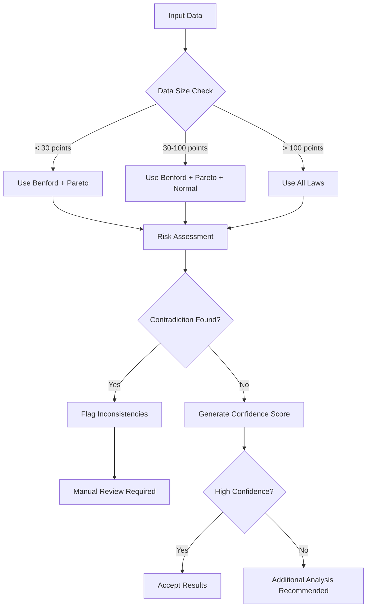

# Usage Guide

This guide covers all aspects of using lawkit for statistical analysis.

## Table of Contents

- [Basic Commands](#basic-commands)
- [Statistical Laws](#statistical-laws)
- [Input Formats](#input-formats)
- [Output Formats](#output-formats)
- [Thresholds](#thresholds)
- [Multi-language Support](#multi-language-support)
- [Integration Analysis](#integration-analysis)
- [Advanced Features](#advanced-features)

## Basic Commands

### Command Structure

```bash
lawkit <SUBCOMMAND> [OPTIONS] <INPUT>
```

### Available Subcommands

- `benf` - Benford's law analysis
- `pareto` - Pareto principle analysis
- `zipf` - Zipf's law analysis
- `normal` - Normal distribution analysis
- `poisson` - Poisson distribution analysis
- `analyze` - Multi-law integration analysis and recommendations
- `validate` - Validate data quality using statistical laws
- `diagnose` - Diagnose data issues using statistical laws
- `generate` - Generate sample data for testing
- `list` - List available statistical laws
- `selftest` - Run self-tests to verify installation

### Common Options

- `--format <FORMAT>` - Output format (text, json, csv, yaml, toml, xml)
- `--quiet` - Minimal output
- `--verbose` - Detailed analysis
- `--threshold <LEVEL>` - Set analysis threshold (low, medium, high, critical, auto)
- `--focus <FOCUS>` - Analysis focus area (for analyze command)
- `--purpose <PURPOSE>` - Analysis purpose (for analyze command)
- `--recommend` - Show recommendations (for analyze command)
- `--samples <NUMBER>` - Number of samples to generate (for generate command)

## Statistical Laws

### Benford Law

Analyzes first-digit frequency distribution for fraud detection.

```bash
# Basic analysis
lawkit benf data.csv

# Detailed analysis with custom threshold
lawkit benf --verbose --threshold critical data.csv

# JSON output format
lawkit benf --format json data.csv
```

**Use Cases:**
- Financial fraud detection
- Data quality assessment
- Accounting anomaly detection
- Scientific data validation

### Pareto Analysis

Implements the 80/20 rule with Gini coefficient calculation.

```bash
# Basic Pareto analysis
lawkit pareto sales_data.csv

# Verbose output with business insights
lawkit pareto --verbose --format json revenue.csv

# Custom threshold analysis
lawkit pareto --threshold high customer_values.csv
```

**Use Cases:**
- Business priority analysis
- Resource allocation
- Customer segmentation
- Quality management

### Zipf Law

Analyzes power-law distributions and frequency patterns.

```bash
# Analyze numerical data
lawkit zipf data.csv

# Detailed analysis with verbose output
lawkit zipf --verbose city_populations.csv

# JSON output format
lawkit zipf --format json data.csv
```

**Use Cases:**
- Text analysis and linguistics
- Population distribution
- Website traffic analysis
- Social media analytics

### Normal Distribution

Statistical analysis with normality testing and quality control.

```bash
# Basic normality testing
lawkit normal measurements.csv

# Detailed analysis with verbose output
lawkit normal --verbose data.csv

# JSON output format
lawkit normal --format json data.csv

# Custom threshold analysis
lawkit normal --threshold high production_data.csv
```

**Use Cases:**
- Quality control
- Process monitoring
- Outlier detection
- Statistical validation

### Poisson Distribution

Event occurrence analysis and rare event modeling.

```bash
# Basic Poisson analysis
lawkit poisson event_counts.csv

# Detailed analysis with verbose output
lawkit poisson --verbose data.csv

# JSON output format
lawkit poisson --format json incidents.csv

# Custom threshold analysis
lawkit poisson --threshold high defect_data.csv
```

**Use Cases:**
- Defect analysis
- Call center modeling
- Network traffic analysis
- Epidemiological studies

## Input Formats

lawkit automatically detects file formats and supports:

### Structured Data
```bash
# CSV files
lawkit benf data.csv

# Excel files
lawkit pareto spreadsheet.xlsx

# JSON data
lawkit zipf data.json

# YAML configuration
lawkit normal config.yaml
```

### Document Formats
```bash
# Text files
lawkit benf document.txt

# Word documents
lawkit benf report.docx

# PowerPoint presentations
lawkit pareto presentation.pptx
```

### Direct Input
```bash
# Pipe data
echo "123,456,789" | lawkit benf

# Command line string
lawkit pareto "100,200,300,400,500"

# Standard input
cat data.txt | lawkit zipf
```

## Output Formats

### Text (Default)
Human-readable output with formatted tables and summaries.

```bash
lawkit benf data.csv
# Output: Formatted tables with analysis results
```

### JSON
Structured data for programmatic use.

```bash
lawkit benf --format json data.csv
# Output: {"first_digit_distribution": {...}, "chi_square": 12.34, ...}
```

### CSV
Tabular format for spreadsheet applications.

```bash
lawkit pareto --format csv data.csv
# Output: Comma-separated values with headers
```

### Other Formats
```bash
# YAML format
lawkit normal --format yaml data.csv

# TOML format (Rust-friendly)
lawkit poisson --format toml data.csv

# XML format (enterprise integration)
lawkit analyze --laws benf,pareto --format xml data.csv
```

## Thresholds

### Threshold Customization

Set custom analysis thresholds for anomaly detection:

```bash
# Predefined levels
lawkit benf --threshold low data.csv      # More permissive
lawkit benf --threshold medium data.csv   # Balanced
lawkit benf --threshold high data.csv     # Strict
lawkit benf --threshold critical data.csv # Very strict

# Auto-detection (default)
lawkit benf --threshold auto data.csv
```

### Data Requirements

Minimum data requirements vary by law:
- **Benford**: 5 points (recommended: 100+)
- **Pareto**: 5 points (recommended: 20+)
- **Zipf**: 5 points (recommended: 50+)
- **Normal**: 8 points (recommended: 30+)
- **Poisson**: 10 points (recommended: 50+)

## Multi-language Support

### International Number Recognition

```bash
# English output (unified across all analysis)
lawkit benf data.csv

# International numbers are automatically recognized
echo "１２３４５６" | lawkit benf      # Japanese numbers
echo "一千二百三十四" | lawkit benf    # Chinese numbers
echo "१२३४५६" | lawkit benf        # Hindi numbers
echo "١٢٣٤٥٦" | lawkit benf        # Arabic numbers
```

### International Numbers

lawkit automatically recognizes international number formats:

- **English**: `1,234.56`, `1234.56`
- **Japanese**: `１，２３４．５６`, `1,234.56`, `一千二百三十四`
- **Chinese**: `1,234.56`, `一千二百三十四`
- **Hindi**: `१,२३४.५६`, `1,234.56`
- **Arabic**: `١٬٢٣٤٫٥٦`, `1,234.56`

## Integration Analysis

### Integration Analysis

Analyze with multiple statistical laws for comprehensive analysis:

```bash
# Analyze with two laws
lawkit analyze --laws benf,pareto data.csv

# Analyze with all applicable laws
lawkit analyze --laws all data.csv

# Verbose analysis with recommendations
lawkit analyze --laws benf,pareto,normal --verbose --recommend data.csv

# Focus on specific analysis area
lawkit analyze --laws all --focus fraud-detection data.csv

# Specify analysis purpose
lawkit analyze --laws all --purpose quality-assessment data.csv

# Output in JSON format
lawkit analyze --laws all --format json data.csv
```

### Integration Features

- **Contradiction Detection**: Identifies conflicting results between laws
- **Confidence Scoring**: Rates the reliability of each analysis
- **Recommendation System**: Suggests the most appropriate statistical law
- **Meta-Analysis**: Combines insights from multiple perspectives

### Multi-Law Decision Flow



## Advanced Features

### Data Generation

```bash
# Generate sample data for testing
lawkit generate --samples 1000 | lawkit benf

# Generate data and save to file
lawkit generate --samples 500 > test_data.csv

# Generate data for specific law
lawkit generate --samples 100 | lawkit pareto
```

### Data Validation

```bash
# Validate data quality using multiple laws
lawkit validate --laws all data.csv

# Validate with specific focus
lawkit validate --laws benf,pareto --focus fraud-detection data.csv

# Validate with recommendations
lawkit validate --laws all --recommend data.csv
```

### Data Diagnosis

```bash
# Diagnose data issues
lawkit diagnose --laws all data.csv

# Diagnose with specific purpose
lawkit diagnose --laws all --purpose quality-assessment data.csv

# Verbose diagnosis with details
lawkit diagnose --laws all --verbose data.csv
```

### Self-Testing

```bash
# Run self-tests to verify installation
lawkit selftest

# Run verbose self-tests
lawkit selftest --verbose
```

## Examples by Use Case

### Financial Fraud Detection

```bash
# Benford's law on transaction amounts
lawkit benf --threshold high transactions.csv

# Pareto analysis of transaction volumes
lawkit pareto --verbose --format json daily_volumes.csv

# Multi-law comparison with fraud detection focus
lawkit analyze --laws benf,pareto --focus fraud-detection financial_data.csv
```

### Quality Control

```bash
# Normal distribution analysis for quality control
lawkit normal --threshold high measurements.csv

# Validate data quality in manufacturing
lawkit validate --laws normal,poisson --purpose quality-control production_data.csv

# Poisson analysis for defect rates
lawkit poisson --verbose defect_counts.csv
```

### Statistical Analysis

```bash
# Zipf's law on numerical distributions
lawkit zipf --verbose data.csv

# Multi-law analysis for comprehensive insights
lawkit analyze --laws all --verbose data.csv
```

### Business Intelligence

```bash
# Customer value analysis (Pareto)
lawkit pareto --verbose customer_revenue.csv

# Event occurrence modeling (Poisson)
lawkit poisson --verbose incident_reports.csv

# Comprehensive business data analysis
lawkit analyze --laws pareto,normal,poisson --purpose business-analysis --verbose business_metrics.csv
```

## Error Handling

lawkit provides clear error messages for common issues:

- **Insufficient data**: Warns when data doesn't meet minimum requirements
- **Invalid formats**: Suggests correct input formats
- **Missing files**: Provides helpful file path guidance
- **Invalid parameters**: Explains correct parameter usage

## Performance Tips

- Use `--quiet` for faster processing of large datasets
- Use appropriate thresholds with `--threshold` for your use case
- Consider output format: JSON is faster for large results than formatted text
- Use `lawkit list` to see all available statistical laws