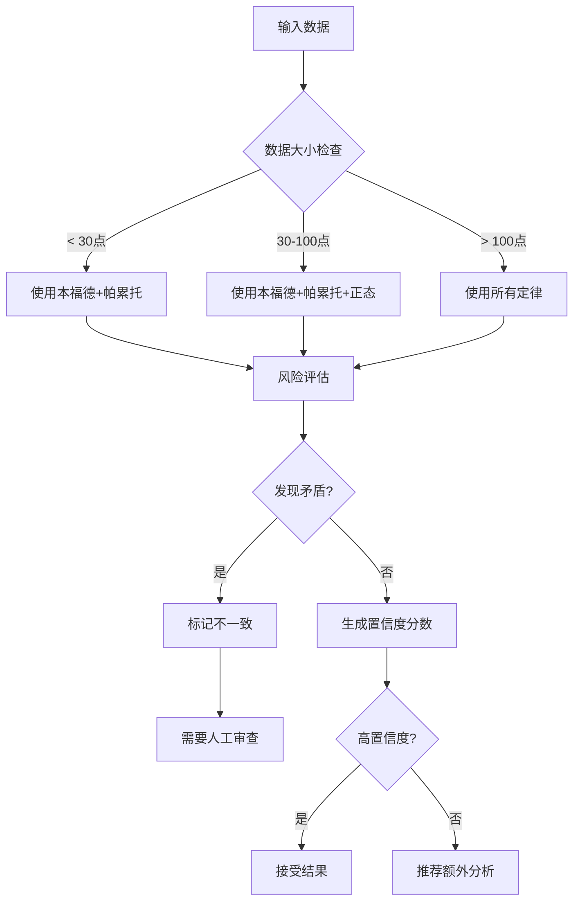

# 使用指南

本指南涵盖使用lawkit进行统计分析的所有方面。

## 目录

- [基本命令](#basic-commands)
- [统计定律](#statistical-laws)
- [输入格式](#input-formats)
- [输出格式](#output-formats)
- [阈值](#thresholds)
- [多语言支持](#multi-language-support)
- [集成分析](#integration-analysis)
- [高级功能](#advanced-features)

## 基本命令

### 命令结构

```bash
lawkit <SUBCOMMAND> [OPTIONS] <INPUT>
```

### 可用子命令

- `benf` - 本福德定律分析
- `pareto` - 帕累托原理分析
- `zipf` - 齐普夫定律分析
- `normal` - 正态分布分析
- `poisson` - 泊松分布分析
- `analyze` - 多定律集成分析和建议
- `validate` - 使用统计定律验证数据质量
- `diagnose` - 使用统计定律诊断数据问题
- `generate` - 生成测试用样本数据
- `list` - 列出可用的统计定律
- `selftest` - 运行自检以验证安装

### 常用选项

- `--format <FORMAT>` - 输出格式 (text, json, csv, yaml, toml, xml)
- `--quiet` - 最小化输出
- `--verbose` - 详细分析
- `--threshold <LEVEL>` - 设置分析阈值 (low, medium, high, critical, auto)
- `--focus <FOCUS>` - 分析焦点区域 (用于analyze命令)
- `--purpose <PURPOSE>` - 分析目的 (用于analyze命令)
- `--recommend` - 显示建议 (用于analyze命令)
- `--samples <NUMBER>` - 生成的样本数量 (用于generate命令)

## 统计定律

### 本福德定律

分析用于欺诈检测的第一位数字频率分布。

```bash
# 基本分析
lawkit benf data.csv

# 使用自定义阈值的详细分析
lawkit benf --verbose --threshold critical data.csv

# JSON输出格式
lawkit benf --format json data.csv
```

**使用场景:**
- 金融欺诈检测
- 数据质量评估
- 会计异常检测
- 科学数据验证

### 帕累托分析

实现带有基尼系数计算的80/20法则。

```bash
# 基本帕累托分析
lawkit pareto sales_data.csv

# 带商业洞察的详细输出
lawkit pareto --verbose --format json revenue.csv

# 自定义阈值分析
lawkit pareto --threshold high customer_values.csv
```

**使用场景:**
- 业务优先级分析
- 资源分配
- 客户细分
- 质量管理

### 齐普夫定律

分析幂律分布和频率模式。

```bash
# 分析数值数据
lawkit zipf data.csv

# 带详细输出的详细分析
lawkit zipf --verbose city_populations.csv

# JSON输出格式
lawkit zipf --format json data.csv
```

**使用场景:**
- 文本分析和语言学
- 人口分布
- 网站流量分析
- 社交媒体分析

### 正态分布

具有正态性检验和质量控制的统计分析。

```bash
# 基本正态性检验
lawkit normal measurements.csv

# 带详细输出的详细分析
lawkit normal --verbose data.csv

# JSON输出格式
lawkit normal --format json data.csv

# 自定义阈值分析
lawkit normal --threshold high production_data.csv
```

**使用场景:**
- 质量控制
- 过程监控
- 异常值检测
- 统计验证

### 泊松分布

事件发生分析和稀有事件建模。

```bash
# 基本泊松分析
lawkit poisson event_counts.csv

# 带详细输出的详细分析
lawkit poisson --verbose data.csv

# JSON输出格式
lawkit poisson --format json incidents.csv

# 自定义阈值分析
lawkit poisson --threshold high defect_data.csv
```

**使用场景:**
- 缺陷分析
- 呼叫中心建模
- 网络流量分析
- 流行病学研究

## 输入格式

lawkit自动检测文件格式并支持:

### 结构化数据
```bash
# CSV文件
lawkit benf data.csv

# Excel文件
lawkit pareto spreadsheet.xlsx

# JSON数据
lawkit zipf data.json

# YAML配置
lawkit normal config.yaml
```

### 文档格式
```bash
# 文本文件
lawkit benf document.txt

# Word文档
lawkit benf report.docx

# PowerPoint演示文稿
lawkit pareto presentation.pptx
```

### 直接输入
```bash
# 管道数据
echo "123,456,789" | lawkit benf

# 命令行字符串
lawkit pareto "100,200,300,400,500"

# 标准输入
cat data.txt | lawkit zipf
```

## 输出格式

### 文本 (默认)
具有格式化表格和摘要的人类可读输出。

```bash
lawkit benf data.csv
# 输出: 带有分析结果的格式化表格
```

### JSON
用于程序化使用的结构化数据。

```bash
lawkit benf --format json data.csv
# 输出: {"first_digit_distribution": {...}, "chi_square": 12.34, ...}
```

### CSV
电子表格应用程序的表格格式。

```bash
lawkit pareto --format csv data.csv
# 输出: 带标题的逗号分隔值
```

### 其他格式
```bash
# YAML格式
lawkit normal --format yaml data.csv

# TOML格式 (Rust友好)
lawkit poisson --format toml data.csv

# XML格式 (企业集成)
lawkit analyze --laws benf,pareto --format xml data.csv
```

## 阈值

### 阈值自定义

为异常检测设置自定义分析阈值:

```bash
# 预定义级别
lawkit benf --threshold low data.csv      # 更宽松
lawkit benf --threshold medium data.csv   # 平衡
lawkit benf --threshold high data.csv     # 严格
lawkit benf --threshold critical data.csv # 非常严格

# 自动检测 (默认)
lawkit benf --threshold auto data.csv
```

### 数据要求

最小数据要求因定律而异:
- **本福德**: 5个点 (推荐: 100+)
- **帕累托**: 5个点 (推荐: 20+)
- **齐普夫**: 5个点 (推荐: 50+)
- **正态**: 8个点 (推荐: 30+)
- **泊松**: 10个点 (推荐: 50+)

## 多语言支持

### 国际数字识别

```bash
# 英语输出 (统一所有分析)
lawkit benf data.csv

# 国际数字自动识别
echo "１２３４５６" | lawkit benf      # 日语数字
echo "一千二百三十四" | lawkit benf    # 中文数字
echo "१२३४५६" | lawkit benf        # 印地语数字
echo "١٢٣٤٥٦" | lawkit benf        # 阿拉伯语数字
```

### 国际数字

lawkit自动识别国际数字格式:

- **英语**: `1,234.56`, `1234.56`
- **日语**: `１，２３４．５６`, `1,234.56`, `一千二百三十四`
- **中文**: `1,234.56`, `一千二百三十四`
- **印地语**: `१,२३४.५६`, `1,234.56`
- **阿拉伯语**: `١٬٢٣٤٫٥٦`, `1,234.56`

## 集成分析

### 集成分析

使用多个统计定律进行综合分析:

```bash
# 使用两个定律分析
lawkit analyze --laws benf,pareto data.csv

# 使用所有适用定律分析
lawkit analyze --laws all data.csv

# 带建议的详细分析
lawkit analyze --laws benf,pareto,normal --verbose --recommend data.csv

# 专注于特定分析区域
lawkit analyze --laws all --focus fraud-detection data.csv

# 指定分析目的
lawkit analyze --laws all --purpose quality-assessment data.csv

# JSON格式输出
lawkit analyze --laws all --format json data.csv
```

### 集成功能

- **矛盾检测**: 识别定律之间的冲突结果
- **置信度评分**: 评估每个分析的可靠性
- **推荐系统**: 建议最合适的统计定律
- **元分析**: 结合多个视角的洞察

### 多定律决策流程



## 高级功能

### 数据生成

```bash
# 生成测试用样本数据
lawkit generate --samples 1000 | lawkit benf

# 生成数据并保存到文件
lawkit generate --samples 500 > test_data.csv

# 为特定定律生成数据
lawkit generate --samples 100 | lawkit pareto
```

### 数据验证

```bash
# 使用多个定律验证数据质量
lawkit validate --laws all data.csv

# 特定焦点验证
lawkit validate --laws benf,pareto --focus fraud-detection data.csv

# 带建议的验证
lawkit validate --laws all --recommend data.csv
```

### 数据诊断

```bash
# 诊断数据问题
lawkit diagnose --laws all data.csv

# 特定目的诊断
lawkit diagnose --laws all --purpose quality-assessment data.csv

# 带详细信息的详细诊断
lawkit diagnose --laws all --verbose data.csv
```

### 自检

```bash
# 运行自检以验证安装
lawkit selftest

# 运行详细自检
lawkit selftest --verbose
```

## 用例示例

### 金融欺诈检测

```bash
# 交易金额的本福德定律
lawkit benf --threshold high transactions.csv

# 交易量的帕累托分析
lawkit pareto --verbose --format json daily_volumes.csv

# 专注于欺诈检测的多定律比较
lawkit analyze --laws benf,pareto --focus fraud-detection financial_data.csv
```

### 质量控制

```bash
# 质量控制的正态分布分析
lawkit normal --threshold high measurements.csv

# 制造业数据质量验证
lawkit validate --laws normal,poisson --purpose quality-control production_data.csv

# 缺陷率的泊松分析
lawkit poisson --verbose defect_counts.csv
```

### 统计分析

```bash
# 数值分布的齐普夫定律
lawkit zipf --verbose data.csv

# 综合洞察的多定律分析
lawkit analyze --laws all --verbose data.csv
```

### 商业智能

```bash
# 客户价值分析 (帕累托)
lawkit pareto --verbose customer_revenue.csv

# 事件发生建模 (泊松)
lawkit poisson --verbose incident_reports.csv

# 综合业务数据分析
lawkit analyze --laws pareto,normal,poisson --purpose business-analysis --verbose business_metrics.csv
```

## 错误处理

lawkit为常见问题提供清晰的错误消息:

- **数据不足**: 当数据不满足最小要求时发出警告
- **无效格式**: 建议正确的输入格式
- **文件缺失**: 提供有用的文件路径指导
- **无效参数**: 解释正确的参数用法

## 性能提示

- 对大数据集使用 `--quiet` 进行更快处理
- 根据您的用例使用 `--threshold` 设置适当的阈值
- 考虑输出格式: 对于大结果，JSON比格式化文本更快
- 使用 `lawkit list` 查看所有可用的统计定律