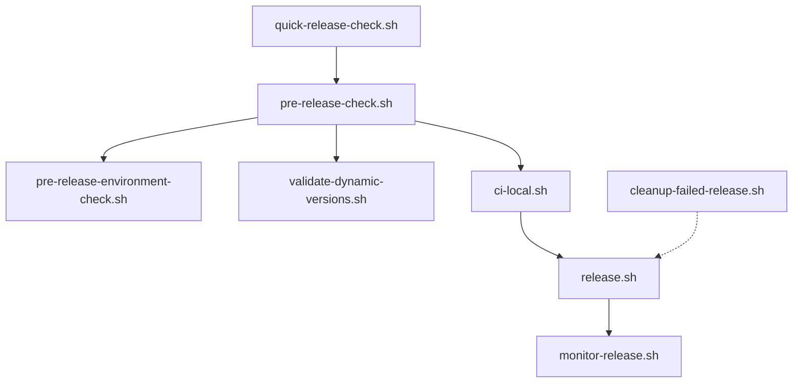

# Scripts Directory

## 📁 Directory Structure

### 🚀 release/
リリース関連のスクリプト

- **`release.sh`** - 統合リリーススクリプト（メイン）
- **`quick-release-check.sh`** - 高速リリース準備確認
- **`pre-release-check.sh`** - 包括的リリース前チェック
- **`pre-release-environment-check.sh`** - 環境・依存関係チェック
- **`validate-dynamic-versions.sh`** - ハードコーディングバージョンチェック
- **`monitor-release.sh`** - リリース監視・成果物確認
- **`cleanup-failed-release.sh`** - 失敗リリースのクリーンアップ

### 🧪 testing/
テスト関連のスクリプト

- **`ci-local.sh`** - ローカルCI環境での包括テスト
- **`test-published-packages.sh`** - 公開済みパッケージの動作確認

### 🛠️ utils/
ユーティリティスクリプト

- **`check-versions.sh`** - バージョン一貫性チェック
- **`check-docs-consistency.sh`** - ドキュメント整合性チェック
- **`setup-github-workflow.sh`** - GitHubワークフロー設定

## 🔄 推奨実行順序

### 通常リリース
```bash
# 1. 高速チェック
./scripts/release/quick-release-check.sh

# 2. 包括的チェック
./scripts/release/pre-release-check.sh

# 3. CI確認
./scripts/testing/ci-local.sh

# 4. リリース実行
./scripts/release/release.sh
```

### 緊急時対応
```bash
# 失敗リリースのクリーンアップ
./scripts/release/cleanup-failed-release.sh v<version>

# リリース状況監視
./scripts/release/monitor-release.sh v<version>
```

### 日常開発
```bash
# バージョン確認
./scripts/utils/check-versions.sh

# ハードコーディングチェック
./scripts/release/validate-dynamic-versions.sh

# パッケージテスト
./scripts/testing/test-published-packages.sh
```

## 📋 スクリプト依存関係



## 🎯 Act1/Act2エラー削減設計

- **事前確認**: release/ ディレクトリで徹底検証
- **Act1/Act2**: 最小限の機械的実行（ワークフロー内）
- **事後確認**: monitor-release.sh で軽量監視